# PYTANIA NA EGZAMIN DYPLOMOWY, STUDIA I STOPNIA INŻYNIERSKIE KIERUNEK INFORMATYKA

# Spis treści
- [Algorytmy i struktury danych](#algorytmy-i-struktury-danych)
  - [1. Pojęcie algorytmu i jego prezentacja](#1-pojęcie-algorytmu-i-jego-prezentacja)
  - [2. Metody szacowania złożoności obliczeniowej algorytmów](#2-metody-szacowania-złożoności-obliczeniowej-algorytmów-złożoność-czasowa-pamięciowa-asymptotyczna-i-benchmarking)
  - [3. Przykłady algorytmów sortowania](#3-przykłady-algorytmów-sortowania-i-ich-złożoność-obliczeniowa)
  - [4. Drzewa poszukiwań binarnych](#4-drzewa-poszukiwań-binarnych-podstawowe-operacje-na-drzewach-sposoby-przechodzenia-drzewa)
  - [5. Metody przeszukiwania grafów i algorytm Dijkstry](#5-metody-przeszukiwania-grafów-i-wyznaczania-najkrótszej-ścieżki-na-przykładzie-algorytmu-dijkstry)
  - [6. Abstrakcyjne struktury danych](#6-abstrakcyjne-struktury-danych-listy-kolejki-stosy-słowniki)
  - [7. Strategia dziel i zwyciężaj, algorytmy zachłanne](#7-strategia-dziel-i-zwyciężaj-idea-algorytmu-zachłannego)
- [Architektura i organizacja komputerów](#architektura-i-organizacja-komputerów)
  - [8. Reprezentacja liczb całkowitych i zmiennoprzecinkowych](#8-reprezentacja-liczb-całkowitych-i-zmiennoprzecinkowych-w-systemach-binarnym-i-szesnastkowym)
  - [9. Specyfika programowania niskopoziomowego](#9-specyfika-programowania-niskopoziomowego)
  - [10. Obliczeniowe jednostki wykonawcze CPU, GPU, TPU, FPU](#10-obliczeniowe-jednostki-wykonawcze-cpu-gpu-tpu-fpu)
- [Sieci komputerowe](#sieci-komputerowe)
  - [11. Protokoły warstwy łącza danych, sieci i transportowej](#11-protokoły-warstwy-łącza-danych-sieci-oraz-transportowej-w-modelu-osi)
  - [12. Przydzielanie adresów przez DHCP](#12-przydzielanie-adresów-przez-protokół-dhcp)
  - [13. Wyliczanie adresów sieci, maski, rozgłoszeniowego w IPv4, IPv6](#13-wyliczanie-adresów-sieci-maski-rozgłoszeniowego-w-ipv4-ipv6)
  - [14. System DNS](#14-system-dns)
- [Bazy danych](#bazy-danych)
  - [15. Klucze główne i obce](#15-klucze-główne-klucze-obce-w-bazach-danych)
  - [16. Diagram związków encji](#16-diagram-związków-encji)
  - [17. Język SQL i podjęzyki DDL, DML, DCL](#17-język-baz-danych-sql-podjęzyki-ddl-dml-dcl)
  - [18. Instrukcja SELECT i łączenie tabel](#18-instrukcja-select-łączenie-danych-z-wielu-tabel)
- [Podstawy elektroniki i miernictwo elektroniczne](#podstawy-elektroniki-i-miernictwo-elektroniczne)
  - [19. Diody półprzewodnikowe, tranzystory](#19-diody-półprzewodnikowe-tranzystory)
  - [20. Układy scalone, impulsowe, cyfrowe](#20-układy-scalone-impulsowe-cyfrowe)
  - [21. Przetworniki ADC i DAC](#21-przetworniki-analogowo-cyfrowe-i-cyfrowo-analogowe)
- [Matematyka dyskretna](#matematyka-dyskretna)
  - [22. Schematy wyboru i tożsamości kombinatoryczne](#22-schematy-wyboru-i-tożsamości-kombinatoryczne)
  - [23. Liniowe równania rekurencyjne](#23-liniowe-równania-rekurencyjne)
  - [24. Grafy i ich własności](#24-grafy-i-ich-własności)
- [Programowanie strukturalne](#programowanie-strukturalne)
  - [25. Typy zmiennych](#25-typy-zmiennych-w-językach-programowania)
  - [26. Rodzaje pętli](#26-rodzaje-pętli)
  - [27. Zmienne typu adresowego (wskaźniki)](#27-zmienne-typu-adresowego-wskaźniki-zastosowanie-w-wybranym-języku-programowania)
  - [28. Funkcje, przekazywanie parametrów](#28-funkcje-przekazywanie-parametrów-przez-wartość-i-referencję)
- [Wizualizacja danych](#wizualizacja-danych)
  - [29. Definicja histogramu i typ wykresu](#29-definicja-histogramu-jakiego-typu-wykresu-warto-użyć-do-prezentacji)
  - [30. Biblioteki do tworzenia wykresów w Python](#30-biblioteki-wspierające-tworzenie-wykresów-za-pomocą-języka-python)
  - [31. Koncepcja "czystych danych/tidy data"](#31-omów-koncepcję-czystych-danychtidy-data)
  - [32. Etapy analizy i wizualizacji danych](#32-etapy-analizy-i-wizualizacji-danych)
- [Programowanie obiektowe](#programowanie-obiektowe)
  - [33. Składniki klasy i modyfikatory dostępu](#33-składniki-klasy-i-modyfikatory-dostępu)
  - [34. Obiekty a klasy, hermetyzacja](#34-obiekty-a-klasy-pojęcie-hermetyzacji)
  - [35. Pola i metody statyczne](#35-pola-i-metody-statyczne-w-klasie)
  - [36. Dziedziczenie, polimorfizm, szablony klas](#36-dziedziczenie-polimorfizm-szablony-klas)
  - [37. Klasy abstrakcyjne i interfejsy](#37-klasy-abstrakcyjne-i-interfejsy)
- [Systemy operacyjne](#systemy-operacyjne)
  - [38. Procesy, wątki, zarządzanie procesami](#38-procesy-wątki-zarządzanie-procesami)
  - [39. Synchronizacja procesów współbieżnych, semafory](#39-synchronizacja-procesów-współbieżnych-semafory)
- [Inżynieria oprogramowania](#inżynieria-oprogramowania)
  - [40. Cykle projektowania i życia oprogramowania](#40-cykle-projektowania-i-życia-oprogramowania)
  - [41. Metody i strategie testowania](#41-metody-oraz-strategie-testowania-oprogramowania)
- [Projektowanie systemów informatycznych](#projektowanie-systemów-informatycznych)
  - [42. Metodologie wytwarzania systemów](#42-metodologie-wytwarzania-systemów-informatycznych)
  - [43. Metody identyfikacji wymagań](#43-metody-identyfikacji-wymagań-systemu-informatycznego)
- [Podstawy logiki, algebra, analiza, metody probabilistyczne](#podstawy-logiki-algebra-analiza-metody-probabilistyczne)
  - [44. Działania na zbiorach](#44-działania-na-zbiorach)
  - [45. Rachunek zdań](#45-rachunek-zdań)
  - [46. Działania na macierzach](#46-działania-na-macierzach)
  - [47. Układy równań liniowych – twierdzenie Kroneckera-Capelliego](#47-układy-równań-liniowych--twierdzenie-kroneckera-capelliego)
  - [48. Pojęcie relacji i funkcji](#48-pojęcie-relacji-i-funkcji)
  - [49. Własności relacji](#49-własności-relacji-relacje-porządkujące-relacje-równoważności)
  - [50. Własności funkcji](#50-własności-funkcji-miejsca-zerowe-ciągłość-pochodna)
  - [51. Zmienna losowa i jej charakterystyki](#51-zmienna-losowa-i-jej-charakterystyki-liczbowe)
- [Programowanie deklaratywne](#programowanie-deklaratywne)
  - [52. Definicje unifikatora, algorytm unifikacji](#52-definicje-unifikatora-podstawienia-uzgadniającego-najogólniejszego-unifikatora-algorytm-unifikacji-i-twierdzenie-o-unifikacji)
  - [53. Budowa programu w Prologu](#53-budowa-programu-w-prologu-klauzule-fakty-reguły-definicje-predykatów-sposób-realizacji-programu)
- [Technika cyfrowa](#technika-cyfrowa)
  - [54. Systemy funkcjonalnie pełne](#54-systemy-zestawy-funkcjonalnie-pełne)
  - [55. Elementy pamięciowe w układach sekwencyjnych](#55-elementy-pamięciowe-stosowane-w-układach-sekwencyjnych)
  - [56. Rodzaje układów sekwencyjnych](#56-rodzaje-układów-sekwencyjnych-różnice-w-procedurach-ich-projektowania)
- [Systemy wbudowane](#systemy-wbudowane)
  - [57. Mikrokontrolery i systemy wbudowane](#57-mikrokontrolery-i-systemy-wbudowane)
  - [58. Tryby adresowania rozkazów mikrokontrolera](#58-tryby-adresowania-rozkazów-mikrokontrolera)
  - [59. Rodzaje transmisji szeregowej](#59-rodzaje-transmisji-szeregowej)
- [Sztuczna inteligencja i metody inżynierii wiedzy](#sztuczna-inteligencja-i-metody-inżynierii-wiedzy)
  - [60. Model obliczeniowy perceptronu](#60-model-obliczeniowy-perceptronu)
  - [61. Metody uczenia sieci neuronowych](#61-metody-uczenia-sieci-neuronowych)
  - [62. Mechanizm działania algorytmu genetycznego](#62-mechanizm-działania-algorytmu-genetycznego)
  - [63. Definicja entropii informacji i zastosowanie](#63-definicja-entropii-informacji-i-wybrane-zastosowanie-tego-pojęcia)
  - [64. Metody generacji reguł decyzyjnych](#64-metody-generacji-reguł-decyzyjnych)
  - [65. Uczenie się zespołowe](#65-uczenie-się-zespołowe)
- [Wprowadzenie do grafiki maszynowej](#wprowadzenie-do-grafiki-maszynowej)
  - [66. Modele barw](#66-modele-barw)
  - [67. Algorytmy rastrowe](#67-algorytmy-rastrowe)
  - [68. Formaty plików graficznych](#68-formaty-plików-graficznych)
  - [69. Przekształcenia afiniczne 3W](#69-przekształcenia-afiniczne-3w)
  - [70. Rzutowanie w grafice 3W](#70-rzutowanie-w-grafice-3w)
  - [71. Krzywe Béziera](#71-krzywe-béziera)
- [Problemy społeczne i zawodowe informatyki](#problemy-społeczne-i-zawodowe-informatyki)
  - [72. Trzy podstawowe obszary uzależnień komputerowych](#72-trzy-podstawowe-obszary-uzależnień-komputerowych)
  - [73. Ochrona własności intelektualnej vs patentowa](#73-zasadnicza-różnica-między-ochroną-własności-intelektualnej-i-ochroną-patentową)
  - [74. Szpiegostwo komputerowe](#74-szpiegostwo-komputerowe)

---

# Algorytmy i struktury danych

## 1. Pojęcie algorytmu i jego prezentacja
**Odpowiedź:**

**Algorytm** to skończony, jednoznacznie określony i uporządkowany ciąg czynności (kroków), który po wykonaniu prowadzi do rozwiązania danego problemu lub zadania.

---

## 2. Cechy poprawnego algorytmu

Aby algorytm był poprawny, musi spełniać podstawowe wymagania:

* **Jednoznaczność** – każdy krok algorytmu musi być dokładnie opisany i nie może być dowolnie interpretowany.
* **Skończoność** – po pewnej liczbie kroków algorytm musi się zakończyć (nie może działać w pętli bez końca).
* **Określoność** – w algorytmie musi być dokładnie wiadomo, jakie dane są potrzebne na początku i co stanowi wynik.
* **Skuteczność (wykonalność)** – każdy krok algorytmu musi być możliwy do wykonania w praktyce.
* **Poprawność** – dla każdego poprawnego zestawu danych wejściowych, algorytm musi podawać poprawny wynik.


---

## 3. Sposoby prezentacji (reprezentacji) algorytmu

### 1. Opis słowny

Algorytm opisany za pomocą zdań w języku naturalnym. Używany do ogólnego wyjaśnienia zasady działania.

**Przykład (algorytm obliczania sumy dwóch liczb):**

1.  Pobierz dwie liczby A i B.
2.  Oblicz ich sumę.
3.  Wyświetl wynik.

### 2. Lista kroków (pseudokod)

Zapis przypominający kod programu, ale bez składni konkretnego języka programowania. Stosowany, gdy chcemy opisać logikę w sposób bardziej formalny.

**Przykład:**

Wczytaj A, B

SUMA = A + B

Wypisz SUMA
### 3. Schemat blokowy (diagram przepływu)

Graficzne przedstawienie algorytmu — każdy krok to blok o określonym kształcie, a strzałki pokazują kierunek działania.

**Legenda:**

* Blok początkowy/końcowy – owal (**START/KONIEC**)
* Blok operacji (obliczenia) – prostokąt
* Blok decyzji (warunek) – romb
* Blok wejścia/wyjścia – równoległobok

**Przykład – schemat sumowania dwóch liczb:**


### Schemat blokowy algorytmu
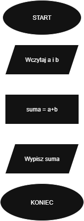


### 4. Program komputerowy

Zapis algorytmu w konkretnym języku programowania – to już wykonana, gotowa wersja, którą komputer może uruchomić.

**Przykład w języku Python:**

```python
a = float(input("Podaj pierwszą liczbę: "))
b = float(input("Podaj drugą liczbę: "))
suma = a + b
print("Suma =", suma)
```

## 2. Metody szacowania złożoności obliczeniowej algorytmów. Złożoność czasowa, pamięciowa, asymptotyczna i benchmarking
**Odpowiedź:**
Szacowanie złożoności służy do określenia, jak czas działania i zużycie zasobów (głównie pamięci) algorytmu rośnie w zależności od rozmiaru danych wejściowych ($n$).

* **Złożoność Czasowa:** Ilość czasu potrzebnego na wykonanie zadania, wyrażona jako funkcja rozmiaru danych wejściowych ($n$), mierzona liczbą operacji elementarnych.
* **Złożoność Pamięciowa:** Ilość pamięci roboczej (dodatkowej) potrzebnej na wykonanie zadania, wyrażona jako funkcja rozmiaru danych wejściowych ($n$).

---

### 1. Metoda Asymptotyczna (Teoretyczna)

Jest to dominująca metoda w teorii informatyki. Opiera się na analizie kodu i określeniu, jak szybko rośnie liczba operacji, ignorując stałe i czynniki niskiego rzędu.

**Złożoność Asymptotyczna** opisuje granicę wzrostu złożoności, gdy rozmiar danych $n$ dąży do nieskończoności.

#### Notacje Asymptotyczne

| Notacja | Nazwa | Przypadek | Opis |
| :--- | :--- | :--- | :--- |
| **$O$ (Duże O)** | Ograniczenie Górne | Najgorszy | Funkcja $f(n)$ rośnie nie szybciej niż $g(n)$. Stosując $O$, podajemy najbardziej znaczący składnik (np. dla $5n^2+20n+100$ piszemy $O(n^2)$). |
| **$\Omega$ (Omega)** | Ograniczenie Dolne | Najlepszy | Funkcja $f(n)$ rośnie nie wolniej niż $g(n)$. |
| **$\Theta$ (Theta)** | Ograniczenie Dokładne | Średni/Typowy | Reprezentuje typowe zachowanie, będąc jednocześnie ograniczeniem górnym ($O$) i dolnym ($\Omega$). |

#### Przykłady Funkcji Złożoności (od najlepszej do najgorszej)

* $O(1)$ – **Stała**
* $O(\log n)$ – **Logarytmiczna**
* $O(n)$ – **Liniowa**
* $O(n \log n)$ – **Liniowo-logarytmiczna**
* $O(n^2)$ – **Kwadratowa**
* $O(n^k)$ – **Wielomianowa** ($k>2$)
* $O(2^n)$ – **Wykładnicza**
* $O(n!)$ – **Rzędu silnia**

---

### 2. Benchmarking (Metoda Praktyczna)

Benchmarking polega na praktycznym pomiarze rzeczywistego czasu wykonania algorytmu na konkretnym sprzęcie.

* **Procedura:** Implementacja → Wykonanie dla różnych $n$ → Zmierzenie rzeczywistego czasu → Wizualizacja wyników (wykres: czas vs. $n$).
* **Zastosowanie:** Umożliwia sprawdzenie, jak stałe czynniki systemowe (sprzęt, pamięć podręczna, kompilator) wpływają na wydajność.
* **Ograniczenia:** Wyniki są zależne od środowiska (sprzętu i obciążenia systemu), co utrudnia uniwersalne porównania.


## 3. Przykłady algorytmów sortowania i ich złożoność obliczeniowa
**Odpowiedź:**
Sortowanie to proces uporządkowania zbioru danych według określonego kryterium.

---

## 1. Sortowanie bąbelkowe (Bubble Sort)

* **Charakterystyka:** Najprostsza metoda sortowania. Algorytm stabilny i sortujący w miejscu (in-place).
* **Zasada działania:** Polega na porównywaniu sąsiednich elementów i zamianie ich miejscami, jeśli są w niewłaściwej kolejności. Proces powtarza się, aż w całym przebiegu nie zajdzie żadna zamiana. Największy element „wypływa” na koniec tablicy.

### Wizualizacja Kroków (Bubble Sort)

Ciąg wejściowy: [4, 2, 5, 1, 7]

| Krok | Operacja | Wynik | Porównanie |
| :---: | :--- | :--- | :--- |
| **Początek** | | [4, 2, 5, 1, 7] | |
| **Przebieg 1** | 4>2, 4<5, 5>1, 5<7 | [2, 4, 1, 5, **7**] | Wypłynięcie 7 |
| **Przebieg 2** | 2<4, 4>1, 4<5 | [2, 1, 4, **5, 7**] | Wypłynięcie 5 |
| **Przebieg 3** | 2>1, 2<4 | [1, 2, **4, 5, 7**] | Wypłynięcie 4 |
| **Przebieg 4** | 1<2 | [1, 2, 4, 5, 7] | Koniec |

**Posortowany ciąg:** [1, 2, 4, 5, 7]

## 2. Sortowanie przez wybieranie (Selection Sort)

* **Charakterystyka:** Prosta metoda sortowania, algorytm sortujący w miejscu (in-place).
* **Zasada działania:** Wyszukiwanie najmniejszego elementu w nieposortowanej części tablicy i zamiana go z pierwszym elementem tej części. Proces powtarza się, przesuwając granicę posortowanego fragmentu.

### Przykład Sortowania Przez Wybieranie

Tablica początkowa: [9, 1, 6, 8, 4, 3, 2, 0]

| Element Tablicy (i) | Tablica (Wyszukiwanie/Zamiana) | Wartość Najmniejsza | Uwagi |
| :---: | :--- | :---: | :--- |
| **0** | [**9, 1, 6, 8, 4, 3, 2, 0**] | **0** | Najmniejsza wartość to 0, zamiana z elementem na pozycji 0 (czyli z 9). |
| **1** | [0, **1, 6, 8, 4, 3, 2, 9**] | **1** | Najmniejsza wartość to 1 (już na właściwej pozycji 1). |
| **2** | [0, 1, **6, 8, 4, 3, 2, 9**] | **2** | Najmniejsza wartość to 2, zamiana z elementem na pozycji 2 (czyli z 6). |
| **3** | [0, 1, 2, **8, 4, 3, 6, 9**] | **3** | Najmniejsza wartość to 3, zamiana z elementem na pozycji 3 (czyli z 8). |
| **4** | [0, 1, 2, 3, **4, 8, 6, 9**] | **4** | Najmniejsza wartość to 4 (już na właściwej pozycji 4). |
| **5** | [0, 1, 2, 3, 4, **8, 6, 9**] | **6** | Najmniejsza wartość to 6, zamiana z elementem na pozycji 5 (czyli z 8). |
| **6** | [0, 1, 2, 3, 4, 6, **8, 9**] | **8** | Najmniejsza wartość to 8 (już na właściwej pozycji 6). |

**Posortowana tablica:** [0, 1, 2, 3, 4, 6, 8, 9]

## 3. Sortowanie przez wstawianie (Insertion Sort)

* **Charakterystyka:** Intuicyjny algorytm. Jego zaletą jest wysoka wydajność dla częściowo posortowanych danych (złożoność $\Omega(n)$). Jest stabilny i sortuje w miejscu (in-place).
* **Zasada działania:** Przypomina układanie kart w ręku. Kolejne elementy są pobierane i wstawiane w odpowiednie miejsce w już uporządkowanej części tablicy.

### Przykład Sortowania Przez Wstawianie

Tablica początkowa:
3  7  4  9  5  2  6  1


| Stan Tablicy | Komentarz (Klucz Wstawiany) |
| :--- | :--- |
| 3  7  4  9  5  2  6  1 | Tablica początkowa |
| 3\* 7  4  9  5  2  6  1 | Porównanie 7 z 3 (3 jest posortowane) |
| 3  7\* 4  9  5  2  6  1 | 7 jest na pozycji |
| 3  4\* 7  9  5  2  6  1 | 4 zostaje wstawione przed 7 |
| 3  4  7  9\* 5  2  6  1 | 9 jest na pozycji |
| 3  4  5\* 7  9  2  6  1 | 5 zostaje wstawione przed 7 i 9 |
| 2\* 3  4  5  7  9  6  1 | 2 zostaje wstawione na początek |
| 2  3  4  5  6\* 7  9  1 | 6 zostaje wstawione przed 7 i 9 |
| 1\* 2  3  4  5  6  7  9 | 1 zostaje wstawione na początek |

**Posortowana tablica:** 1  2  3  4  5  6  7  9


## 4. Sortowanie przez scalanie (Merge Sort)

* **Charakterystyka:** Algorytm wykorzystujący metodę „dziel i zwyciężaj” (*divide and conquer*). Jest algorytmem stabilnym.
* **Zasada działania:** Działa rekurencyjnie — dzieli tablicę na mniejsze części, sortuje je osobno, a następnie scala w jedną uporządkowaną całość.
  
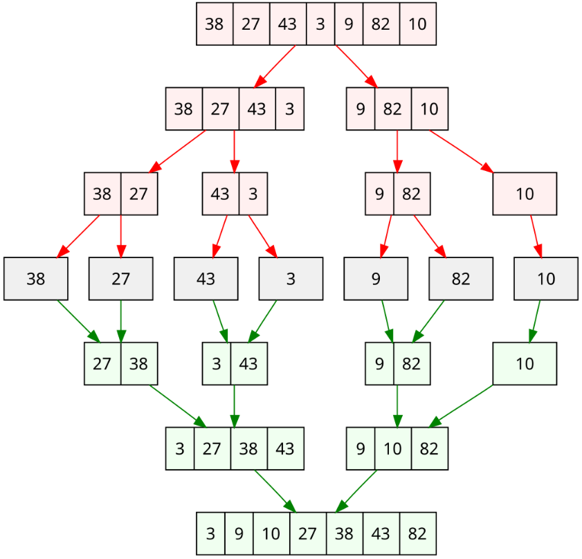

## 5. Sortowanie przez kopcowanie (Heap Sort)

* **Charakterystyka:** Algorytm oparty na strukturze danych zwanej **kopcem** (*heap*). Jest algorytmem sortującym w miejscu (in-place).
* **Zasada działania:** Najpierw budowany jest kopiec (drzewo binarne spełniające określone własności porządkowe), a następnie największy element (korzeń) jest przenoszony na koniec tablicy.
* https://pl.wikipedia.org/wiki/Sortowanie_przez_kopcowanie

## 6. Sortowanie szybkie (Quick Sort)

* **Charakterystyka:** Jeden z najszybszych algorytmów sortowania w praktyce, również wykorzystujący metodę „dziel i zwyciężaj”.
* **Zasada działania:** Wybierany jest tzw. element rozdzielający (pivot), a następnie tablica jest dzielona na dwie części: elementy mniejsze/równe pivotowi oraz elementy większe od pivotu. Obie części są sortowane rekurencyjnie.
  
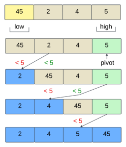
---

## Złożoność Czasowa Algorytmów Sortowania (Notacja O)

| Nazwa algorytmu | Złożoność czasowa (Optymistyczna) | Złożoność czasowa (Typowa) | Złożoność czasowa (Pesymistyczna) | Złożoność pamięciowa (Pesymistyczna) |
| :--- | :---: | :---: | :---: | :---: |
| **Bubble Sort** | $\Omega(\text{n})$ | $\Theta(\text{n}^2)$ | $\text{O}(\text{n}^2)$ | $\text{O}(1)$ |
| **Selection Sort** | $\Omega(\text{n}^2)$ | $\Theta(\text{n}^2)$ | $\text{O}(\text{n}^2)$ | $\text{O}(1)$ |
| **Insertion Sort** | $\Omega(\text{n})$ | $\Theta(\text{n}^2)$ | $\text{O}(\text{n}^2)$ | $\text{O}(1)$ |
| **Merge Sort** | $\Omega(\text{n} \log(\text{n}))$ | $\Theta(\text{n} \log(\text{n}))$ | $\text{O}(\text{n} \log(\text{n}))$ | $\text{O}(\text{n})$ |
| **Quick Sort** | $\Omega(\text{n} \log(\text{n}))$ | $\Theta(\text{n} \log(\text{n}))$ | $\text{O}(\text{n}^2)$ | $\text{O}(\text{n})$ |
| **Heap Sort** | $\Omega(\text{n} \log(\text{n}))$ | $\Theta(\text{n} \log(\text{n}))$ | $\text{O}(\text{n} \log(\text{n}))$ | $\text{O}(1)$ |


## 4. Drzewa poszukiwań binarnych. Podstawowe operacje na drzewach. Sposoby przechodzenia drzewa
**Odpowiedź:**
**Binarne drzewo poszukiwań (BST – Binary Search Tree)** – drzewo binarne, w którym lewe dziecko węzła jest od niego mniejsze, a prawe – większe lub równe. Każdy węzeł, oprócz wartości klucza, przechowuje wskaźniki na swoje dzieci oraz na swojego rodzica.

---

## Podstawowe Operacje na Drzewie

### Operacje wykonywane na drzewie

#### Wyszukiwanie (Search)
Znajdowanie węzła o danym kluczu. Porównywanie klucza i schodzenie do lewego lub prawego poddrzewa.

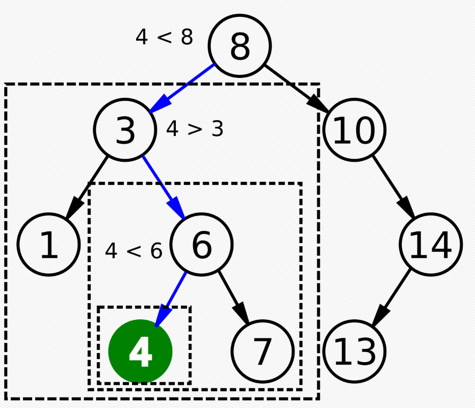

#### Wstawianie (Insert)
Dodanie nowego węzła. Wyszukuje się pozycję dla nowego klucza (zawsze jako liść) zgodnie z własnością BST.

#### Wyszukiwanie najmniejszego i największego klucza w drzewie
Znajdowanie najmniejszego elementu (skrajnie lewa ścieżka) lub największego elementu (skrajnie prawa ścieżka).

#### Usuwanie (Delete)
Usuwanie węzła. Najbardziej skomplikowana operacja z uwagi na trzy przypadki: węzeł jest liściem, ma jedno dziecko lub ma dwoje dzieci (wymaga zastąpienia go przez następnik in-order).

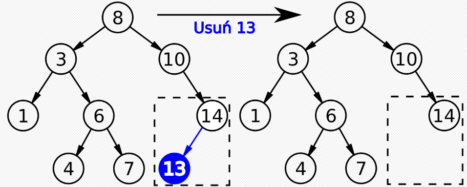
**Usuwanie węzła, który jest liściem**
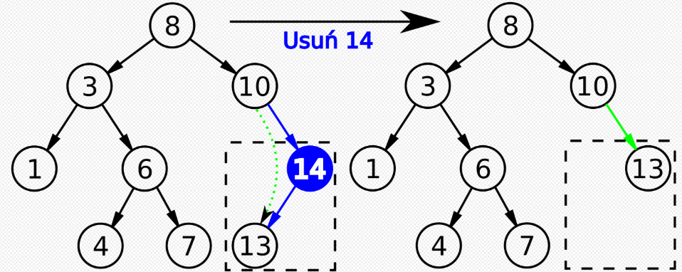
**Usuwanie węzła z jednym synem**

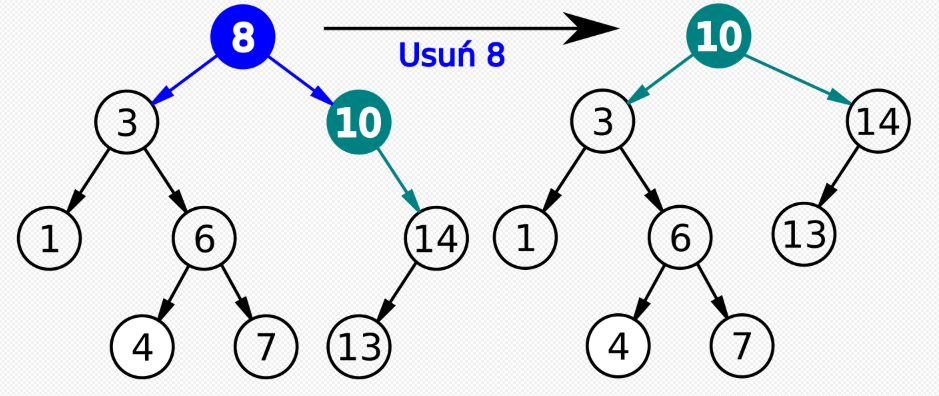
**Usuwanie węzła z kluczem 8 z dwoma synami.** Następnikiem węzła jest węzeł z kluczem 10

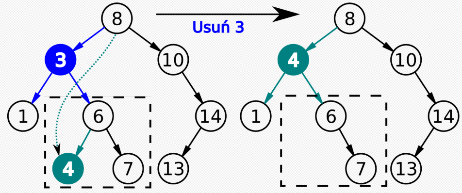
**Usuwanie węzła z kluczem 3 z dwoma synami.** Następnikiem węzła jest węzeł z kluczem 4


---

## Sposoby Przechodzenia Drzewa (Traversal)

### 1. Przechodzenie Pre-order (Węzeł-Lewo-Prawo)
Metoda ta polega na odwiedzeniu najpierw bieżącego węzła, a następnie rekurencyjnym przejściu do lewego poddrzewa i wreszcie do prawego poddrzewa.

**Pre-order:** F, B, A, D, C, E, G, I, H.

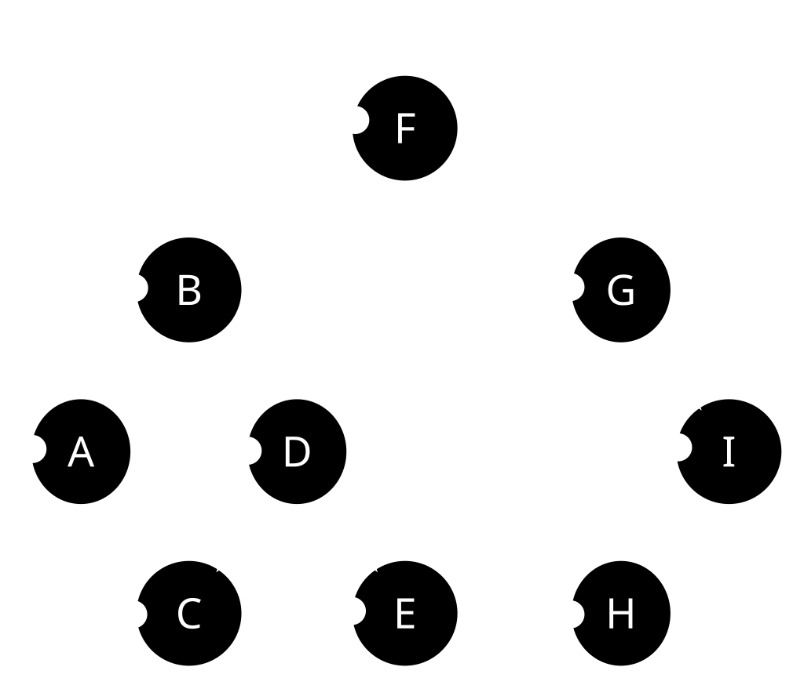

### 2. Przechodzenie In-order (Lewo-Węzeł-Prawo)
Metoda ta polega na odwiedzeniu najpierw lewego poddrzewa, następnie bieżącego węzła, a na końcu prawego poddrzewa, co dla BST daje uporządkowany ciąg kluczy.

**In-order:** A, B, C, D, E, F, G, H, I.

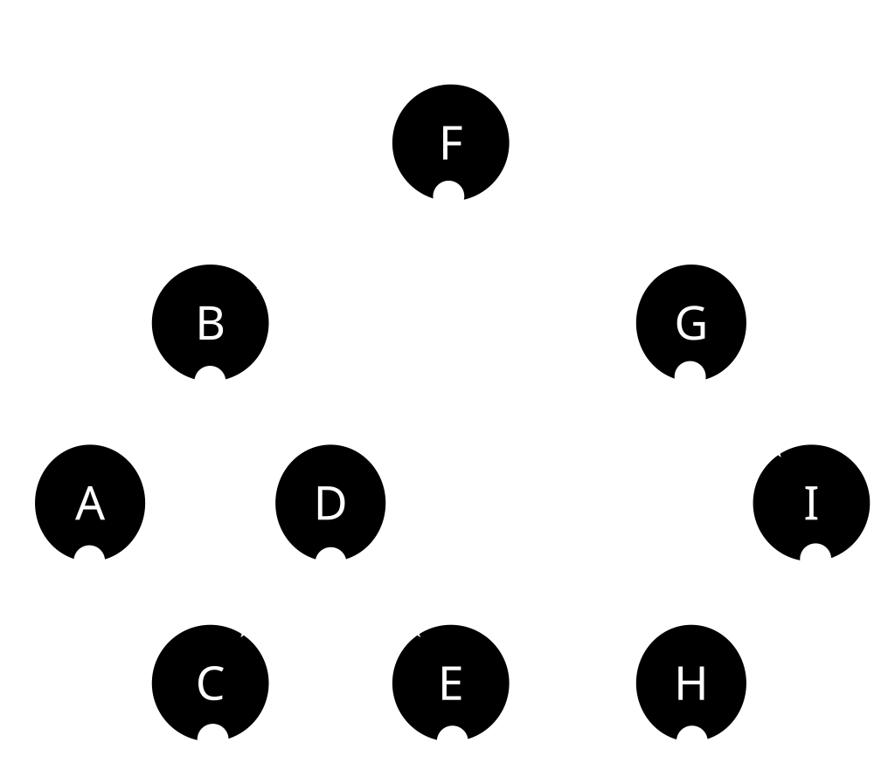

### 3. Przechodzenie Post-order (Lewo-Prawo-Węzeł)
Metoda ta polega na odwiedzeniu najpierw lewego poddrzewa, następnie prawego poddrzewa, a na końcu bieżącego węzła (korzenia poddrzewa).

**Post-order:** A, C, E, D, B, H, I, G, F.

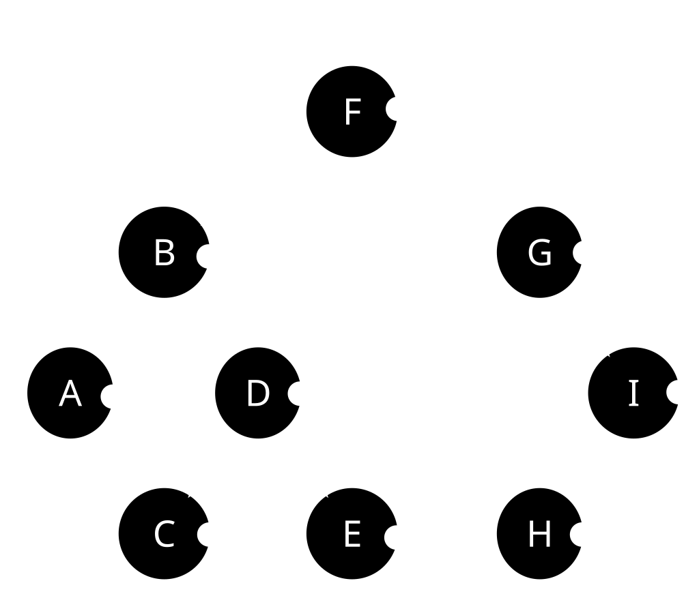


## 5. Metody przeszukiwania grafów i wyznaczania najkrótszej ścieżki na przykładzie algorytmu Dijkstry
**Odpowiedź:**

### [Przeszukiwanie grafu / przechodzenie grafu](https://en.wikipedia.org/wiki/Graph_traversal) - odwiedzenie wszystkich wierzchołków grafu w usystematyzowany sposób. Dwie podstawowe metody:
- [BFS - Breadth First Search / Przeszukiwanie wszerz](https://pl.wikipedia.org/wiki/Przeszukiwanie_wszerz) 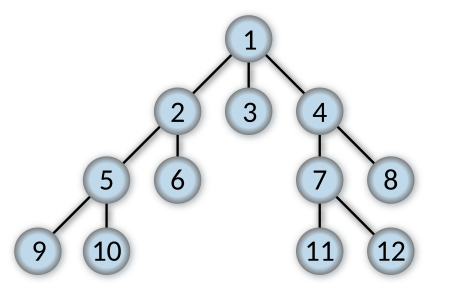
- [DFS - Depth First Search / Przeszukiwanie w głąb](https://pl.wikipedia.org/wiki/Przeszukiwanie_w_g%C5%82%C4%85b) 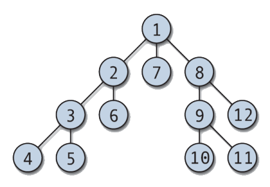

W grafach ważonych (z kosztami krawędzi) BFS już nie wystarcza. Potrzebujemy algorytmów, które uwzględniają długości krawędzi, np.:
- algorytm Dijkstry, [Wikipedia ENG](https://en.wikipedia.org/wiki/Dijkstra%27s_algorithm), [Wikipedia PL](https://pl.wikipedia.org/wiki/Algorytm_Dijkstry)
- algorytm Bellmana-Forda (obsługuje też wagi ujemne),
- algorytm Floyda-Warshalla (dla wszystkich par wierzchołków)

### Algorytm Dijkstry:
[Poradnik na YouTube](https://www.youtube.com/watch?v=_lHSawdgXpI)
- Tworzymy tabelę nieodwiedzonych wierzchołków.
- Tworzymy tabelę kosztu przejścia, gdzie początkowo:
  startowy = 0,
  wszystkie inne = ∞.
- Wybieramy wierzchołek o najmniejszej znanej odległości i wykreślamy go z nieodwiedzonych.
- Teraz szukamy kolejnego punktu. Koszt dojścia do niego uwzględnia sumę poprzednich kosztów. Zapisujemy koszty w tabeli przejść i wybieramy najmniejszy.
- Pętelka :)

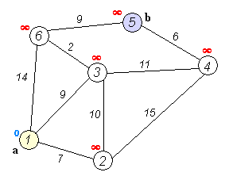

## 6. Abstrakcyjne struktury danych: listy, kolejki, stosy, słowniki
**Odpowiedź:**

Abstrakcyjne struktury danych to modele logiczne sposobu organizacji i przechowywania danych, niezależne od implementacji. Do podstawowych należą:
- Lista - uporządkowana sekwencja elementów, do której można uzyskać dostęp za pomocą indeksu. Umożliwia wstawianie, usuwanie i odczyt w dowolnym miejscu. Może być implementowana jako tablica dynamiczna lub lista wiązana. [Wykład Piojas 1](https://piojas.pl/wp-content/uploads/2024/05/PSwyklad13.html#/title-slide), [Wykład Piojas 2](https://piojas.pl/wp-content/uploads/2024/05/PSwyklad14.html#/title-slide), [Wikipedia PL](https://pl.wikipedia.org/wiki/Lista), [Wikipedia ENG](https://en.wikipedia.org/wiki/List_(abstract_data_type))
- Stos (stack) – struktura LIFO (Last In, First Out). Ostatni wstawiony element jest pierwszy do usunięcia. Podstawowe operacje: push (dołożenie) i pop (zdjęcie ze stosu). Stos znajduje zastosowanie m.in. w rekurencji i analizie wyrażeń. [Wikipedia PL](https://pl.wikipedia.org/wiki/Stos_(informatyka)), [Wikipedia ENG](https://en.wikipedia.org/wiki/Stack_(abstract_data_type))
- Kolejka (queue) – struktura FIFO (First In, First Out). Pierwszy element dodany jest pierwszy do usunięcia. Operacje: enqueue (dodanie na koniec) i dequeue (usunięcie z początku). Wariantem jest kolejka priorytetowa. [Wikipedia PL](https://pl.wikipedia.org/wiki/Kolejka_(informatyka)), [Wikipedia ENG](https://en.wikipedia.org/wiki/Queue_(abstract_data_type))
- Słownik (mapa, tablica asocjacyjna) – przechowuje pary klucz–wartość, umożliwiając szybkie wyszukiwanie po kluczu. Najczęściej implementowany za pomocą tablicy mieszającej (hash table) lub drzewa zrównoważonego. [Wikipedia PL](https://pl.wikipedia.org/wiki/Tablica_asocjacyjna), [Wikipedia ENG](https://en.wikipedia.org/wiki/Associative_array)

| Struktura | Organizacja danych            | Zasada działania        | Typowe zastosowania                           |
|-----------|-------------------------------|-------------------------|-----------------------------------------------|
| Lista     | Uporządkowana sekwencja       | Dostęp przez indeks     | Przechowywanie i przetwarzanie sekwencji      |
| Stos      | Elementy jeden na drugim      | LIFO (Last In, First Out)| Rekursja, cofanie operacji, analiza wyrażeń   |
| Kolejka   | Elementy w kolejności przyjścia | FIFO (First In, First Out)| Symulacje, buforowanie, obsługa zadań        |
| Słownik   | Pary klucz–wartość            | Dostęp przez klucz      | Wyszukiwanie danych, mapowanie, bazy danych   |


## 7. Strategia dziel i zwyciężaj, idea algorytmu zachłannego
**Odpowiedź:**

### Dziel i zwyciężaj
Polega na rozwiązywaniu problemu przez podział na mniejsze podproblemy tego samego typu, rozwiązanie ich (najczęściej rekurencyjnie), a następnie połączenie uzyskanych wyników w rozwiązanie całości. Klasyczne przykłady to: sortowanie szybkie (quicksort), sortowanie przez scalanie (mergesort), algorytm Karacuby dla mnożenia liczb. Kluczowe etapy: dziel (rozbicie problemu), zwyciężaj (rozwiązanie podproblemów), scal (połączenie wyników). [Wikipedia PL](https://pl.wikipedia.org/wiki/Dziel_i_zwyci%C4%99%C5%BCaj)

### Algorytm zachłanny
Opiera się na podejmowaniu w każdym kroku decyzji lokalnie optymalnej (wybieramy najlepsze rozwiązanie chwilowe), w nadziei, że doprowadzi to do rozwiązania globalnie optymalnego. Stosuje się go tam, gdzie problem ma własność optymalnej podstruktury i zachłanności. Przykłady: algorytmy znajdowania minimalnego drzewa rozpinającego, algorytm Dijkstry. [Wikipedia PL](https://pl.wikipedia.org/wiki/Algorytm_zach%C5%82anny)

---

# Architektura i organizacja komputerów

## 8. Reprezentacja liczb całkowitych i zmiennoprzecinkowych w systemach binarnym i szesnastkowym
**Odpowiedź:**

### System Binarny
- Używa tylko 0 i 1.
- Każde miejsce ma wartość potęgi dwójki.

1011 (binarnie) = 1* 8 + 0* 4 + 1* 2 + 1* 1 = 11 (dziesiętnie)
[Wikipedia PL](https://pl.wikipedia.org/wiki/Dw%C3%B3jkowy_system_liczbowy)

### System szesnastkowy (hex)
- Używa cyfr 0–9 i liter A–F (gdzie A=10, B=11 … F=15).
- 1 cyfra hex = 4 bity (np. 1111 = F).

1011 (binarnie) = B (hex), 11111111 (binarnie) = FF (hex)
[Wikipedia PL](https://pl.wikipedia.org/wiki/Szesnastkowy_system_liczbowy)
### Liczby całkowite
#### Bez znaku: zwykły zapis binarny.

00001011 = 11

#### Ze znakiem (dodatnie/ujemne): najczęściej kod U2 (uzupełnień do dwóch). [Wikipedia PL](https://pl.wikipedia.org/wiki/Kod_uzupe%C5%82nie%C5%84_do_dw%C3%B3ch)
00001011 = +11

11110101 = -11

### Liczby zmiennoprzecinkowe
[Wikipedia PL](https://pl.wikipedia.org/wiki/IEEE_754)
[Przykłady](https://eduinf.waw.pl/inf/alg/006_bin/0021.php)

Liczby zmiennoprzecinkowe reprezentowane są zgodnie ze standardem IEEE 754. Składają się z trzech pól:
- znaku +/- (S) - 1 bit,
- wykładnika (E) - zapisany w kodzie z przesunięciem (bias),
- mantysy (M) - ułamkowej części liczby w zapisie binarnym.

Wartość liczby określa wzór:
(-1)^S × 1,M × 2^(E-bias).

## 9. Specyfika programowania niskopoziomowego

**Odpowiedź:**

Język niskiego poziomu – kod maszynowy, język programowania, w którym jednej operacji elementarnej odpowiada jedna operacja elementarna rzeczywistego procesora. W tych językach używa się prostych wyrażeń symbolicznych, które odpowiadają zestawowi rozkazów maszynowych. Języki niskiego poziomu nie posiadają abstrakcji programistycznych takich jak pętle czy struktury. Kod jest przekazywany do procesora w niezmienionej formie. Jednym z najbardziej znanych języków jest Assembler. Każda operacja kodu napisanego w języku niskiego poziomu odnosi się do konkretnej operacji. Kod jest unikatowy dla konkretnej architektury i jest trudny w modyfikacji. Programowanie w języku niskiego poziomu pozwala tworzyć bardzo wydajne programy, ale język jest ciężki w zrozumieniu dla człowieka.

---

## 10. Obliczeniowe jednostki wykonawcze CPU, GPU, TPU, FPU

**Odpowiedź:**

**Procesor (ang. central processing unit, CPU)** – sekwencyjne urządzenie cyfrowe, które pobiera dane z pamięci operacyjnej, interpretuje je i wykonuje jako rozkazy. Procesory wykonywane są zwykle jako układy scalone zamknięte w hermetycznej obudowie, często posiadającej złocone wyprowadzenia (stosowane ze względu na odporność na utlenianie) i w takiej postaci nazywa się je mikroprocesorami – w mowie potocznej pojęcia procesor i mikroprocesor używane są zamiennie. Sercem procesora jest monokryształ krzemu, na który naniesiono techniką fotolitografii szereg warstw półprzewodnikowych, tworzących, w zależności od zastosowania, sieć od kilku tysięcy do kilku miliardów tranzystorów. Jego obwody wykonywane są z metali o dobrym przewodnictwie elektrycznym, takich jak aluminium czy miedź. Jedną z podstawowych cech procesora jest określona długość (liczba bitów) słowa, na którym wykonuje on podstawowe operacje obliczeniowe. Jeśli przykładowo słowo tworzą 64 bity, to taki procesor określany jest jako 64-bitowy. Innym ważnym parametrem określającym procesor jest szybkość, z jaką wykonuje on rozkazy. Przy danej architekturze procesora, szybkość ta w znacznym stopniu zależy od czasu trwania pojedynczego taktu, a więc głównie od częstotliwości jego taktowania.

**Procesor graficzny (ang. graphics processing unit, GPU)** – jednostka obliczeniowa znajdująca się w kartach graficznych.

**Tensor Processing Unit (TPU)** to specyficzny dla aplikacji układ scalony (ASIC) akceleratora AI opracowany przez Google do uczenia maszynowego sieci neuronowych przy użyciu własnego oprogramowania TensorFlow firmy Google.

**Koprocesor arytmetyczny, jednostka zmiennoprzecinkowa (ang. Floating-Point Unit, FPU)** – układ scalony wspomagający procesor w obliczeniach głównie zmiennoprzecinkowych, ale również na liczbach całkowitych. W większości współczesnych konstrukcji koprocesor arytmetyczny, a także jednostki obsługujące bardziej skomplikowane obliczenia (np. instrukcje wektorowe), zintegrowany jest z procesorem w jednym układzie scalonym. Koprocesorami nazywane bywają również układy wspomagające tworzenie i przetwarzanie grafiki (głównie wektorowej), czyli procesory graficzne (GPU). Ponadto nazwa koprocesor czasami używana jest w stosunku do układów przetwarzających sygnały (DSP) i procesorów dźwiękowych pozwalających pozycjonować dźwięki w przestrzeni (karta Sound Blaster X-Fi).

---

# Sieci komputerowe

## 11. Protokoły warstwy łącza danych, sieci oraz transportowej w modelu OSI

**Odpowiedź:**

**Protokoły warstwy łącza danych:**
 
- **WiFi** - zestaw standardów stworzonych do budowy bezprzewodowych sieci komputerowych. Szczególnym zastosowaniem wi-fi jest budowanie sieci lokalnych (LAN) opartych na komunikacji radiowej, czyli WLAN.
- **PPP** - protokół połączenia punkt-punkt, – protokół komunikacyjny warstwy łącza danych używany przy bezpośrednich połączeniach pomiędzy dwoma węzłami sieci.
- **ATM** - Asynchronous Transfer Mode – szerokopasmowy standard komunikacji, realizujący przesył pakietów poprzez łącza wirtualne. Wybór drogi jest dokonywany tylko raz, przy zestawianiu łącza. Wszystkie pakiety należące do jednego połączenia wirtualnego są wysyłane tą samą trasą. Jest stosowany w sieciach MAN i WAN.
- **Token ring** - metoda tworzenia sieci LAN opracowana przez firmę IBM w latach 70., dziś wypierana przez technologię Ethernetu. Szybkość przesyłania informacji w sieciach Token Ring wynosi 4 lub 16 Mb/s.

**Protokoły sieci:**

- **IPv4** - czwarta wersja protokołu komunikacyjnego IP przeznaczonego dla Internetu. Identyfikacja hostów w IPv4 opiera się na adresach IP. Dane przesyłane są w postaci standardowych datagramów. Wykorzystanie IPv4 jest możliwe niezależnie od technologii łączącej urządzenia sieciowe – sieć telefoniczna, kablowa, radiowa itp.
- **IPv6** - protokół komunikacyjny, będący następcą protokołu IPv4, do którego opracowania przyczynił się w głównej mierze problem małej, kończącej się liczby adresów IPv4. Podstawowymi zadaniami nowej wersji protokołu jest zwiększenie przestrzeni dostępnych adresów poprzez zwiększenie długości adresu z 32 bitów do 128 bitów, uproszczenie nagłówka protokołu oraz zapewnienie jego elastyczności poprzez wprowadzenie rozszerzeń, a także wprowadzenie wsparcia dla klas usług, uwierzytelniania oraz spójności danych.
- **ICMP** - wykorzystywany w diagnostyce sieci oraz trasowaniu. Pełni przede wszystkim funkcję kontroli transmisji w sieci. Jest wykorzystywany w programach ping oraz traceroute.

**Protokoły warstwy transportowej:**
 
- **TCP** - protokół sterowania transmisją - połączeniowy, niezawodny, strumieniowy protokół komunikacyjny stosowany do przesyłania danych między procesami uruchomionymi na różnych maszynach, będący częścią szeroko wykorzystywanego obecnie stosu TCP/IP.
- **UDP** - protokół bezpołączeniowy, więc nie ma narzutu na nawiązywanie połączenia i śledzenie sesji (w przeciwieństwie do TCP). Nie ma też mechanizmów kontroli przepływu i retransmisji. Korzyścią płynącą z takiego uproszczenia budowy jest szybsza transmisja danych i brak dodatkowych zadań, którymi musi zajmować się host posługujący się tym protokołem.

---

## 12. Przydzielanie adresów przez protokół DHCP

**Odpowiedź:**

DHCP (ang. Dynamic Host Configuration Protocol – protokół dynamicznego konfigurowania hostów) – protokół komunikacyjny umożliwiający hostom uzyskanie od serwera danych konfiguracyjnych, np. adresu IP hosta, adresu IP bramy sieciowej, adresu serwera DNS, maski podsieci.

- **przydzielanie ręczne** oparte na tablicy adresów MAC oraz odpowiednich dla nich adresów IP. Jest ona tworzona przez administratora serwera DHCP. W takiej sytuacji prawo do pracy w sieci mają tylko komputery zarejestrowane wcześniej przez obsługę systemu.
- **przydzielanie automatyczne**, gdzie wolne adresy IP z zakresu ustalonego przez administratora są przydzielane kolejnym zgłaszającym się po nie klientom.
- **przydzielanie dynamiczne**, pozwalające na ponowne użycie adresów IP. Administrator sieci nadaje zakres adresów IP do rozdzielenia. Wszyscy klienci mają tak skonfigurowane interfejsy sieciowe, że po starcie systemu automatycznie pobierają swoje adresy. Każdy adres przydzielany jest na pewien czas. Taka konfiguracja powoduje, że zwykły użytkownik ma ułatwioną pracę z siecią.


## 13. Wyliczanie adresów: sieci, maski, rozgłoszeniowego w IPv4, IPv6
**Odpowiedź:**
> **Tu wpisujesz swoją odpowiedź**

## 14. System DNS
**Odpowiedź:**
> **Tu wpisujesz swoją odpowiedź**

---

# Bazy danych

## 15. Klucze główne, klucze obce w bazach danych
**Odpowiedź:**
> **Tu wpisujesz swoją odpowiedź**

## 16. Diagram związków encji
**Odpowiedź:**
> **Tu wpisujesz swoją odpowiedź**

## 17. Język baz danych SQL. Podjęzyki DDL, DML, DCL
**Odpowiedź:**
> **Tu wpisujesz swoją odpowiedź**

## 18. Instrukcja SELECT, łączenie danych z wielu tabel
**Odpowiedź:**
> **Tu wpisujesz swoją odpowiedź**

---

# Podstawy elektroniki i miernictwo elektroniczne

## 19. Diody półprzewodnikowe. Tranzystory
**Odpowiedź:**
> **Tu wpisujesz swoją odpowiedź**

## 20. Układy scalone, impulsowe, cyfrowe
**Odpowiedź:**
> **Tu wpisujesz swoją odpowiedź**

## 21. Przetworniki analogowo-cyfrowe i cyfrowo-analogowe
**Odpowiedź:**
> **Tu wpisujesz swoją odpowiedź**

---

# Matematyka dyskretna

## 22. Schematy wyboru i tożsamości kombinatoryczne
**Odpowiedź:**
> **Tu wpisujesz swoją odpowiedź**

## 23. Liniowe równania rekurencyjne
**Odpowiedź:**
> **Tu wpisujesz swoją odpowiedź**

## 24. Grafy i ich własności
**Odpowiedź:**
> **Tu wpisujesz swoją odpowiedź**

---

# Programowanie strukturalne

## 25. Typy zmiennych w językach programowania
**Odpowiedź:**
> **Tu wpisujesz swoją odpowiedź**

## 26. Rodzaje pętli
**Odpowiedź:**
> **Tu wpisujesz swoją odpowiedź**

## 27. Zmienne typu adresowego (wskaźniki). Zastosowanie w wybranym języku programowania
**Odpowiedź:**
> **Tu wpisujesz swoją odpowiedź**

## 28. Funkcje. Przekazywanie parametrów przez wartość i referencję
**Odpowiedź:**
> **Tu wpisujesz swoją odpowiedź**

---

# Wizualizacja danych

## 29. Definicja histogramu. Jakiego typu wykresu warto użyć do prezentacji?
**Odpowiedź:**
> **Tu wpisujesz swoją odpowiedź**

## 30. Biblioteki wspierające tworzenie wykresów za pomocą języka Python
**Odpowiedź:**
> **Tu wpisujesz swoją odpowiedź**

## 31. Omów koncepcję "czystych danych/tidy data"
**Odpowiedź:**
> **Tu wpisujesz swoją odpowiedź**

## 32. Etapy analizy i wizualizacji danych
**Odpowiedź:**
> **Tu wpisujesz swoją odpowiedź**

---

# Programowanie obiektowe

## 33. Składniki klasy i modyfikatory dostępu
**Odpowiedź:**
> **Tu wpisujesz swoją odpowiedź**

## 34. Obiekty a klasy, pojęcie hermetyzacji
**Odpowiedź:**
> **Tu wpisujesz swoją odpowiedź**

## 35. Pola i metody statyczne w klasie
**Odpowiedź:**
> **Tu wpisujesz swoją odpowiedź**

## 36. Dziedziczenie, polimorfizm, szablony klas
**Odpowiedź:**
> **Tu wpisujesz swoją odpowiedź**

## 37. Klasy abstrakcyjne i interfejsy
**Odpowiedź:**
> **Tu wpisujesz swoją odpowiedź**

---

# Systemy operacyjne

## 38. Procesy, wątki, zarządzanie procesami
**Odpowiedź:**
> **Tu wpisujesz swoją odpowiedź**

## 39. Synchronizacja procesów współbieżnych. Semafory
**Odpowiedź:**
> **Tu wpisujesz swoją odpowiedź**

---

# Inżynieria oprogramowania

## 40. Cykle projektowania i życia oprogramowania
**Odpowiedź:**
> **Tu wpisujesz swoją odpowiedź**

## 41. Metody oraz strategie testowania oprogramowania
**Odpowiedź:**
> **Tu wpisujesz swoją odpowiedź**

---

# Projektowanie systemów informatycznych

## 42. Metodologie wytwarzania systemów informatycznych
**Odpowiedź:**
> **Tu wpisujesz swoją odpowiedź**

## 43. Metody identyfikacji wymagań systemu informatycznego
**Odpowiedź:**
> **Tu wpisujesz swoją odpowiedź**

---

# Podstawy logiki, algebra, analiza, metody probabilistyczne

## 44. Działania na zbiorach
**Odpowiedź:**
> **Tu wpisujesz swoją odpowiedź**

## 45. Rachunek zdań
**Odpowiedź:**
> **Tu wpisujesz swoją odpowiedź**

## 46. Działania na macierzach
**Odpowiedź:**
> **Tu wpisujesz swoją odpowiedź**

## 47. Układy równań liniowych – twierdzenie Kroneckera-Capelliego
**Odpowiedź:**
> **Tu wpisujesz swoją odpowiedź**

## 48. Pojęcie relacji i funkcji
**Odpowiedź:**
> **Tu wpisujesz swoją odpowiedź**

## 49. Własności relacji: relacje porządkujące; relacje równoważności
**Odpowiedź:**
> **Tu wpisujesz swoją odpowiedź**

## 50. Własności funkcji: miejsca zerowe, ciągłość, pochodna
**Odpowiedź:**
> **Tu wpisujesz swoją odpowiedź**

## 51. Zmienna losowa i jej charakterystyki liczbowe
**Odpowiedź:**
> **Tu wpisujesz swoją odpowiedź**

---

# Programowanie deklaratywne

## 52. Definicje unifikatora (podstawienia uzgadniającego), najogólniejszego unifikatora, algorytm unifikacji i twierdzenie o unifikacji
**Odpowiedź:**
> **Tu wpisujesz swoją odpowiedź**

## 53. Budowa programu w Prologu: klauzule (fakty, reguły), definicje predykatów. Sposób realizacji programu
**Odpowiedź:**
> **Tu wpisujesz swoją odpowiedź**

---

# Technika cyfrowa

## 54. Systemy (zestawy) funkcjonalnie pełne
**Odpowiedź:**
> **Tu wpisujesz swoją odpowiedź**

## 55. Elementy pamięciowe stosowane w układach sekwencyjnych
**Odpowiedź:**
> **Tu wpisujesz swoją odpowiedź**

## 56. Rodzaje układów sekwencyjnych, różnice w procedurach ich projektowania
**Odpowiedź:**
> **Tu wpisujesz swoją odpowiedź**

---

# Systemy wbudowane

## 57. Mikrokontrolery i systemy wbudowane
**Odpowiedź:**
> **Tu wpisujesz swoją odpowiedź**

## 58. Tryby adresowania rozkazów mikrokontrolera
**Odpowiedź:**
> **Tu wpisujesz swoją odpowiedź**

## 59. Rodzaje transmisji szeregowej
**Odpowiedź:**
> **Tu wpisujesz swoją odpowiedź**

---

# Sztuczna inteligencja i metody inżynierii wiedzy

## 60. Model obliczeniowy perceptronu
**Odpowiedź:**
> **Tu wpisujesz swoją odpowiedź**

## 61. Metody uczenia sieci neuronowych
**Odpowiedź:**
> **Tu wpisujesz swoją odpowiedź**

## 62. Mechanizm działania algorytmu genetycznego
**Odpowiedź:**
> **Tu wpisujesz swoją odpowiedź**

## 63. Definicja entropii informacji i wybrane zastosowanie tego pojęcia
**Odpowiedź:**
> **Tu wpisujesz swoją odpowiedź**

## 64. Metody generacji reguł decyzyjnych
**Odpowiedź:**
> **Tu wpisujesz swoją odpowiedź**

## 65. Uczenie się zespołowe
**Odpowiedź:**
> **Tu wpisujesz swoją odpowiedź**

---

# Wprowadzenie do grafiki maszynowej

## 66. Modele barw
**Odpowiedź:**
> **Tu wpisujesz swoją odpowiedź**

## 67. Algorytmy rastrowe
**Odpowiedź:**
> **Tu wpisujesz swoją odpowiedź**

## 68. Formaty plików graficznych
**Odpowiedź:**
> **Tu wpisujesz swoją odpowiedź**

## 69. Przekształcenia afiniczne 3W
**Odpowiedź:**
> **Tu wpisujesz swoją odpowiedź**

## 70. Rzutowanie w grafice 3W
**Odpowiedź:**
> **Tu wpisujesz swoją odpowiedź**

## 71. Krzywe Béziera
**Odpowiedź:**
> **Tu wpisujesz swoją odpowiedź**

---

# Problemy społeczne i zawodowe informatyki

## 72. Trzy podstawowe obszary uzależnień komputerowych
**Odpowiedź:**
> **Tu wpisujesz swoją odpowiedź**

## 73. Zasadnicza różnica między ochroną własności intelektualnej i ochroną patentową
**Odpowiedź:**
> **Tu wpisujesz swoją odpowiedź**

## 74. Szpiegostwo komputerowe
**Odpowiedź:**
> **Tu wpisujesz swoją odpowiedź**
