# PYTANIA NA EGZAMIN DYPLOMOWY, STUDIA I STOPNIA INŻYNIERSKIE KIERUNEK INFORMATYKA

# Spis treści
- [Algorytmy i struktury danych](#algorytmy-i-struktury-danych)
  - [1. Pojęcie algorytmu i jego prezentacja](#1-pojęcie-algorytmu-i-jego-prezentacja)
  - [2. Metody szacowania złożoności obliczeniowej algorytmów](#2-metody-szacowania-złożoności-obliczeniowej-algorytmów-złożoność-czasowa-pamięciowa-asymptotyczna-i-benchmarking)
  - [3. Przykłady algorytmów sortowania](#3-przykłady-algorytmów-sortowania-i-ich-złożoność-obliczeniowa)
  - [4. Drzewa poszukiwań binarnych](#4-drzewa-poszukiwań-binarnych-podstawowe-operacje-na-drzewach-sposoby-przechodzenia-drzewa)
  - [5. Metody przeszukiwania grafów i algorytm Dijkstry](#5-metody-przeszukiwania-grafów-i-wyznaczania-najkrótszej-ścieżki-na-przykładzie-algorytmu-dijkstry)
  - [6. Abstrakcyjne struktury danych](#6-abstrakcyjne-struktury-danych-listy-kolejki-stosy-słowniki)
  - [7. Strategia dziel i zwyciężaj, algorytmy zachłanne](#7-strategia-dziel-i-zwyciężaj-idea-algorytmu-zachłannego)
- [Architektura i organizacja komputerów](#architektura-i-organizacja-komputerów)
  - [8. Reprezentacja liczb całkowitych i zmiennoprzecinkowych](#8-reprezentacja-liczb-całkowitych-i-zmiennoprzecinkowych-w-systemach-binarnym-i-szesnastkowym)
  - [9. Specyfika programowania niskopoziomowego](#9-specyfika-programowania-niskopoziomowego)
  - [10. Obliczeniowe jednostki wykonawcze CPU, GPU, TPU, FPU](#10-obliczeniowe-jednostki-wykonawcze-cpu-gpu-tpu-fpu)
- [Sieci komputerowe](#sieci-komputerowe)
  - [11. Protokoły warstwy łącza danych, sieci i transportowej](#11-protokoły-warstwy-łącza-danych-sieci-oraz-transportowej-w-modelu-osi)
  - [12. Przydzielanie adresów przez DHCP](#12-przydzielanie-adresów-przez-protokół-dhcp)
  - [13. Wyliczanie adresów sieci, maski, rozgłoszeniowego w IPv4, IPv6](#13-wyliczanie-adresów-sieci-maski-rozgłoszeniowego-w-ipv4-ipv6)
  - [14. System DNS](#14-system-dns)
- [Bazy danych](#bazy-danych)
  - [15. Klucze główne i obce](#15-klucze-główne-klucze-obce-w-bazach-danych)
  - [16. Diagram związków encji](#16-diagram-związków-encji)
  - [17. Język SQL i podjęzyki DDL, DML, DCL](#17-język-baz-danych-sql-podjęzyki-ddl-dml-dcl)
  - [18. Instrukcja SELECT i łączenie tabel](#18-instrukcja-select-łączenie-danych-z-wielu-tabel)
- [Podstawy elektroniki i miernictwo elektroniczne](#podstawy-elektroniki-i-miernictwo-elektroniczne)
  - [19. Diody półprzewodnikowe, tranzystory](#19-diody-półprzewodnikowe-tranzystory)
  - [20. Układy scalone, impulsowe, cyfrowe](#20-układy-scalone-impulsowe-cyfrowe)
  - [21. Przetworniki ADC i DAC](#21-przetworniki-analogowo-cyfrowe-i-cyfrowo-analogowe)
- [Matematyka dyskretna](#matematyka-dyskretna)
  - [22. Schematy wyboru i tożsamości kombinatoryczne](#22-schematy-wyboru-i-tożsamości-kombinatoryczne)
  - [23. Liniowe równania rekurencyjne](#23-liniowe-równania-rekurencyjne)
  - [24. Grafy i ich własności](#24-grafy-i-ich-własności)
- [Programowanie strukturalne](#programowanie-strukturalne)
  - [25. Typy zmiennych](#25-typy-zmiennych-w-językach-programowania)
  - [26. Rodzaje pętli](#26-rodzaje-pętli)
  - [27. Zmienne typu adresowego (wskaźniki)](#27-zmienne-typu-adresowego-wskaźniki-zastosowanie-w-wybranym-języku-programowania)
  - [28. Funkcje, przekazywanie parametrów](#28-funkcje-przekazywanie-parametrów-przez-wartość-i-referencję)
- [Wizualizacja danych](#wizualizacja-danych)
  - [29. Definicja histogramu i typ wykresu](#29-definicja-histogramu-jakiego-typu-wykresu-warto-użyć-do-prezentacji)
  - [30. Biblioteki do tworzenia wykresów w Python](#30-biblioteki-wspierające-tworzenie-wykresów-za-pomocą-języka-python)
  - [31. Koncepcja "czystych danych/tidy data"](#31-omów-koncepcję-czystych-danychtidy-data)
  - [32. Etapy analizy i wizualizacji danych](#32-etapy-analizy-i-wizualizacji-danych)
- [Programowanie obiektowe](#programowanie-obiektowe)
  - [33. Składniki klasy i modyfikatory dostępu](#33-składniki-klasy-i-modyfikatory-dostępu)
  - [34. Obiekty a klasy, hermetyzacja](#34-obiekty-a-klasy-pojęcie-hermetyzacji)
  - [35. Pola i metody statyczne](#35-pola-i-metody-statyczne-w-klasie)
  - [36. Dziedziczenie, polimorfizm, szablony klas](#36-dziedziczenie-polimorfizm-szablony-klas)
  - [37. Klasy abstrakcyjne i interfejsy](#37-klasy-abstrakcyjne-i-interfejsy)
- [Systemy operacyjne](#systemy-operacyjne)
  - [38. Procesy, wątki, zarządzanie procesami](#38-procesy-wątki-zarządzanie-procesami)
  - [39. Synchronizacja procesów współbieżnych, semafory](#39-synchronizacja-procesów-współbieżnych-semafory)
- [Inżynieria oprogramowania](#inżynieria-oprogramowania)
  - [40. Cykle projektowania i życia oprogramowania](#40-cykle-projektowania-i-życia-oprogramowania)
  - [41. Metody i strategie testowania](#41-metody-oraz-strategie-testowania-oprogramowania)
- [Projektowanie systemów informatycznych](#projektowanie-systemów-informatycznych)
  - [42. Metodologie wytwarzania systemów](#42-metodologie-wytwarzania-systemów-informatycznych)
  - [43. Metody identyfikacji wymagań](#43-metody-identyfikacji-wymagań-systemu-informatycznego)
- [Podstawy logiki, algebra, analiza, metody probabilistyczne](#podstawy-logiki-algebra-analiza-metody-probabilistyczne)
  - [44. Działania na zbiorach](#44-działania-na-zbiorach)
  - [45. Rachunek zdań](#45-rachunek-zdań)
  - [46. Działania na macierzach](#46-działania-na-macierzach)
  - [47. Układy równań liniowych – twierdzenie Kroneckera-Capelliego](#47-układy-równań-liniowych--twierdzenie-kroneckera-capelliego)
  - [48. Pojęcie relacji i funkcji](#48-pojęcie-relacji-i-funkcji)
  - [49. Własności relacji](#49-własności-relacji-relacje-porządkujące-relacje-równoważności)
  - [50. Własności funkcji](#50-własności-funkcji-miejsca-zerowe-ciągłość-pochodna)
  - [51. Zmienna losowa i jej charakterystyki](#51-zmienna-losowa-i-jej-charakterystyki-liczbowe)
- [Programowanie deklaratywne](#programowanie-deklaratywne)
  - [52. Definicje unifikatora, algorytm unifikacji](#52-definicje-unifikatora-podstawienia-uzgadniającego-najogólniejszego-unifikatora-algorytm-unifikacji-i-twierdzenie-o-unifikacji)
  - [53. Budowa programu w Prologu](#53-budowa-programu-w-prologu-klauzule-fakty-reguły-definicje-predykatów-sposób-realizacji-programu)
- [Technika cyfrowa](#technika-cyfrowa)
  - [54. Systemy funkcjonalnie pełne](#54-systemy-zestawy-funkcjonalnie-pełne)
  - [55. Elementy pamięciowe w układach sekwencyjnych](#55-elementy-pamięciowe-stosowane-w-układach-sekwencyjnych)
  - [56. Rodzaje układów sekwencyjnych](#56-rodzaje-układów-sekwencyjnych-różnice-w-procedurach-ich-projektowania)
- [Systemy wbudowane](#systemy-wbudowane)
  - [57. Mikrokontrolery i systemy wbudowane](#57-mikrokontrolery-i-systemy-wbudowane)
  - [58. Tryby adresowania rozkazów mikrokontrolera](#58-tryby-adresowania-rozkazów-mikrokontrolera)
  - [59. Rodzaje transmisji szeregowej](#59-rodzaje-transmisji-szeregowej)
- [Sztuczna inteligencja i metody inżynierii wiedzy](#sztuczna-inteligencja-i-metody-inżynierii-wiedzy)
  - [60. Model obliczeniowy perceptronu](#60-model-obliczeniowy-perceptronu)
  - [61. Metody uczenia sieci neuronowych](#61-metody-uczenia-sieci-neuronowych)
  - [62. Mechanizm działania algorytmu genetycznego](#62-mechanizm-działania-algorytmu-genetycznego)
  - [63. Definicja entropii informacji i zastosowanie](#63-definicja-entropii-informacji-i-wybrane-zastosowanie-tego-pojęcia)
  - [64. Metody generacji reguł decyzyjnych](#64-metody-generacji-reguł-decyzyjnych)
  - [65. Uczenie się zespołowe](#65-uczenie-się-zespołowe)
- [Wprowadzenie do grafiki maszynowej](#wprowadzenie-do-grafiki-maszynowej)
  - [66. Modele barw](#66-modele-barw)
  - [67. Algorytmy rastrowe](#67-algorytmy-rastrowe)
  - [68. Formaty plików graficznych](#68-formaty-plików-graficznych)
  - [69. Przekształcenia afiniczne 3W](#69-przekształcenia-afiniczne-3w)
  - [70. Rzutowanie w grafice 3W](#70-rzutowanie-w-grafice-3w)
  - [71. Krzywe Béziera](#71-krzywe-béziera)
- [Problemy społeczne i zawodowe informatyki](#problemy-społeczne-i-zawodowe-informatyki)
  - [72. Trzy podstawowe obszary uzależnień komputerowych](#72-trzy-podstawowe-obszary-uzależnień-komputerowych)
  - [73. Ochrona własności intelektualnej vs patentowa](#73-zasadnicza-różnica-między-ochroną-własności-intelektualnej-i-ochroną-patentową)
  - [74. Szpiegostwo komputerowe](#74-szpiegostwo-komputerowe)

---

# Algorytmy i struktury danych

## 1. Pojęcie algorytmu i jego prezentacja
**Odpowiedź:**

**Algorytm** to skończony, jednoznacznie określony i uporządkowany ciąg czynności (kroków), który po wykonaniu prowadzi do rozwiązania danego problemu lub zadania.

---

## 2. Cechy poprawnego algorytmu

Aby algorytm był poprawny, musi spełniać podstawowe wymagania:

* **Jednoznaczność** – każdy krok algorytmu musi być dokładnie opisany i nie może być dowolnie interpretowany.
* **Skończoność** – po pewnej liczbie kroków algorytm musi się zakończyć (nie może działać w pętli bez końca).
* **Określoność** – w algorytmie musi być dokładnie wiadomo, jakie dane są potrzebne na początku i co stanowi wynik.
* **Skuteczność (wykonalność)** – każdy krok algorytmu musi być możliwy do wykonania w praktyce.
* **Poprawność** – dla każdego poprawnego zestawu danych wejściowych, algorytm musi podawać poprawny wynik.


---

## 3. Sposoby prezentacji (reprezentacji) algorytmu

### 1. Opis słowny

Algorytm opisany za pomocą zdań w języku naturalnym. Używany do ogólnego wyjaśnienia zasady działania.

**Przykład (algorytm obliczania sumy dwóch liczb):**

1.  Pobierz dwie liczby A i B.
2.  Oblicz ich sumę.
3.  Wyświetl wynik.

### 2. Lista kroków (pseudokod)

Zapis przypominający kod programu, ale bez składni konkretnego języka programowania. Stosowany, gdy chcemy opisać logikę w sposób bardziej formalny.

**Przykład:**

Wczytaj A, B

SUMA = A + B

Wypisz SUMA
### 3. Schemat blokowy (diagram przepływu)

Graficzne przedstawienie algorytmu — każdy krok to blok o określonym kształcie, a strzałki pokazują kierunek działania.

**Legenda:**

* Blok początkowy/końcowy – owal (**START/KONIEC**)
* Blok operacji (obliczenia) – prostokąt
* Blok decyzji (warunek) – romb
* Blok wejścia/wyjścia – równoległobok

**Przykład – schemat sumowania dwóch liczb:**


### Schemat blokowy algorytmu


### 4. Program komputerowy

Zapis algorytmu w konkretnym języku programowania – to już wykonana, gotowa wersja, którą komputer może uruchomić.

**Przykład w języku Python:**

```python
a = float(input("Podaj pierwszą liczbę: "))
b = float(input("Podaj drugą liczbę: "))
suma = a + b
print("Suma =", suma)
```

## 2. Metody szacowania złożoności obliczeniowej algorytmów. Złożoność czasowa, pamięciowa, asymptotyczna i benchmarking
**Odpowiedź:**
Szacowanie złożoności służy do określenia, jak czas działania i zużycie zasobów (głównie pamięci) algorytmu rośnie w zależności od rozmiaru danych wejściowych ($n$).

* **Złożoność Czasowa:** Ilość czasu potrzebnego na wykonanie zadania, wyrażona jako funkcja rozmiaru danych wejściowych ($n$), mierzona liczbą operacji elementarnych.
* **Złożoność Pamięciowa:** Ilość pamięci roboczej (dodatkowej) potrzebnej na wykonanie zadania, wyrażona jako funkcja rozmiaru danych wejściowych ($n$).

---

### 1. Metoda Asymptotyczna (Teoretyczna)

Jest to dominująca metoda w teorii informatyki. Opiera się na analizie kodu i określeniu, jak szybko rośnie liczba operacji, ignorując stałe i czynniki niskiego rzędu.

**Złożoność Asymptotyczna** opisuje granicę wzrostu złożoności, gdy rozmiar danych $n$ dąży do nieskończoności.

#### Notacje Asymptotyczne

| Notacja | Nazwa | Przypadek | Opis |
| :--- | :--- | :--- | :--- |
| **$O$ (Duże O)** | Ograniczenie Górne | Najgorszy | Funkcja $f(n)$ rośnie nie szybciej niż $g(n)$. Stosując $O$, podajemy najbardziej znaczący składnik (np. dla $5n^2+20n+100$ piszemy $O(n^2)$). |
| **$\Omega$ (Omega)** | Ograniczenie Dolne | Najlepszy | Funkcja $f(n)$ rośnie nie wolniej niż $g(n)$. |
| **$\Theta$ (Theta)** | Ograniczenie Dokładne | Średni/Typowy | Reprezentuje typowe zachowanie, będąc jednocześnie ograniczeniem górnym ($O$) i dolnym ($\Omega$). |

#### Przykłady Funkcji Złożoności (od najlepszej do najgorszej)

* $O(1)$ – **Stała**
* $O(\log n)$ – **Logarytmiczna**
* $O(n)$ – **Liniowa**
* $O(n \log n)$ – **Liniowo-logarytmiczna**
* $O(n^2)$ – **Kwadratowa**
* $O(n^k)$ – **Wielomianowa** ($k>2$)
* $O(2^n)$ – **Wykładnicza**
* $O(n!)$ – **Rzędu silnia**

---

### 2. Benchmarking (Metoda Praktyczna)

Benchmarking polega na praktycznym pomiarze rzeczywistego czasu wykonania algorytmu na konkretnym sprzęcie.

* **Procedura:** Implementacja → Wykonanie dla różnych $n$ → Zmierzenie rzeczywistego czasu → Wizualizacja wyników (wykres: czas vs. $n$).
* **Zastosowanie:** Umożliwia sprawdzenie, jak stałe czynniki systemowe (sprzęt, pamięć podręczna, kompilator) wpływają na wydajność.
* **Ograniczenia:** Wyniki są zależne od środowiska (sprzętu i obciążenia systemu), co utrudnia uniwersalne porównania.


## 3. Przykłady algorytmów sortowania i ich złożoność obliczeniowa
**Odpowiedź:**
Sortowanie to proces uporządkowania zbioru danych według określonego kryterium.

---

## 1. Sortowanie bąbelkowe (Bubble Sort)

* **Charakterystyka:** Najprostsza metoda sortowania. Algorytm stabilny i sortujący w miejscu (in-place).
* **Zasada działania:** Polega na porównywaniu sąsiednich elementów i zamianie ich miejscami, jeśli są w niewłaściwej kolejności. Proces powtarza się, aż w całym przebiegu nie zajdzie żadna zamiana. Największy element „wypływa” na koniec tablicy.

### Wizualizacja Kroków (Bubble Sort)

Ciąg wejściowy: [4, 2, 5, 1, 7]

| Krok | Operacja | Wynik | Porównanie |
| :---: | :--- | :--- | :--- |
| **Początek** | | [4, 2, 5, 1, 7] | |
| **Przebieg 1** | 4>2, 4<5, 5>1, 5<7 | [2, 4, 1, 5, **7**] | Wypłynięcie 7 |
| **Przebieg 2** | 2<4, 4>1, 4<5 | [2, 1, 4, **5, 7**] | Wypłynięcie 5 |
| **Przebieg 3** | 2>1, 2<4 | [1, 2, **4, 5, 7**] | Wypłynięcie 4 |
| **Przebieg 4** | 1<2 | [1, 2, 4, 5, 7] | Koniec |

**Posortowany ciąg:** [1, 2, 4, 5, 7]

## 2. Sortowanie przez wybieranie (Selection Sort)

* **Charakterystyka:** Prosta metoda sortowania, algorytm sortujący w miejscu (in-place).
* **Zasada działania:** Wyszukiwanie najmniejszego elementu w nieposortowanej części tablicy i zamiana go z pierwszym elementem tej części. Proces powtarza się, przesuwając granicę posortowanego fragmentu.

### Przykład Sortowania Przez Wybieranie

Tablica początkowa: [9, 1, 6, 8, 4, 3, 2, 0]

| Element Tablicy (i) | Tablica (Wyszukiwanie/Zamiana) | Wartość Najmniejsza | Uwagi |
| :---: | :--- | :---: | :--- |
| **0** | [**9, 1, 6, 8, 4, 3, 2, 0**] | **0** | Najmniejsza wartość to 0, zamiana z elementem na pozycji 0 (czyli z 9). |
| **1** | [0, **1, 6, 8, 4, 3, 2, 9**] | **1** | Najmniejsza wartość to 1 (już na właściwej pozycji 1). |
| **2** | [0, 1, **6, 8, 4, 3, 2, 9**] | **2** | Najmniejsza wartość to 2, zamiana z elementem na pozycji 2 (czyli z 6). |
| **3** | [0, 1, 2, **8, 4, 3, 6, 9**] | **3** | Najmniejsza wartość to 3, zamiana z elementem na pozycji 3 (czyli z 8). |
| **4** | [0, 1, 2, 3, **4, 8, 6, 9**] | **4** | Najmniejsza wartość to 4 (już na właściwej pozycji 4). |
| **5** | [0, 1, 2, 3, 4, **8, 6, 9**] | **6** | Najmniejsza wartość to 6, zamiana z elementem na pozycji 5 (czyli z 8). |
| **6** | [0, 1, 2, 3, 4, 6, **8, 9**] | **8** | Najmniejsza wartość to 8 (już na właściwej pozycji 6). |

**Posortowana tablica:** [0, 1, 2, 3, 4, 6, 8, 9]

## 3. Sortowanie przez wstawianie (Insertion Sort)

* **Charakterystyka:** Intuicyjny algorytm. Jego zaletą jest wysoka wydajność dla częściowo posortowanych danych (złożoność $\Omega(n)$). Jest stabilny i sortuje w miejscu (in-place).
* **Zasada działania:** Przypomina układanie kart w ręku. Kolejne elementy są pobierane i wstawiane w odpowiednie miejsce w już uporządkowanej części tablicy.

### Przykład Sortowania Przez Wstawianie

Tablica początkowa:
3  7  4  9  5  2  6  1


| Stan Tablicy | Komentarz (Klucz Wstawiany) |
| :--- | :--- |
| 3  7  4  9  5  2  6  1 | Tablica początkowa |
| 3\* 7  4  9  5  2  6  1 | Porównanie 7 z 3 (3 jest posortowane) |
| 3  7\* 4  9  5  2  6  1 | 7 jest na pozycji |
| 3  4\* 7  9  5  2  6  1 | 4 zostaje wstawione przed 7 |
| 3  4  7  9\* 5  2  6  1 | 9 jest na pozycji |
| 3  4  5\* 7  9  2  6  1 | 5 zostaje wstawione przed 7 i 9 |
| 2\* 3  4  5  7  9  6  1 | 2 zostaje wstawione na początek |
| 2  3  4  5  6\* 7  9  1 | 6 zostaje wstawione przed 7 i 9 |
| 1\* 2  3  4  5  6  7  9 | 1 zostaje wstawione na początek |

**Posortowana tablica:** 1  2  3  4  5  6  7  9


## 4. Sortowanie przez scalanie (Merge Sort)

* **Charakterystyka:** Algorytm wykorzystujący metodę „dziel i zwyciężaj” (*divide and conquer*). Jest algorytmem stabilnym.
* **Zasada działania:** Działa rekurencyjnie — dzieli tablicę na mniejsze części, sortuje je osobno, a następnie scala w jedną uporządkowaną całość.
  


## 5. Sortowanie przez kopcowanie (Heap Sort)

* **Charakterystyka:** Algorytm oparty na strukturze danych zwanej **kopcem** (*heap*). Jest algorytmem sortującym w miejscu (in-place).
* **Zasada działania:** Najpierw budowany jest kopiec (drzewo binarne spełniające określone własności porządkowe), a następnie największy element (korzeń) jest przenoszony na koniec tablicy.
* https://pl.wikipedia.org/wiki/Sortowanie_przez_kopcowanie

## 6. Sortowanie szybkie (Quick Sort)

* **Charakterystyka:** Jeden z najszybszych algorytmów sortowania w praktyce, również wykorzystujący metodę „dziel i zwyciężaj”.
* **Zasada działania:** Wybierany jest tzw. element rozdzielający (pivot), a następnie tablica jest dzielona na dwie części: elementy mniejsze/równe pivotowi oraz elementy większe od pivotu. Obie części są sortowane rekurencyjnie.
  

---

## Złożoność Czasowa Algorytmów Sortowania (Notacja O)

| Nazwa algorytmu | Złożoność czasowa (Optymistyczna) | Złożoność czasowa (Typowa) | Złożoność czasowa (Pesymistyczna) | Złożoność pamięciowa (Pesymistyczna) |
| :--- | :---: | :---: | :---: | :---: |
| **Bubble Sort** | $\Omega(\text{n})$ | $\Theta(\text{n}^2)$ | $\text{O}(\text{n}^2)$ | $\text{O}(1)$ |
| **Selection Sort** | $\Omega(\text{n}^2)$ | $\Theta(\text{n}^2)$ | $\text{O}(\text{n}^2)$ | $\text{O}(1)$ |
| **Insertion Sort** | $\Omega(\text{n})$ | $\Theta(\text{n}^2)$ | $\text{O}(\text{n}^2)$ | $\text{O}(1)$ |
| **Merge Sort** | $\Omega(\text{n} \log(\text{n}))$ | $\Theta(\text{n} \log(\text{n}))$ | $\text{O}(\text{n} \log(\text{n}))$ | $\text{O}(\text{n})$ |
| **Quick Sort** | $\Omega(\text{n} \log(\text{n}))$ | $\Theta(\text{n} \log(\text{n}))$ | $\text{O}(\text{n}^2)$ | $\text{O}(\text{n})$ |
| **Heap Sort** | $\Omega(\text{n} \log(\text{n}))$ | $\Theta(\text{n} \log(\text{n}))$ | $\text{O}(\text{n} \log(\text{n}))$ | $\text{O}(1)$ |


## 4. Drzewa poszukiwań binarnych. Podstawowe operacje na drzewach. Sposoby przechodzenia drzewa
**Odpowiedź:**
**Binarne drzewo poszukiwań (BST – Binary Search Tree)** – drzewo binarne, w którym lewe dziecko węzła jest od niego mniejsze, a prawe – większe lub równe. Każdy węzeł, oprócz wartości klucza, przechowuje wskaźniki na swoje dzieci oraz na swojego rodzica.

---

## Podstawowe Operacje na Drzewie

### Operacje wykonywane na drzewie

#### Wyszukiwanie (Search)
Znajdowanie węzła o danym kluczu. Porównywanie klucza i schodzenie do lewego lub prawego poddrzewa.


#### Wstawianie (Insert)
Dodanie nowego węzła. Wyszukuje się pozycję dla nowego klucza (zawsze jako liść) zgodnie z własnością BST.

#### Wyszukiwanie najmniejszego i największego klucza w drzewie
Znajdowanie najmniejszego elementu (skrajnie lewa ścieżka) lub największego elementu (skrajnie prawa ścieżka).

#### Usuwanie (Delete)
Usuwanie węzła. Najbardziej skomplikowana operacja z uwagi na trzy przypadki: węzeł jest liściem, ma jedno dziecko lub ma dwoje dzieci (wymaga zastąpienia go przez następnik in-order).


**Usuwanie węzła, który jest liściem**

**Usuwanie węzła z jednym synem**


**Usuwanie węzła z kluczem 8 z dwoma synami.** Następnikiem węzła jest węzeł z kluczem 10


**Usuwanie węzła z kluczem 3 z dwoma synami.** Następnikiem węzła jest węzeł z kluczem 4


---

## Sposoby Przechodzenia Drzewa (Traversal)

### 1. Przechodzenie Pre-order (Węzeł-Lewo-Prawo)
Metoda ta polega na odwiedzeniu najpierw bieżącego węzła, a następnie rekurencyjnym przejściu do lewego poddrzewa i wreszcie do prawego poddrzewa.

**Pre-order:** F, B, A, D, C, E, G, I, H.


### 2. Przechodzenie In-order (Lewo-Węzeł-Prawo)
Metoda ta polega na odwiedzeniu najpierw lewego poddrzewa, następnie bieżącego węzła, a na końcu prawego poddrzewa, co dla BST daje uporządkowany ciąg kluczy.

**In-order:** A, B, C, D, E, F, G, H, I.


### 3. Przechodzenie Post-order (Lewo-Prawo-Węzeł)
Metoda ta polega na odwiedzeniu najpierw lewego poddrzewa, następnie prawego poddrzewa, a na końcu bieżącego węzła (korzenia poddrzewa).

**Post-order:** A, C, E, D, B, H, I, G, F.


## 5. Metody przeszukiwania grafów i wyznaczania najkrótszej ścieżki na przykładzie algorytmu Dijkstry
**Odpowiedź:**

### [Przeszukiwanie grafu / przechodzenie grafu](https://en.wikipedia.org/wiki/Graph_traversal) - odwiedzenie wszystkich wierzchołków grafu w usystematyzowany sposób. Dwie podstawowe metody:
- [BFS - Breadth First Search / Przeszukiwanie wszerz](https://pl.wikipedia.org/wiki/Przeszukiwanie_wszerz) 
- [DFS - Depth First Search / Przeszukiwanie w głąb](https://pl.wikipedia.org/wiki/Przeszukiwanie_w_g%C5%82%C4%85b) 

W grafach ważonych (z kosztami krawędzi) BFS już nie wystarcza. Potrzebujemy algorytmów, które uwzględniają długości krawędzi, np.:
- algorytm Dijkstry, [Wikipedia ENG](https://en.wikipedia.org/wiki/Dijkstra%27s_algorithm), [Wikipedia PL](https://pl.wikipedia.org/wiki/Algorytm_Dijkstry)
- algorytm Bellmana-Forda (obsługuje też wagi ujemne),
- algorytm Floyda-Warshalla (dla wszystkich par wierzchołków)

### Algorytm Dijkstry:
[Poradnik na YouTube](https://www.youtube.com/watch?v=_lHSawdgXpI)
- Tworzymy tabelę nieodwiedzonych wierzchołków.
- Tworzymy tabelę kosztu przejścia, gdzie początkowo:
  startowy = 0,
  wszystkie inne = ∞.
- Wybieramy wierzchołek o najmniejszej znanej odległości i wykreślamy go z nieodwiedzonych.
- Teraz szukamy kolejnego punktu. Koszt dojścia do niego uwzględnia sumę poprzednich kosztów. Zapisujemy koszty w tabeli przejść i wybieramy najmniejszy.
- Pętelka :)


## 6. Abstrakcyjne struktury danych: listy, kolejki, stosy, słowniki
**Odpowiedź:**

Abstrakcyjne struktury danych to modele logiczne sposobu organizacji i przechowywania danych, niezależne od implementacji. Do podstawowych należą:
- Lista - uporządkowana sekwencja elementów, do której można uzyskać dostęp za pomocą indeksu. Umożliwia wstawianie, usuwanie i odczyt w dowolnym miejscu. Może być implementowana jako tablica dynamiczna lub lista wiązana. [Wykład Piojas 1](https://piojas.pl/wp-content/uploads/2024/05/PSwyklad13.html#/title-slide), [Wykład Piojas 2](https://piojas.pl/wp-content/uploads/2024/05/PSwyklad14.html#/title-slide), [Wikipedia PL](https://pl.wikipedia.org/wiki/Lista), [Wikipedia ENG](https://en.wikipedia.org/wiki/List_(abstract_data_type))
- Stos (stack) – struktura LIFO (Last In, First Out). Ostatni wstawiony element jest pierwszy do usunięcia. Podstawowe operacje: push (dołożenie) i pop (zdjęcie ze stosu). Stos znajduje zastosowanie m.in. w rekurencji i analizie wyrażeń. [Wikipedia PL](https://pl.wikipedia.org/wiki/Stos_(informatyka)), [Wikipedia ENG](https://en.wikipedia.org/wiki/Stack_(abstract_data_type))
- Kolejka (queue) – struktura FIFO (First In, First Out). Pierwszy element dodany jest pierwszy do usunięcia. Operacje: enqueue (dodanie na koniec) i dequeue (usunięcie z początku). Wariantem jest kolejka priorytetowa. [Wikipedia PL](https://pl.wikipedia.org/wiki/Kolejka_(informatyka)), [Wikipedia ENG](https://en.wikipedia.org/wiki/Queue_(abstract_data_type))
- Słownik (mapa, tablica asocjacyjna) – przechowuje pary klucz–wartość, umożliwiając szybkie wyszukiwanie po kluczu. Najczęściej implementowany za pomocą tablicy mieszającej (hash table) lub drzewa zrównoważonego. [Wikipedia PL](https://pl.wikipedia.org/wiki/Tablica_asocjacyjna), [Wikipedia ENG](https://en.wikipedia.org/wiki/Associative_array)

| Struktura | Organizacja danych            | Zasada działania        | Typowe zastosowania                           |
|-----------|-------------------------------|-------------------------|-----------------------------------------------|
| Lista     | Uporządkowana sekwencja       | Dostęp przez indeks     | Przechowywanie i przetwarzanie sekwencji      |
| Stos      | Elementy jeden na drugim      | LIFO (Last In, First Out)| Rekursja, cofanie operacji, analiza wyrażeń   |
| Kolejka   | Elementy w kolejności przyjścia | FIFO (First In, First Out)| Symulacje, buforowanie, obsługa zadań        |
| Słownik   | Pary klucz–wartość            | Dostęp przez klucz      | Wyszukiwanie danych, mapowanie, bazy danych   |


## 7. Strategia dziel i zwyciężaj, idea algorytmu zachłannego
**Odpowiedź:**

### Dziel i zwyciężaj
Polega na rozwiązywaniu problemu przez podział na mniejsze podproblemy tego samego typu, rozwiązanie ich (najczęściej rekurencyjnie), a następnie połączenie uzyskanych wyników w rozwiązanie całości. Klasyczne przykłady to: sortowanie szybkie (quicksort), sortowanie przez scalanie (mergesort), algorytm Karacuby dla mnożenia liczb. Kluczowe etapy: dziel (rozbicie problemu), zwyciężaj (rozwiązanie podproblemów), scal (połączenie wyników). [Wikipedia PL](https://pl.wikipedia.org/wiki/Dziel_i_zwyci%C4%99%C5%BCaj)

### Algorytm zachłanny
Opiera się na podejmowaniu w każdym kroku decyzji lokalnie optymalnej (wybieramy najlepsze rozwiązanie chwilowe), w nadziei, że doprowadzi to do rozwiązania globalnie optymalnego. Stosuje się go tam, gdzie problem ma własność optymalnej podstruktury i zachłanności. Przykłady: algorytmy znajdowania minimalnego drzewa rozpinającego, algorytm Dijkstry. [Wikipedia PL](https://pl.wikipedia.org/wiki/Algorytm_zach%C5%82anny)

---

# Architektura i organizacja komputerów

## 8. Reprezentacja liczb całkowitych i zmiennoprzecinkowych w systemach binarnym i szesnastkowym
**Odpowiedź:**

### System Binarny
- Używa tylko 0 i 1.
- Każde miejsce ma wartość potęgi dwójki.

1011 (binarnie) = 1* 8 + 0* 4 + 1* 2 + 1* 1 = 11 (dziesiętnie)
[Wikipedia PL](https://pl.wikipedia.org/wiki/Dw%C3%B3jkowy_system_liczbowy)

### System szesnastkowy (hex)
- Używa cyfr 0–9 i liter A–F (gdzie A=10, B=11 … F=15).
- 1 cyfra hex = 4 bity (np. 1111 = F).

1011 (binarnie) = B (hex), 11111111 (binarnie) = FF (hex)
[Wikipedia PL](https://pl.wikipedia.org/wiki/Szesnastkowy_system_liczbowy)
### Liczby całkowite
#### Bez znaku: zwykły zapis binarny.

00001011 = 11

#### Ze znakiem (dodatnie/ujemne): najczęściej kod U2 (uzupełnień do dwóch). [Wikipedia PL](https://pl.wikipedia.org/wiki/Kod_uzupe%C5%82nie%C5%84_do_dw%C3%B3ch)
00001011 = +11

11110101 = -11

### Liczby zmiennoprzecinkowe
[Wikipedia PL](https://pl.wikipedia.org/wiki/IEEE_754)
[Przykłady](https://eduinf.waw.pl/inf/alg/006_bin/0021.php)

Liczby zmiennoprzecinkowe reprezentowane są zgodnie ze standardem IEEE 754. Składają się z trzech pól:
- znaku +/- (S) - 1 bit,
- wykładnika (E) - zapisany w kodzie z przesunięciem (bias),
- mantysy (M) - ułamkowej części liczby w zapisie binarnym.

Wartość liczby określa wzór:
(-1)^S × 1,M × 2^(E-bias).

## 9. Specyfika programowania niskopoziomowego

**Odpowiedź:**

Język niskiego poziomu to język programowania, w którym jednej operacji elementarnej odpowiada jedna operacja elementarna rzeczywistego procesora. W tych językach używa się prostych wyrażeń symbolicznych odpowiadających zestawowi rozkazów maszynowych.
Języki niskiego poziomu nie posiadają gotowych abstrakcji programistycznych takich jak pętle (for, while) czy struktury danych znane z języków wysokiego poziomu. Programista musi samodzielnie implementować takie mechanizmy za pomocą podstawowych instrukcji – pętle tworzy się używając skoków warunkowych i bezwarunkowych (JMP, JZ, JNZ) oraz etykiet.

Jednym z najbardziej znanych języków niskiego poziomu jest **Assembler**. Kod napisany w Assemblerze musi być przetłumaczony przez asembler na kod maszynowy (ciąg instrukcji binarnych), zanim zostanie wykonany przez procesor. Każda instrukcja asemblera odpowiada zazwyczaj jednej instrukcji maszynowej konkretnego procesora.
Kod jest **unikatowy dla konkretnej architektury procesora** (np. x86, ARM) – program napisany dla jednej architektury nie będzie działał na innej bez przepisania. Jest to związane z tym, że różne procesory mają różne zestawy instrukcji (ISA - Instruction Set Architecture).

**Zalety:** możliwość tworzenia bardzo wydajnych programów, pełna kontrola nad sprzętem, minimalne zużycie pamięci, optymalna szybkość wykonywania.

**Wady:** kod trudny w zrozumieniu, brak przenośności między architekturami, czasochłonny proces tworzenia, trudność w modyfikacji i utrzymaniu.

Programowanie niskopoziomowe znajduje zastosowanie w systemach wbudowanych, sterownikach urządzeń, bootloaderach oraz fragmentach krytycznych dla wydajności.

---

## 10. Obliczeniowe jednostki wykonawcze CPU, GPU, TPU, FPU

**Odpowiedź:**

**Procesor (ang. central processing unit, CPU)** – sekwencyjne urządzenie cyfrowe, które pobiera dane z pamięci operacyjnej, interpretuje je i wykonuje jako rozkazy. Procesory wykonywane są jako układy scalone zamknięte w hermetycznej obudowie z złoconymi wyprowadzeniami. Sercem procesora jest monokryształ krzemu z siecią od kilku tysięcy do kilku miliardów tranzystorów naniesioną techniką fotolitografii. Podstawową cechą procesora jest długość słowa (np. 64-bitowy procesor) oraz częstotliwość taktowania określająca szybkość wykonywania rozkazów.

**Procesor graficzny (ang. graphics processing unit, GPU)** – wyspecjalizowana jednostka obliczeniowa w kartach graficznych, zaprojektowana do równoległego przetwarzania danych. Charakteryzuje się architekturą umożliwiającą jednoczesne wykonywanie tysięcy prostych operacji, co czyni go idealnym do obliczeń graficznych, uczenia maszynowego oraz obliczeń naukowych.

**Tensor Processing Unit (TPU)** – specyficzny dla aplikacji układ scalony (ASIC) opracowany przez Google, zoptymalizowany pod kątem operacji na tensorach używanych w uczeniu maszynowym i sieciach neuronowych. TPU oferuje znacznie wyższą wydajność energetyczną i obliczeniową w zadaniach związanych z AI w porównaniu do CPU czy GPU.

**Koprocesor arytmetyczny, jednostka zmiennoprzecinkowa (ang. Floating-Point Unit, FPU)** – układ scalony wspomagający procesor w obliczeniach głównie zmiennoprzecinkowych, ale również na liczbach całkowitych. We współczesnych konstrukcjach FPU oraz jednostki obsługujące instrukcje wektorowe (SSE, AVX) są zintegrowane z procesorem w jednym układzie scalonym. Koprocesorami nazywane są również GPU oraz układy DSP (przetwarzające sygnały).

---

# Sieci komputerowe

## 11. Protokoły warstwy łącza danych, sieci oraz transportowej w modelu OSI

**Odpowiedź:**

**Protokoły warstwy łącza danych:**

 - **Ethernet** - najpopularniejszy standard sieci lokalnych (LAN), definiujący sposób przesyłania danych w ramkach. Obsługuje prędkości od 10 Mb/s do 100 Gb/s i więcej.
- **WiFi** - zestaw standardów stworzonych do budowy bezprzewodowych sieci komputerowych. Szczególnym zastosowaniem wi-fi jest budowanie sieci lokalnych (LAN) opartych na komunikacji radiowej, czyli WLAN.
- **PPP** - protokół połączenia punkt-punkt, – protokół komunikacyjny warstwy łącza danych używany przy bezpośrednich połączeniach pomiędzy dwoma węzłami sieci, często w połączeniach dial-up i tunelach VPN.
- **Token ring** - metoda tworzenia sieci LAN opracowana przez firmę IBM w latach 70., dziś wypierana przez technologię Ethernetu. Szybkość przesyłania informacji w sieciach Token Ring wynosi 4 lub 16 Mb/s.

**Protokoły sieci:**

- **IPv4** - czwarta wersja protokołu komunikacyjnego IP przeznaczonego dla Internetu. Identyfikacja hostów w IPv4 opiera się na adresach IP. Dane przesyłane są w postaci standardowych datagramów. Wykorzystanie IPv4 jest możliwe niezależnie od technologii łączącej urządzenia sieciowe – sieć telefoniczna, kablowa, radiowa itp.
- **IPv6** - protokół komunikacyjny, będący następcą protokołu IPv4 z 128-bitowymi adresami, rozwiązujący problem wyczerpywania się puli adresów IPv4. Oferuje uproszczony nagłówek, wsparcie dla klas usług, uwierzytelniania i spójności danych.
- **ICMP** - wykorzystywany w diagnostyce sieci oraz trasowaniu. Pełni przede wszystkim funkcję kontroli transmisji w sieci. Jest wykorzystywany w programach ping oraz traceroute.

**Protokoły warstwy transportowej:**
 
- **TCP** - protokół sterowania transmisją - połączeniowy, niezawodny, strumieniowy protokół komunikacyjny stosowany do przesyłania danych między procesami uruchomionymi na różnych maszynach, będący częścią szeroko wykorzystywanego obecnie stosu TCP/IP.
- **UDP** - protokół bezpołączeniowy bez mechanizmów kontroli przepływu i retransmisji. Szybsza transmisja, ale bez gwarancji dostarczenia. Używany w streaming, grach online, DNS, VoIP.

---

## 12. Przydzielanie adresów przez protokół DHCP

**Odpowiedź:**

DHCP (ang. Dynamic Host Configuration Protocol – protokół umożliwiający hostom automatyczne uzyskanie od serwera danych konfiguracyjnych: adresu IP, maski podsieci, adresu bramy sieciowej, adresu serwera DNS oraz innych parametrów sieciowych.

- **przydzielanie ręczne** oparte na tablicy adresów MAC oraz odpowiednich dla nich adresów IP. Jest ona tworzona przez administratora serwera DHCP. W takiej sytuacji prawo do pracy w sieci mają tylko komputery zarejestrowane wcześniej przez obsługę systemu.
- **przydzielanie automatyczne**, gdzie wolne adresy IP z zakresu ustalonego przez administratora są przydzielane kolejnym zgłaszającym się po nie klientom.
- **przydzielanie dynamiczne**, pozwalające na ponowne użycie adresów IP. Administrator sieci nadaje zakres adresów IP do rozdzielenia. Wszyscy klienci mają tak skonfigurowane interfejsy sieciowe, że po starcie systemu automatycznie pobierają swoje adresy. Każdy adres przydzielany jest na pewien czas. Taka konfiguracja powoduje, że zwykły użytkownik ma ułatwioną pracę z siecią.

**Proces DHCP (DORA):**
- **Discover** – urządzenie (Klient) szuka serwera, który może zaproponować mu dostęp do sieci.
- **Offer** – serwer DHCP wysyła odpowiedź, zawierającą informację, że ma dla Klienta wolny adres IP.
- **Request** – Klient wysyła żądanie, które jest jednocześnie akceptacją otrzymanego adresu.
- **Acknowledgement** – serwer DHCP potwierdza, że adres został przydzielony konkretnemu Klientowi (urządzeniu).


## 13. Wyliczanie adresów: sieci, maski, rozgłoszeniowego w IPv4, IPv6
**Odpowiedź:**

Adresowanie IP pozwala na jednoznaczną identyfikację urządzeń w sieci komputerowej. Każdy adres należy do określonej podsieci, której granice wyznacza **maska podsieci**. Na podstawie adresu hosta i maski można wyliczyć adres sieci, zakres hostów oraz adres rozgłoszeniowy (w IPv4).

Adres IPv4 ma długość 32 bitów i zapisywany jest w postaci czterech oktetów.

**Wyliczanie adresu sieci:**
1. Mamy adres 192.168.1.34/24. Na początku rozpisujemy adres hosta do postaci bitowej, czyli 192.168.1.34 zapisujemy jako:
**11000000.10101000.00000001.00100010**
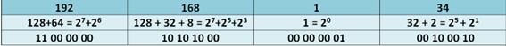
2. Przechodzimy do maski. Zapis skrócony to liczba jedynek. 
/24 -> **11111111.11111111.11111111.00000000**
3. Na końcu mnożymy bitowy zapis adresu i bitowy zapis maski, zapisując adresy jeden pod drugim. Wykonujemy operację AND, czyli jeśli A=1 AND B=1, to A&B=1. W uproszczeniu: jeśli w masce jest 1, to przepisujemy cyfrę z adresu hosta. W pozostałych miejscach wstawiamy 0.
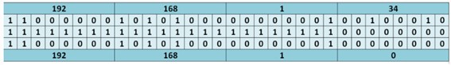

Dla adresu i maski 192.168.1.34/24, adresem sieci będzie **192.168.1.0/24**

**Wyliczanie adresu rozgłoszeniowego:**

Aby obliczyć adres rozgłoszeniowy, musimy pomnożyć adres hosta rozpisany binarnie przez maskę, a następnie w miejscach, gdzie w masce występują 0, umieszczamy 1.

Dla adresu i maski 192.168.1.34/24, adresem rozgłoszeniowym będzie **192.168.1.255/24**

**IPv6**

IPv6 (Internet Protocol version 6) to protokół sieciowy nowej generacji, który zastępuje IPv4, przede wszystkim z powodu wyczerpania dostępnych adresów w starszym protokole. Adres IPv6 ma długość **128 bitów**, co pozwala na utworzenie ogromnej liczby unikalnych adresów. Adres zapisywany jest w postaci **ósemek szesnastkowych oddzielonych dwukropkami**, np.: 2001:0db8:85a3:0000:0000:8a2e:0370:7334. Dla uproszczenia długie ciągi zer można skracać, np. 2001:db8:85a3::8a2e:370:7334.


## 14. System DNS
**Odpowiedź:**

System DNS (Domain Name System) jest **hierarchicznym** i rozproszonym systemem, którego głównym zadaniem jest tłumaczenie nazw domenowych na adresy IP. Czyli my w przeglądarkę wpisujemy www.google.com, a DNS tłumaczy to np. na 142.250.186.100. 

Struktura usługi DNS ma postać odwróconego drzewa, gdzie na szczycie znajdują się serwery główne, tak zwane **Root Servers**, reprezentowane przez znak kropki, której my nie widzimy, chociaż faktycznie ona tam jest, a poniżej serwery dla poszczególnych domen. Domeny **drugiego poziomu** to domeny typu com, pl, org czy też gov. Dalej mamy **domeny trzeciego** poziomu czyli wp.pl, microsoft.com itd. Następne w hierarchii są domeny typu poczta.wp.pl czy netacad.cisco.com. **Serwery autorytatywne** to lokalne serwery przechowujące aktualne informacje na temat urządzeń w danej domenie

Podsumowując, mamy serwery domeny głównej i serwery autorytatywne. Klientem systemu DNS jest usługa systemowa zwana **resolver**, która implementowana jest w każdym systemie operacyjnym. To ona odpowiedzialna jest za komunikację z serwerem DNS.

Ważnym elementem działania systemu DNS jest **buforowanie** odpowiedzi. Raz rozwiązana nazwa domenowa jest przechowywana tymczasowo w pamięci podręcznej, co przyspiesza kolejne zapytania i zmniejsza obciążenie sieci.

Rodzaje zapytań DNS możemy podzielić na:
- **rekurencyjne** - wymuszają na serwerze odnalezienie informacji na temat danej domeny lub przesłanie komunikatu o błędzie
- **iteracyjne** - nie wymuszają łączenia się z innymi serwerami DNS, gdy serwer nie zna adresu IP domeny — w takim przypadku prezentują one najlepszą odpowiedź, jaką w danej chwili posiadają.

---

# Bazy danych

## 15. Klucze główne, klucze obce w bazach danych
**Odpowiedź:**

**Klucz główny** (primary key) to atrybut lub zestaw atrybutów, który **jednoznacznie identyfikuje** każdy rekord w tabeli bazy danych. Wartości klucza głównego muszą być **unikalne** i nie mogą przyjmować wartości pustych (NULL). Dzięki temu możliwe jest szybkie i jednoznaczne odwołanie się do konkretnego rekordu. Każda tabela może posiadać **tylko jeden** klucz główny, ale może on składać się z kilku kolumn. Klucz główny powinien być stabilny, czyli jego wartość nie powinna ulegać zmianie w czasie.

**Klucz obcy** (foreign key) to atrybut w jednej tabeli, który odwołuje się do klucza głównego w innej tabeli. Służy do tworzenia relacji między tabelami i zapewnia spójność danych w bazie. Dzięki kluczom obcym możliwe jest odwzorowanie powiązań logicznych, np. przypisanie zamówienia do konkretnego użytkownika. Klucz obcy wymusza integralność referencyjną – oznacza to, że nie można wprowadzić wartości, która nie istnieje w tabeli nadrzędnej. Na przykład, jeżeli w tabeli „Zamówienia” pole „id_uzytkownika” jest kluczem obcym, to jego wartość musi odpowiadać istniejącemu „id_uzytkownika” w tabeli „Użytkownicy”.

Stosowanie kluczy głównych i obcych pozwala utrzymać porządek i integralność danych, eliminuje duplikaty oraz umożliwia łatwe łączenie informacji z wielu tabel za pomocą zapytań SQL. Dzięki nim baza danych staje się spójnym systemem powiązanych ze sobą elementów.

## 16. Diagram związków encji
**Odpowiedź:**

**Diagram związków encji** (ERD – Entity Relationship Diagram) - graficzne narzędzie służące do projektowania baz danych. Dzięki ERD można zobaczyć, jakie informacje będą przechowywane w bazie oraz jak będą ze sobą powiązane. Przedstawia on:
- **encje** - obiekty, o których gromadzimy dane
- **atrybuty** - cechy encji
- **związki** - relacje między encjami

**Encje** oznacza się prostokątami. Są to obiekty takie jak np. Klient, Produkt, Zamówienie. Każda encja ma swoje **atrybuty**, czyli dane opisujące jej właściwości. Przykładowo, encja Klient może mieć atrybuty: id_klienta, imię, nazwisko, e-mail, telefon. Wśród atrybutów wyróżnia się **klucz główny**, czyli pole jednoznacznie identyfikujące każdy rekord w tabeli.

**Związki (relacje)** oznacza się rombami lub samymi liniami. Pokazują one powiązania między encjami. Np. Klient – „składa” → Zamówienie albo Zamówienie – „zawiera” → Produkt. 

Przy relacjach podaje się **krotności (liczebności)**:
- 1:1 (jeden do jednego) – np. jeden użytkownik ma jeden profil
- 1:N (jeden do wielu) – np. jeden klient może złożyć wiele zamówień, ale każde zamówienie należy do jednego klienta
- N:1 (wiele do jednego) - np. wiele pracowników może pracować w jednym dziale, ale każdy pracownik należy do jednego działu.
- M:N (wiele do wielu) – np. zamówienie może zawierać wiele produktów, a produkt może wystąpić w wielu zamówieniach

W przypadku relacji wiele do wielu (M:N) w praktyce stosuje się dodatkową encję pośredniczącą, np. „Pozycja_zamówienia”, która łączy Zamówienie i Produkt i przechowuje m.in. liczbę sztuk danego produktu w danym zamówieniu.


## 17. Język baz danych SQL. Podjęzyki DDL, DML, DCL
**Odpowiedź:**
**SQL (Structured Query Language)** to podstawowy język do pracy z relacyjnymi bazami danych. Umożliwia tworzenie, modyfikowanie, odpytywanie oraz kontrolę dostępu do danych. SQL dzieli się na różne podjęzyki, czyli grupy poleceń, które pełnią konkretne funkcje.

Najważniejsze z nich to:​

**1. DDL (Data Definition Language) – Język definicji danych.**
  <br>Służy do definiowania i modyfikowania struktury bazy danych: <br>czyli do tworzenia, zmieniania i usuwania obiektów takich jak tabele, bazy, indeksy.
   - **Najczęstsze polecenia:**
    
      * `CREATE` – tworzy nowe obiekty (np. tabelę, bazę)
    
      * `ALTER` – zmienia istniejącą strukturę (np. dodaje kolumnę)
    
      * `DROP` – usuwa obiekty
  
   - **Przykład:**
      ```
      CREATE TABLE pracownicy (
      id INT, imie VARCHAR(100), nazwisko VARCHAR(100)
     );
     ```
     To polecenie tworzy nową tabelę "pracownicy" z trzema kolumnami.

**2. DML (Data Manipulation Language) – Język manipulacji danymi.**
   <br>Pozwala na operacje na danych zapisanych już w tabelach – dodawanie, modyfikowanie, usuwanie.
  
  - **Najczęstsze polecenia:**
      
     * `INSERT` – dodaje nowe rekordy
      
     * `UPDATE` – aktualizuje istniejące rekordy
      
      * `DELETE` – usuwa rekordy
      
  - **Przykład:**
    ```
    INSERT INTO pracownicy (id, imie, nazwisko) VALUES (1, 'Adam', 'Nowak');
    UPDATE pracownicy SET imie = 'Jan' WHERE id = 1;
    DELETE FROM pracownicy WHERE id = 1;
    ```

**3. DCL (Data Control Language) – Język kontroli nad danymi**
  - **Pozwala kontrolować dostęp do danych i obiektów w bazie** – czyli kto i co może zrobić.
  - **Najczęstsze polecenia:**
    
    - `GRANT` – nadaje uprawnienia
      
    - `REVOKE` – odbiera uprawnienia
  - **Przykład:**
    ```
    GRANT SELECT ON pracownicy TO uzytkownik;
    REVOKE SELECT ON pracownicy FROM uzytkownik;
    ```

## 18. Instrukcja SELECT, łączenie danych z wielu tabel
**Odpowiedź:**
Polecenie SELECT służy do pobierania danych z tabel w bazie danych. <br>To podstawowa komenda w SQL i należy do podjęzyka DQL (Data Query Language), który jest częścią DML.<br>
**Składnia podstawowa**
```
SELECT kolumny
FROM nazwa_tabeli
[WHERE warunki]
[ORDER BY kolumna [ASC | DESC]];
```

**Przykład**
```
SELECT imie, nazwisko, placa
FROM pracownicy
WHERE placa > 1000
ORDER BY nazwisko ASC;
```

**Opis:** zapytanie wybiera kolumny imie, nazwisko i placa z tabeli pracownicy, dla osób zarabiających więcej niż 1000, i sortuje wyniki rosnąco według nazwiska.

**Działanie klauzul:**
- `SELECT` – określa, które kolumny ma zwrócić zapytanie.

- `FROM` – wskazuje, z której tabeli dane mają pochodzić.

- `WHERE` – pozwala filtrować rekordy wg warunków logicznych (np. placa > 1000).

- `ORDER BY` – sortuje wynik według wybranych kolumn (rosnąco ASC lub malejąco DESC).

**2.Łączenie danych z wielu tabel — JOIN**

W relacyjnych bazach danych informacje są często podzielone między różne tabele. Aby uzyskać dane z kilku tabel jednocześnie, używamy **łączenia tabel (JOIN).**

**Typy łączeń (JOIN)**
**a) INNER JOIN** — łączenie wewnętrzne
Zwraca tylko te wiersze, które mają dopasowanie w obu tabelach.
```
SELECT pracownicy.imie, dzialy.nazwa
FROM pracownicy
INNER JOIN dzialy ON pracownicy.id_dzialu = dzialy.id_dzialu;
```

**Opis:** pokazuje imię pracownika i nazwę działu tylko wtedy, gdy istnieje dopasowanie w obu tabelach.

**b) LEFT JOIN — łączenie z lewej tabeli**
Zwraca wszystkie rekordy z lewej tabeli, nawet jeśli nie ma dopasowania w prawej.
```SELECT pracownicy.imie, dzialy.nazwa
FROM pracownicy
LEFT JOIN dzialy ON pracownicy.id_dzialu = dzialy.id_dzialu;
```

**Opis:** pokaże wszystkich pracowników, nawet jeśli nie mają przypisanego działu.

**c) RIGHT JOIN — łączenie z prawej tabeli**
Zwraca wszystkie rekordy z prawej tabeli, nawet bez dopasowania w lewej.
```
SELECT pracownicy.imie, dzialy.nazwa
FROM pracownicy
RIGHT JOIN dzialy ON pracownicy.id_dzialu = dzialy.id_dzialu;
```

**Opis:** pokaże wszystkie działy – także te, w których nie ma pracowników.

**d) FULL JOIN — pełne łączenie**
Zwraca wszystkie rekordy z obu tabel, niezależnie od dopasowania.
```
SELECT pracownicy.imie, dzialy.nazwa
FROM pracownicy
FULL JOIN dzialy ON pracownicy.id_dzialu = dzialy.id_dzialu;
```

**3. Aliasowanie i filtrowanie po JOIN**
Aby uprościć kod, można używać aliasów:

```
SELECT p.imie, d.nazwa
FROM pracownicy AS p
JOIN dzialy AS d ON p.id_dzialu = d.id_dzialu
WHERE d.nazwa = 'Sprzedaż';
```

**Opis:** zwraca imiona pracowników, którzy pracują w dziale „Sprzedaż”.


---

# Podstawy elektroniki i miernictwo elektroniczne

## 19. Diody półprzewodnikowe. Tranzystory
**Odpowiedź:**
**Diody półprzewodnikowe**
  - **Budowa i działanie:** Dioda składa się z dwóch warstw półprzewodników: typu P (z nadmiarem dziur – dodatnich nośników ładunku) i typu N (z nadmiarem elektronów – ujemnych nośników ładunku). Obszar styku tych warstw tworzy złącze P-N. Dioda ma dwa     wyprowadzenia: anodę (A, po stronie P) i katodę (K, po stronie N).​

  - Prąd płynie przez diodę tylko w jednym kierunku — gdy anoda jest podłączona do wyższego potencjału niż katoda (kierunek przewodzenia). W przeciwną stronę (kierunek zaporowy) dioda blokuje przepływ prądu.

  - Typy diod:
  
    - Prostownicze — do zamiany prądu przemiennego (AC) na stały (DC)
  
    - Zenera — stabilizują napięcie
  
    - LED (elektroluminescencyjne) — źródła światła
  
    - Fotodiody — czujniki światła
  
    - Schottky’ego, tunelowe, varikapy, detekcyjne itp
      
  - **Zastosowanie:** Prostowniki, układy zabezpieczające, wskaźniki LED, ogniwa fotowoltaiczne, czujniki światła, układy stabilizujące napięcie

**Tranzystory**
  - **Budowa i rodzaje:** Tranzystor jest elementem półprzewodnikowym składającym się z trzech warstw półprzewodników (NPN lub PNP dla tranzystorów bipolarnych; MOSFET, IGBT dla tranzystorów unipolarnych).​
  
  - Zasada działania: Tranzystor działa jak elektroniczny przełącznik lub wzmacniacz. Niewielki prąd (lub napięcie) przyłożony do jednej z elektrod (baza w bipolarnych, bramka w MOSFET) pozwala sterować większym prądem płynącym przez pozostałe elektrody (kolektor-emiter lub dren-źródło).​
  
  - **Zastosowanie:** Wzmacniacze sygnałów, układy przełączające, zasilacze, generatory, regulatory napięcia, sterowniki silników, układy cyfrowe (podstawa działania komputerów i mikroprocesorów).

## 20. Układy scalone, impulsowe, cyfrowe
**Odpowiedź:**
**Układy scalone**
- **Definicja: Układ scalony (IC – Integrated Circuit)** to miniaturowy obwód elektroniczny, w którym na jednej płytce półprzewodnika (zwykle z krzemu) zintegrowano tysiące, a nawet miliardy elementów takich jak tranzystory, rezystory, diody i kondensatory.​

- **Budowa:** Wszystkie elementy są na stałe umieszczone i połączone wewnątrz mikrochipu, który następnie zostaje zamknięty w obudowie z metalowymi wyprowadzeniami (pinami), np. typu DIP, SOIC, QFP lub QFN.​

- **Podział ze względu na konstrukcję:**

   - Monolityczne – wszystkie elementy wykonane są w jednym monokrysztale półprzewodnika.
    
   - Hybrydowe – wykonane z połączenia kilku warstw i różnych materiałów (np. przewodników i rezystorów).

- **Podział według stopnia integracji:**

   - SSI (Small Scale Integration) – do 100 elementów.
    
   - MSI (Medium Scale Integration) – do 1000 elementów.
    
   - LSI, VLSI, ULSI – tysiące do miliardów elementów w jednym układzie (np. mikroprocesory).​
 
**Układy impulsowe**
- **Charakterystyka:** Układy impulsowe działają na zasadzie przetwarzania sygnałów elektrycznych mających postać impulsów, czyli krótkich zmian napięcia w czasie. Sygnały te mogą być wykorzystywane do sterowania, modulacji lub generowania częstotliwości.​

- **Działanie:** Ich zadaniem jest zamiana sygnałów ciągłych (analogowych) na serię impulsów lub odwrotnie. Wykorzystują elementy takie jak tranzystory, diody, kondensatory i specjalne układy scalone przystosowane do pracy impulsowej.​

- **Zastosowanie:**

   - generatory i przetwornice,
    
   - układy czasowe (np. 555 Timer),
    
   - zasilacze impulsowe (SMPS),
    
   - modulatory i demodulatory w systemach telekomunikacyjnych.

**Układy cyfrowe**
- **Charakterystyka:** Układy cyfrowe przetwarzają sygnały binarne – czyli mają tylko dwa stany: 0 (niski poziom napięcia) i 1 (wysoki poziom). Działają na zasadach logiki Boole’a.​

- **Elementy podstawowe:**

   - bramki logiczne (AND, OR, NOT, NAND, NOR),
    
   - przerzutniki (flip-flops),
    
   - liczniki, rejestry, multipleksery.

- **Rodzaje technologii:**
    
   - TTL (Transistor-Transistor Logic),
    
   - CMOS (Complementary Metal-Oxide-Semiconductor) – energooszczędna i powszechnie stosowana w nowoczesnych mikrokontrolerach i procesorach.​

- **Zastosowanie:** w komputerach, mikrokontrolerach, systemach sterowania, pamięciach RAM/ROM, czujnikach cyfrowych i urządzeniach komunikacyjnych.​

## 21. Przetworniki analogowo-cyfrowe i cyfrowo-analogowe
**Odpowiedź:**

Przetworniki analogowo-cyfrowe (ADC) i cyfrowo-analogowe (DAC) to fundamentalne układy elektroniczne, które pełnią rolę interfejsu między światem analogowym a cyfrowym. Umożliwiają one systemom cyfrowym, takim jak komputery i mikrokontrolery, interakcję z rzeczywistymi, ciągłymi sygnałami fizycznymi.

### **Przetwornik analogowo-cyfrowy (ADC)**

**Przetwornik analogowo-cyfrowy (ADC, Analog-to-Digital Converter)** to układ, który zamienia sygnał analogowy (np. napięcie z czujnika) na jego cyfrową, dyskretną reprezentację w postaci liczby binarnej. Dzięki temu możliwe jest przetwarzanie i przechowywanie danych ze świata fizycznego w urządzeniach cyfrowych.

**Zasada działania:** Proces konwersji A/C składa się z trzech głównych etapów:

1.  **Próbkowanie (Sampling):** Polega na mierzeniu wartości sygnału analogowego w regularnych, stałych odstępach czasu. Szybkość tego procesu określa **częstotliwość próbkowania**, wyrażana w hercach (Hz). Zgodnie z twierdzeniem Nyquista-Shannona, aby wiernie odwzorować sygnał, częstotliwość próbkowania musi być co najmniej dwukrotnie większa od najwyższej częstotliwości występującej w sygnale wejściowym.
2.  **Kwantyzacja (Quantization):** To proces, w którym każdej pobranej próbce sygnału przypisywana jest najbliższa wartość z określonego, skończonego zbioru poziomów. Można to porównać do zaokrąglenia wartości do najbliższej dostępnej "działki" na skali.
3.  **Kodowanie (Coding):** Na tym etapie skwantowane wartości są zamieniane na odpowiadające im liczby binarne.

**Kluczowe parametry ADC:**

*   **Rozdzielczość:** Określa dokładność, z jaką sygnał jest przetwarzany. Wyrażana jest w bitach. N-bitowy przetwornik może przedstawić sygnał za pomocą 2^n różnych poziomów. Na przykład, 8-bitowy ADC ma 256 poziomów, a 12-bitowy już 4096. Wyższa rozdzielczość oznacza mniejszy błąd kwantyzacji.
*   **Częstotliwość próbkowania:** Definiuje, jak często pobierane są próbki sygnału. Jest kluczowa w zastosowaniach wymagających monitorowania szybko zmieniających się sygnałów, np. w audio.
*   **Błąd kwantyzacji:** Nieunikniony błąd wynikający z zaokrąglania ciągłych wartości analogowych do dyskretnych poziomów cyfrowych.

### **Przetwornik cyfrowo-analogowy (DAC)**

**Przetwornik cyfrowo-analogowy (DAC, Digital-to-Analog Converter)** realizuje operację odwrotną do ADC. Przekształca sygnał cyfrowy (ciąg liczb binarnych) na proporcjonalny do niego sygnał analogowy, zazwyczaj w postaci napięcia lub prądu.

**Zasada działania:** DAC odbiera dane cyfrowe i na ich podstawie generuje odpowiedni poziom napięcia lub prądu. W praktyce, sygnał wyjściowy ma często postać "schodkową", dlatego zazwyczaj jest wygładzany za pomocą filtra analogowego, aby uzyskać płynny przebieg. Najpopularniejsze konstrukcje DAC opierają się na tzw. drabince rezystorowej R-2R, która jest prosta i efektywna.

**Kluczowe parametry DAC:**

*   **Rozdzielczość:** Podobnie jak w ADC, określa liczbę bitów słowa cyfrowego na wejściu. Im wyższa rozdzielczość, tym więcej poziomów napięcia może wygenerować przetwornik, co przekłada się na większą wierność sygnału analogowego.
*   **Czas ustalania (Settling Time):** Czas potrzebny, aby sygnał wyjściowy osiągnął i ustabilizował się na nowej wartości po zmianie danych wejściowych.
*   **Liniowość:** Parametr określający, jak bardzo rzeczywista charakterystyka przetwornika odbiega od idealnej, liniowej zależności między wartością cyfrową a analogową.

### **Zastosowania przetworników ADC i DAC**

Przetworniki te są wszechobecne we współczesnej elektronice:

*   **Zastosowania ADC:**
    *   **Urządzenia pomiarowe i sensory:** Przetwarzanie sygnałów z czujników temperatury, ciśnienia, światła itp.
    *   **Audio:** Digitalizacja dźwięku z mikrofonów.
    *   **Medycyna:** Urządzenia do EKG, tomografy komputerowe.
    *   **Komunikacja:** Modemy, odbiorniki radiowe.
*   **Zastosowania DAC:**
    *   **Sprzęt audio:** Odtwarzacze CD, karty dźwiękowe, smartfony, gdzie cyfrowe pliki muzyczne (np. MP3) są zamieniane na dźwięk słyszalny w głośnikach lub słuchawkach.
    *   **Wideo:** Karty graficzne do generowania sygnału dla monitorów.
    *   **Automatyka i sterowanie:** Sterowanie silnikami, generatorami funkcyjnymi.
    *   **Telefonia cyfrowa.**

---

# Matematyka dyskretna

## 22. Schematy wyboru i tożsamości kombinatoryczne
**Odpowiedź:**

Kombinatoryka to dział matematyki zajmujący się zliczaniem obiektów o określonych właściwościach. Kluczowe w niej są **schematy wyboru**, które systematyzują sposoby wybierania lub układania elementów ze zbiorów, oraz **tożsamości kombinatoryczne**, czyli równości pozwalające upraszczać skomplikowane wyrażenia związane ze zliczaniem.

### **Schematy wyboru**

Schematy wyboru określają, w jaki sposób możemy tworzyć grupy (podzbiory, ciągi) z elementów danego zbioru. Podstawowe pytania, które pozwalają zidentyfikować odpowiedni schemat, to:
1.  Czy kolejność wybieranych elementów jest istotna?
2.  Czy elementy mogą się powtarzać?
3.  Czy wykorzystujemy wszystkie elementy ze zbioru?

Oto cztery fundamentalne schematy wyboru *k* elementów ze zbioru *n*-elementowego:

#### **1. Wariacje z powtórzeniami**
*   **Charakterystyka:** Tworzymy *k*-elementowe ciągi, w których **kolejność jest ważna**, a elementy **mogą się powtarzać**.
*   **Przykład:** Ile czterocyfrowych kodów PIN można utworzyć z cyfr {0, 1, ..., 9}?
*   **Wzór:**
    $$ W_n^k = n^k $$
    *W naszym przykładzie:* $10^4 = 10000$ możliwych kodów.

#### **2. Wariacje bez powtórzeń**
*   **Charakterystyka:** Tworzymy *k*-elementowe ciągi, w których **kolejność jest ważna**, a elementy **nie mogą się powtarzać**.
*   **Przykład:** Na ile sposobów można wybrać i obsadzić stanowiska przewodniczącego, zastępcy i skarbnika w 20-osobowej klasie?
*   **Wzór:**
    $$ V_n^k = \frac{n!}{(n-k)!} $$
    *W naszym przykładzie:* $V_{20}^3 = \frac{20!}{17!} = 20 \cdot 19 \cdot 18 = 6840$ sposobów.

#### **3. Permutacje**
*   **Charakterystyka:** Jest to szczególny przypadek wariacji bez powtórzeń, gdzie *k = n*. Oznacza to, że tworzymy *n*-elementowe ciągi, wykorzystując **wszystkie elementy** zbioru. **Kolejność jest ważna**, a elementy się **nie powtarzają**.
*   **Przykład:** Na ile sposobów można ustawić 5 osób w kolejce?
*   **Wzór:**
    $$ P_n = n! $$
    *W naszym przykładzie:* $P_5 = 5! = 120$ sposobów.

#### **4. Kombinacje**
*   **Charakterystyka:** Wybieramy *k*-elementowe podzbiory, w których **kolejność nie ma znaczenia**, a elementy **nie mogą się powtarzać**.
*   **Przykład:** Na ile sposobów można wybrać 3-osobową delegację z 20-osobowej klasy?
*   **Wzór (Symbol Newtona):**
    $$ C_n^k = \binom{n}{k} = \frac{n!}{k!(n-k)!} $$
    *W naszym przykładzie:* $C_{20}^3 = \binom{20}{3} = \frac{20!}{3! \cdot 17!} = \frac{18 \cdot 19 \cdot 20}{6} = 1140$ sposobów.

*Istnieją również **kombinacje z powtórzeniami**, gdzie kolejność jest nieistotna, a elementy mogą się powtarzać.*

### **Tożsamości kombinatoryczne**

Tożsamości kombinatoryczne to równości algebraiczne, które można udowodnić, interpretując obie strony równania jako dwa różne sposoby zliczania tych samych obiektów.

#### **1. Tożsamość Pascala (reguła trójkąta Pascala)**
Tożsamość ta stanowi podstawę konstrukcji Trójkąta Pascala, w którym każda liczba (poza skrajnymi jedynkami) jest sumą dwóch liczb znajdujących się bezpośrednio nad nią.
*   **Wzór:**
    $$ \binom{n}{k} = \binom{n-1}{k-1} + \binom{n-1}{k} $$
*   **Interpretacja kombinatoryczna:** Liczba sposobów wyboru *k* osób z *n* jest równa sumie liczby sposobów wyboru, w których wyróżniona osoba jest w delegacji (wtedy dobieramy *k-1* osób z *n-1* pozostałych) oraz liczby sposobów, w których jej nie ma (wtedy wybieramy *k* osób z *n-1* pozostałych).

#### **2. Dwumian Newtona**
Wzór ten pozwala rozpisać potęgę sumy dwóch składników. Współczynniki w rozwinięciu są kolejnymi liczbami z wierszy Trójkąta Pascala.
*   **Wzór:**
    $$ (x+y)^n = \sum_{k=0}^{n} \binom{n}{k} x^{n-k} y^k $$
*   **Przykład dla n=3:**
    $$ (x+y)^3 = \binom{3}{0}x^3y^0 + \binom{3}{1}x^2y^1 + \binom{3}{2}x^1y^2 + \binom{3}{3}x^0y^3 = x^3 + 3x^2y + 3xy^2 + y^3 $$

#### **3. Suma współczynników dwumianowych**
*   **Wzór:**
    $$ \sum_{k=0}^{n} \binom{n}{k} = \binom{n}{0} + \binom{n}{1} + \dots + \binom{n}{n} = 2^n $$
*   **Interpretacja kombinatoryczna:** Lewa strona to suma liczby wszystkich możliwych podzbiorów (pustego, 1-elementowych, 2-elementowych, itd.) zbioru *n*-elementowego. Prawa strona mówi, że dla każdego z *n* elementów mamy dwie możliwości: albo należy on do podzbioru, albo nie. Daje to $2^n$ wszystkich możliwych podzbiorów.

#### **4. Tożsamość Vandermonde'a**
Tożsamość ta jest przydatna przy obliczaniu bardziej złożonych sum.
*   **Wzór:**
    $$ \binom{m+n}{k} = \sum_{r=0}^{k} \binom{m}{r} \binom{n}{k-r} $$
*   **Interpretacja kombinatoryczna:** Wyobraźmy sobie wybór *k*-osobowej delegacji z grupy składającej się z *m* kobiet i *n* mężczyzn. Lewa strona to ogólna liczba sposobów. Prawa strona to suma sposobów wyboru delegacji składającej się z *r* kobiet (wybranych na $\binom{m}{r}$ sposobów) i *k-r* mężczyzn (wybranych na $\binom{n}{k-r}$ sposobów), dla wszystkich możliwych wartości *r*.


## 23. Liniowe równania rekurencyjne
**Odpowiedź:**

**Liniowe równanie rekurencyjne** to równanie, które definiuje ciąg `(a_n)` poprzez wyrażenie n-tego wyrazu ciągu jako liniowej kombinacji jego poprzednich wyrazów. "Rozwiązanie" takiego równania polega na znalezieniu **wzoru jawnego (zamkniętego)**, który pozwala obliczyć `a_n` bezpośrednio na podstawie `n`, bez potrzeby obliczania wszystkich wcześniejszych wyrazów.

Równania te są kluczowe w analizie złożoności obliczeniowej algorytmów rekurencyjnych (np. w strategii "dziel i zwyciężaj"), modelowaniu procesów w biologii, ekonomii i informatyce.

### **Budowa i klasyfikacja**

Ogólna postać liniowego równania rekurencyjnego rzędu *k* o stałych współczynnikach to:
$$ a_n = c_1 a_{n-1} + c_2 a_{n-2} + \dots + c_k a_{n-k} + f(n) $$
gdzie `c_1, c_2, ..., c_k` są stałymi.

Równania te dzielimy na dwa główne typy:

1.  **Jednorodne (homogeneous):** gdy `f(n) = 0`. Wyraz `a_n` zależy wyłącznie od swoich poprzedników.
    *   *Przykład (ciąg Fibonacciego):* `F_n = F_{n-1} + F_{n-2}`

2.  **Niejednorodne (non-homogeneous):** gdy `f(n) ≠ 0`. Występuje dodatkowa funkcja zależna od `n`.
    *   *Przykład:* `a_n = 3a_{n-1} + 2n`

Do pełnego zdefiniowania ciągu potrzebne są również **warunki początkowe**, czyli wartości kilku pierwszych wyrazów (np. `a_0`, `a_1`, ..., `a_{k-1}`).

### **Metoda rozwiązywania równań jednorodnych**

Proces znajdowania wzoru jawnego dla równania jednorodnego przebiega w czterech krokach:

**Krok 1: Stworzenie równania charakterystycznego**
Z równania rekurencyjnego `a_n - c_1 a_{n-1} - \dots - c_k a_{n-k} = 0` tworzymy wielomian, zastępując `a_{n-i}` potęgą `r^{k-i}`. Dla równania rzędu 2, `a_n = c_1 a_{n-1} + c_2 a_{n-2}`, równanie charakterystyczne ma postać:
$$ r^2 - c_1 r - c_2 = 0 $$

**Krok 2: Znalezienie pierwiastków równania charakterystycznego**
Rozwiązujemy powyższe równanie kwadratowe (lub wielomian wyższego stopnia), aby znaleźć jego pierwiastki `r_1, r_2, ...`.

**Krok 3: Zapisanie rozwiązania ogólnego**
Postać rozwiązania ogólnego zależy od natury pierwiastków:
*   **Dwa różne pierwiastki rzeczywiste (`r_1 ≠ r_2`):**
    Rozwiązanie ogólne ma postać: `a_n = A \cdot r_1^n + B \cdot r_2^n`
*   **Jeden pierwiastek rzeczywisty podwójny (`r_1 = r_2 = r`):**
    Rozwiązanie ogólne ma postać: `a_n = (A \cdot n + B) \cdot r^n`

**Krok 4: Wyznaczenie stałych `A` i `B` na podstawie warunków początkowych**
Podstawiamy warunki początkowe (np. wartości `a_0` i `a_1`) do wzoru ogólnego, tworząc układ równań, z którego obliczamy konkretne wartości stałych `A` i `B`.

---
**Przykład: Rozwiązanie ciągu Fibonacciego**

*   Równanie: `F_n = F_{n-1} + F_{n-2}`
*   Warunki początkowe: `F_0 = 0`, `F_1 = 1`

1.  **Równanie charakterystyczne:** `r^2 - r - 1 = 0`
2.  **Pierwiastki:**
    $$ r_1 = \frac{1+\sqrt{5}}{2} \quad (\text{złota liczba}, \phi) $$
    $$ r_2 = \frac{1-\sqrt{5}}{2} \quad (\psi) $$
3.  **Rozwiązanie ogólne:**
    $$ F_n = A \cdot \left(\frac{1+\sqrt{5}}{2}\right)^n + B \cdot \left(\frac{1-\sqrt{5}}{2}\right)^n $$
4.  **Wyznaczenie stałych:**
    *   Dla `n=0`: `A + B = 0 \implies B = -A`
    *   Dla `n=1`: `A \cdot \frac{1+\sqrt{5}}{2} + B \cdot \frac{1-\sqrt{5}}{2} = 1`
    *   Po rozwiązaniu układu równań otrzymujemy: `A = \frac{1}{\sqrt{5}}` i `B = -\frac{1}{\sqrt{5}}`

Ostateczny **wzór jawny (wzór Bineta)** to:
$$ F_n = \frac{1}{\sqrt{5}} \left( \left(\frac{1+\sqrt{5}}{2}\right)^n - \left(\frac{1-\sqrt{5}}{2}\right)^n \right) $$
---

### **Równania niejednorodne**

Rozwiązanie ogólne równania niejednorodnego `a_n` jest sumą dwóch składników:
$$ a_n = a_n^{(h)} + a_n^{(p)} $$
gdzie:
*   `a_n^{(h)}` to rozwiązanie ogólne **odpowiadającego mu równania jednorodnego** (znajdowane metodą opisaną powyżej).
*   `a_n^{(p)}` to tzw. **rozwiązanie szczególne**, które "zgadujemy" na podstawie postaci funkcji `f(n)`. Najczęściej stosuje się **metodę współczynników nieoznaczonych**, gdzie przewidywana postać `a_n^{(p)}` jest podobna do `f(n)` (np. jeśli `f(n)` jest wielomianem, przewidujemy wielomian; jeśli funkcją wykładniczą, przewidujemy funkcję wykładniczą).

## 24. Grafy i ich własności
**Odpowiedź:**

**Graf** jest fundamentalną strukturą matematyczną i informatyczną służącą do modelowania relacji między obiektami. Formalnie, graf `G` definiuje się jako parę `(V, E)`, gdzie:
*   `V` (ang. *vertices*) to zbiór **wierzchołków** (obiektów).
*   `E` (ang. *edges*) to zbiór **krawędzi**, czyli par wierzchołków, które reprezentują relacje między nimi.

### **Podstawowe pojęcia i terminologia**

*   **Wierzchołek (węzeł):** Podstawowy element grafu, reprezentujący obiekt.
*   **Krawędź:** Połączenie między dwoma wierzchołkami. Może być **skierowana** (uporządkowana para, `(u, v)`) lub **nieskierowana** (nieuporządkowany zbiór, `{u, v}`).
*   **Sąsiedztwo:** Dwa wierzchołki są **sąsiednie**, jeśli łączy je krawędź.
*   **Stopień wierzchołka (`deg(v)`):** Liczba krawędzi połączonych z danym wierzchołkiem.
    *   W grafach skierowanych rozróżniamy **stopień wejściowy** (*in-degree*) i **wyjściowy** (*out-degree*).
*   **Pętla:** Krawędź łącząca wierzchołek z samym sobą.
*   **Ścieżka:** Sekwencja wierzchołków, w której każde dwa kolejne są połączone krawędzią. **Długość ścieżki** to liczba jej krawędzi.
*   **Cykl:** Ścieżka, która zaczyna się i kończy w tym samym wierzchołku, a jej wierzchołki (poza początkowym/końcowym) się nie powtarzają.

### **Rodzaje grafów**

Grafy klasyfikujemy na podstawie właściwości ich krawędzi i struktury:

| Kryterium | Rodzaj | Opis |
| :--- | :--- | :--- |
| **Kierunek krawędzi** | **Nieskierowany** | Krawędzie są dwukierunkowe (relacja symetryczna, np. znajomość na Facebooku). |
| | **Skierowany (Digraf)**| Krawędzie mają określony kierunek (relacja niesymetryczna, np. obserwowanie na Twitterze). |
| **Wagi krawędzi** | **Nieważony** | Wszystkie krawędzie są równoważne. |
| | **Ważony** | Każda krawędź ma przypisaną wartość (wagę, koszt, odległość), np. mapa drogowa z odległościami. |
| **Struktura** | **Prosty** | Nie zawiera pętli ani krawędzi wielokrotnych między tymi samymi wierzchołkami. |
| | **Spójny** | Istnieje ścieżka między każdą parą wierzchołków (w grafach skierowanych mówimy o **silnej spójności**). |
| | **Acykliczny** | Nie zawiera żadnych cykli. Skierowany Graf Acykliczny (DAG) jest kluczowy w modelowaniu zależności. |
| | **Pełny (Klika)** | Każdy wierzchołek jest połączony z każdym innym. Graf pełny o *n* wierzchołkach oznaczamy `K_n`. |
| | **Dwudzielny** | Zbiór wierzchołków można podzielić na dwa rozłączne podzbiory tak, że krawędzie istnieją tylko *między* tymi podzbiorami. |
| | **Drzewo** | Spójny graf acykliczny. **Las** to zbiór rozłącznych drzew. |

### **Reprezentacja grafów w informatyce**

Istnieją dwie główne metody przechowywania struktury grafu w pamięci komputera:

1.  **Macierz sąsiedztwa (Adjacency Matrix):**
    *   Kwadratowa macierz `A` o wymiarach `|V| x |V|`.
    *   `A[i][j] = 1` (lub waga), jeśli istnieje krawędź od wierzchołka *i* do *j*. W przeciwnym razie `A[i][j] = 0`.
    *   **Zalety:** Szybkie sprawdzanie istnienia krawędzi (złożoność `O(1)`).
    *   **Wady:** Duże zużycie pamięci (`O(|V|^2)`), nieefektywne dla grafów rzadkich (mało krawędzi).

2.  **Lista sąsiedztwa (Adjacency List):**
    *   Tablica, w której dla każdego wierzchołka *i* przechowujemy listę jego sąsiadów.
    *   **Zalety:** Oszczędność pamięci (`O(|V| + |E|)`), idealna dla grafów rzadkich.
    *   **Wady:** Wolniejsze sprawdzanie istnienia krawędzi (w pesymistycznym przypadku `O(deg(v))`).

### **Ważne własności i twierdzenia**

1.  **Lemat o uściskach dłoni:** Suma stopni wszystkich wierzchołków w grafie jest równa podwojonej liczbie jego krawędzi:
    $$ \sum_{v \in V} \text{deg}(v) = 2|E| $$
    *Wynika z faktu, że każda krawędź "dodaje" po jednym stopniu do dwóch wierzchołków, które łączy.*
    *   **Wniosek:** Liczba wierzchołków o nieparzystym stopniu musi być parzysta.

2.  **Własności drzew:** Drzewo o *n* wierzchołkach zawsze posiada dokładnie *n-1* krawędzi. Dodanie dowolnej krawędzi do drzewa tworzy cykl.

3.  **Grafy eulerowskie i hamiltonowskie:**
    *   **Cykl Eulera:** Cykl, który przechodzi przez **każdą krawędź** grafu dokładnie raz.
        *   **Warunek istnienia:** Graf musi być spójny, a każdy jego wierzchołek musi mieć **parzysty stopień**.
    *   **Cykl Hamiltona:** Cykl, który przechodzi przez **każdy wierzchołek** grafu dokładnie raz.
        *   **Brak prostego warunku:** Znalezienie cyklu Hamiltona jest problemem NP-zupełnym, co oznacza, że nie są znane efektywne algorytmy jego rozwiązywania.

4.  **Grafy planarne:** Graf, który można narysować na płaszczyźnie tak, aby jego krawędzie nie przecinały się poza wierzchołkami.
    *   **Wzór Eulera dla grafów planarnych:** `V - E + F = 2`, gdzie `V` to liczba wierzchołków, `E` - krawędzi, a `F` - ścian (obszarów wydzielonych przez krawędzie, wliczając obszar zewnętrzny).

---

# Programowanie strukturalne

## 25. Typy zmiennych w językach programowania
### 1. Typy podstawowe (prymitywne)

**Typy numeryczne:**
- **Liczby całkowite (int, long, short, byte)** - przechowują liczby bez części dziesiętnej
  - Przykład: `int wiek = 25;` (Java/C#)
  - Zakres zależy od rozmiaru typu (np. int: -2,147,483,648 do 2,147,483,647)

- **Liczby zmiennoprzecinkowe (float, double)** - reprezentują liczby rzeczywiste
  - `float cena = 19.99f;` - pojedyncza precyzja (32 bity)
  - `double pi = 3.14159265359;` - podwójna precyzja (64 bity)

**Typy znakowe:**
- **char** - pojedynczy znak Unicode
  - Przykład: `char litera = 'A';`

**Typy logiczne:**
- **boolean/bool** - przechowuje wartości prawda/fałsz
  - Przykład: `boolean czyDorosly = true;`

### 2. Typy złożone (referencyjne)

**Tablice:**
- Kolekcje elementów tego samego typu
- `int[] liczby = {1, 2, 3, 4, 5};`

**Łańcuchy znaków (String):**
- Sekwencje znaków
- `String imie = "Jan";`

**Obiekty i klasy:**
- Definiowane przez użytkownika struktury danych
- `Osoba jan = new Osoba("Jan", "Kowalski");`

### Systemy typowania

#### Typowanie statyczne vs dynamiczne

**Typowanie statyczne** (Java, C++, C#):
```java
int liczba = 10;        // typ określony w czasie kompilacji
// liczba = "tekst";    // błąd kompilacji!
```

**Typowanie dynamiczne** (Python, JavaScript):
```python
liczba = 10           # typ określony w czasie wykonania
liczba = "tekst"      # możliwe przypisanie innego typu
```

#### Typowanie silne vs słabe

**Typowanie silne** - brak automatycznych konwersji między niezgodnymi typami:
```python
# Python - typowanie silne
age = 25
name = "Jan"
# result = age + name  # TypeError!
```

**Typowanie słabe** - automatyczne konwersje typów:
```javascript
// JavaScript - typowanie słabe
let age = 25;
let name = "Jan";
let result = age + name;  // "25Jan" - automatyczna konwersja
```

### Konwersje typów

#### Konwersja jawna (rzutowanie)
```java
// Java
double d = 9.78;
int i = (int) d;           // i = 9 (utrata precyzji)
```

#### Konwersja niejawna (automatyczna)
```java
// Java
int i = 42;
double d = i;              // automatyczna konwersja int -> double

```


## 26. Rodzaje pętli

Pętle są fundamentalnymi strukturami kontrolnymi w programowaniu, które pozwalają na wielokrotne wykonywanie bloków kodu. Główne rodzaje pętli to:

### 1. Pętla `for` (licznikowa)
Używana gdy znamy liczbę iteracji lub chcemy iterować po kolekcji.

**Java/C++/C#:**
```java
// Klasyczna pętla for
for (int i = 0; i < 10; i++) {
    System.out.println(i);
}

// Enhanced for (foreach)
int[] tablica = {1, 2, 3, 4, 5};
for (int element : tablica) {
    System.out.println(element);
}
```

**Python:**
```python
# Pętla for z range
for i in range(10):
    print(i)

# Iteracja po kolekcji
lista = [1, 2, 3, 4, 5]
for element in lista:
    print(element)
```

### 2. Pętla `while` (z warunkiem na początku)
Wykonuje się dopóki warunek jest prawdziwy. Sprawdza warunek przed każdą iteracją.

```java
int i = 0;
while (i < 10) {
    System.out.println(i);
    i++;
}
```

```python
i = 0
while i < 10:
    print(i)
    i += 1
```

### 3. Pętla `do-while` (z warunkiem na końcu)
Wykonuje się co najmniej raz, sprawdza warunek po każdej iteracji.

**Java/C++:**
```java
int i = 0;
do {
    System.out.println(i);
    i++;
} while (i < 10);
```

**Python** (brak natywnej pętli do-while, symulacja):
```python
i = 0
while True:
    print(i)
    i += 1
    if i >= 10:
        break
```

### 4. Pętle nieskończone
```java
// Java
while (true) {
    // kod
    if (warunek) break;
}

for (;;) {
    // kod
    if (warunek) break;
}
```

```python
# Python
while True:
    # kod
    if warunek:
        break
```

### 5. Pętle zagnieżdżone
```java
for (int i = 0; i < 3; i++) {
    for (int j = 0; j < 3; j++) {
        System.out.println("i=" + i + ", j=" + j);
    }
}
```

### Instrukcje kontrolne w pętlach:

**`break`** - przerywa wykonanie pętli:
```java
for (int i = 0; i < 10; i++) {
    if (i == 5) break;
    System.out.println(i);  // wypisze 0,1,2,3,4
}
```

**`continue`** - przechodzi do następnej iteracji:
```java
for (int i = 0; i < 10; i++) {
    if (i % 2 == 0) continue;
    System.out.println(i);  // wypisze tylko nieparzyste: 1,3,5,7,9
}
```

### Wybór odpowiedniej pętli:

- **`for`** - gdy znamy liczbę iteracji lub iterujemy po kolekcji
- **`while`** - gdy nie znamy liczby iteracji, ale mamy jasny warunek zakończenia
- **`do-while`** - gdy chcemy wykonać kod co najmniej raz przed sprawdzeniem warunku

### Przykłady praktyczne:

**Obliczanie sumy elementów tablicy:**
```java
int[] liczby = {1, 2, 3, 4, 5};
int suma = 0;
for (int liczba : liczby) {
    suma += liczba;
}
```

**Wyszukiwanie elementu:**
```java
boolean znaleziono = false;
int szukana = 3;
int i = 0;
while (i < tablica.length && !znaleziono) {
    if (tablica[i] == szukana) {
        znaleziono = true;
    }
    i++;
}
```

Pętle są kluczowym narzędziem w programowaniu, pozwalającym na efektywne przetwarzanie danych i automatyzację powtarzalnych operacji.

## 27. Zmienne typu adresowego (wskaźniki). Zastosowanie w wybranym języku programowania
**Odpowiedź:**
### 1. Pojęcie wskaźnika

**Wskaźnik (ang. pointer)** to zmienna, która **przechowuje adres pamięci innej zmiennej**.  
Dzięki wskaźnikom możemy bezpośrednio manipulować danymi w pamięci komputera.

Wskaźniki są szeroko używane w językach takich jak **C** i **C++**, natomiast w nowoczesnych językach (Java, C#, Python) stosuje się **referencje** lub **obiekty**, które działają w podobny sposób, ale są bezpieczniejsze i automatycznie zarządzane przez środowisko uruchomieniowe.

---

### 2. Wskaźniki w języku C/C++

#### Deklaracja i inicjalizacja wskaźnika
```cpp
int liczba = 10;      // zwykła zmienna
int* wsk = &liczba;   // wskaźnik przechowujący adres zmiennej liczba
```

#### Dostęp do wartości przez wskaźnik
```cpp
cout << *wsk;   // wyświetli wartość zmiennej liczba (czyli 10)
```

#### Zmiana wartości przez wskaźnik
```cpp
*wsk = 20;      // zmienia wartość zmiennej liczba na 20
```

#### Wskaźnik pusty (nullptr)
```cpp
int* p = nullptr;  // wskaźnik nie wskazuje na żaden adres
```

---

### 3. Operacje na wskaźnikach

- **Operator `&`** – zwraca adres zmiennej  
  `int* p = &x;`

- **Operator `*`** – dereferencja, czyli dostęp do wartości pod danym adresem  
  `cout << *p;`

- **Arytmetyka wskaźników** – przesuwanie wskaźnika po elementach tablicy  
  ```cpp
  int tab[3] = {1, 2, 3};
  int* p = tab;
  cout << *(p + 1); // wypisze 2
  ```

---

### 4. Zastosowanie wskaźników

- **Dynamiczna alokacja pamięci**
  ```cpp
  int* dane = new int[5]; // dynamiczna tablica
  delete[] dane;          // zwolnienie pamięci
  ```

- **Przekazywanie danych do funkcji przez adres**
  (umożliwia modyfikację oryginalnej zmiennej)
  ```cpp
  void zwieksz(int* x) {
      (*x)++;
  }

  int liczba = 5;
  zwieksz(&liczba);
  // liczba = 6
  ```

- **Struktury danych (listy, drzewa, grafy)** – używają wskaźników do łączenia elementów  
- **Interakcja z niskopoziomową pamięcią (np. w systemach embedded)**

---

### 5. Referencje i wskaźniki w nowoczesnych językach

**Java / C#**
- Nie udostępniają bezpośrednich wskaźników (dla bezpieczeństwa).
- Zmienne obiektowe to **referencje** – działają podobnie jak bezpieczne wskaźniki:
  ```java
  String a = "Ala";
  String b = a;    // b wskazuje na ten sam obiekt co a
  ```

**Python**
- Wszystko jest przekazywane przez referencję (adres obiektu w pamięci):
  ```python
  lista1 = [1, 2, 3]
  lista2 = lista1
  lista2.append(4)
  print(lista1)   # [1, 2, 3, 4]
  ```

---

## 28. Funkcje. Przekazywanie parametrów przez wartość i referencję
**Odpowiedź:**
### 1. Funkcja – pojęcie

**Funkcja** to blok kodu wykonujący określone zadanie, który można wywołać wielokrotnie z różnymi argumentami.  
Pozwala na **modularność**, **czytelność** i **wielokrotne użycie kodu**.

---

### 2. Budowa funkcji (C++ przykład)
```cpp
int dodaj(int a, int b) {   // nagłówek funkcji
    return a + b;           // ciało funkcji
}
```

Wywołanie:
```cpp
int wynik = dodaj(3, 4);   // wynik = 7
```

---

### 3. Przekazywanie parametrów

#### a) **Przez wartość**
- Do funkcji przekazywana jest **kopiowana wartość** argumentu.  
- Oryginalna zmienna nie ulega zmianie.

```cpp
void zwieksz(int x) {
    x++;
}

int liczba = 5;
zwieksz(liczba);
cout << liczba; // wynik: 5 (bez zmian)
```

#### b) **Przez referencję (lub wskaźnik)**
- Funkcja otrzymuje **adres zmiennej** – modyfikacje dotyczą oryginału.

**Przez referencję:**
```cpp
void zwieksz(int& x) {
    x++;
}

int liczba = 5;
zwieksz(liczba);
cout << liczba; // wynik: 6
```

**Przez wskaźnik:**
```cpp
void zwieksz(int* x) {
    (*x)++;
}

int liczba = 5;
zwieksz(&liczba);
cout << liczba; // wynik: 6
```

---

### 4. Przekazywanie parametrów w innych językach

**Java:**
- Wszystko przekazywane jest **przez wartość**, ale **dla obiektów** przekazywana jest wartość **referencji**:
  ```java
  void zmien(StringBuilder tekst) {
      tekst.append("!");
  }

  StringBuilder s = new StringBuilder("Hello");
  zmien(s);
  System.out.println(s); // "Hello!"
  ```

**Python:**
- Parametry przekazywane są **przez referencję do obiektu**:
  ```python
  def dodaj_element(lista):
      lista.append(4)

  a = [1, 2, 3]
  dodaj_element(a)
  print(a)  # [1, 2, 3, 4]
  ```

---


---

# Wizualizacja danych

## 29. Definicja histogramu. Jakiego typu wykresu warto użyć do prezentacji?
**Odpowiedź:**
**Histogram** to rodzaj wykresu służący do przedstawiania rozkładu danych liczbowych. Pokazuje, **jak często** (czyli z jaką częstotliwością) występują wartości z określonych przedziałów (zwanych klasami). Każdy słupek na histogramie pokazuje, **ile elementów mieści się w danym zakresie wartości** (przedziale). Im wyższy słupek, tym więcej danych w tym zakresie. Oś pozioma (OX) oznacza zakresy wartości badanej cechy, natomiast oś pionowa (OY) – liczebność obserwacji w danym zakresie.

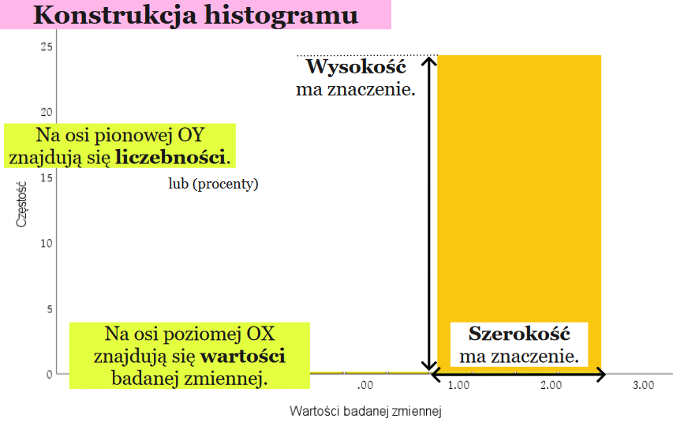

Histogram różni się od wykresu słupkowego tym, że jego słupki są połączone – nie ma przerw między nimi, ponieważ prezentuje dane ciągłe, a nie kategoryczne. Dzięki temu pozwala ocenić nie tylko ilość obserwacji, ale także kształt rozkładu danych (np. czy jest on symetryczny, skośny czy wielomodalny).


### **Przykład:**
Załóżmy, że zmierzyliśmy wzrost 20 osób (w cm):

160, 162, 163, 164, 165, 165, 166, 167, 168, 169, 170, 171, 172, 173, 174, 175, 175, 176, 178, 180  

Jeśli podzielimy dane na przedziały co 5 cm (np. 160–164, 165–169, 170–174, 175–179, 180+), to histogram pokaże nam, **ile osób mieści się w każdym przedziale**.

| Przedział (cm) | Liczba osób |
|----------------|-------------|
| 160–164 | 4 |
| 165–169 | 6 |
| 170–174 | 5 |
| 175–179 | 4 |
| 180+ | 1 |


### **Wizualizacja (histogram):**
```python
import matplotlib.pyplot as plt

dane = [160,162,163,164,165,165,166,167,168,169,170,171,172,173,174,175,175,176,178,180]
plt.hist(dane, bins=5, color='skyblue', edgecolor='black')
plt.title("Histogram wzrostu osób")
plt.xlabel("Wzrost [cm]")
plt.ylabel("Liczba osób")
plt.show()
```

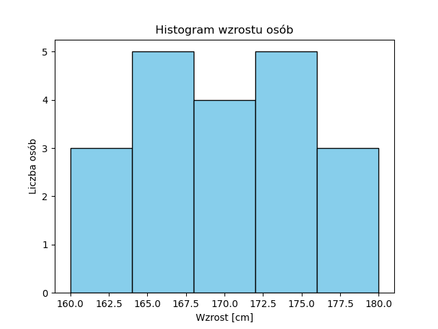


### **Jaki typ wykresu wybrać do prezentacji?**
Do prezentacji danych ilościowych najlepiej użyć właśnie histogramu, gdy chcemy zrozumieć strukturę rozkładu – wykres ten ułatwia analizę statystyczną i podejmowanie decyzji badawczych. Gdy natomiast mamy do czynienia z danymi kategorycznymi (np. płeć, kolor auta, kierunek studiów), lepszym rozwiązaniem będzie wykres słupkowy z przerwami między kolumnami, aby oddzielić od siebie niezależne kategorie.

**Histogram** – do danych liczbowych ciągłych (np. wzrost, waga, czas, temperatura).  
**Wykres słupkowy (bar chart)** – do danych **kategorycznych** (np. ulubiony kolor, kraj pochodzenia, typ urządzenia).  

**Różnica:**  
- Histogram pokazuje **rozkład liczbowy (ciągły)**.  
- Wykres słupkowy pokazuje **ilości kategorii (dane nieciągłe)**.  

---

## 30. Biblioteki wspierające tworzenie wykresów za pomocą języka Python
**Odpowiedź:**
W języku **Python** istnieje wiele bibliotek, które pomagają w tworzeniu wykresów i wizualizacji danych. Dzięki nim możemy łatwo pokazać wyniki analiz w formie graficznej.


### **Najważniejsze biblioteki:**

#### 🟦 **Matplotlib**
"Stara, dobra klasyka". Matplotlib to najstarsza i najbardziej podstawowa biblioteka do rysowania wykresów w Pythonie. Można go porównać do "rysownika z linijką" - pozwala nam zrobić dosłownie wszystko, ale musimy dokładnie mu powiedzieć co i jak narysować.
- Najbardziej podstawowa i popularna biblioteka do rysowania wykresów.
- Pozwala tworzyć linie, słupki, koła, histogramy i wykresy 3D.
- Umożliwia pełną kontrolę nad kolorami, tytułami i osiami.

**Przykład:**
```python
import matplotlib.pyplot as plt

x = [1, 2, 3, 4]
y = [10, 15, 7, 12]
plt.plot(x, y)
plt.title("Przykładowy wykres liniowy")
plt.xlabel("Czas")
plt.ylabel("Wartość")
plt.show()
```

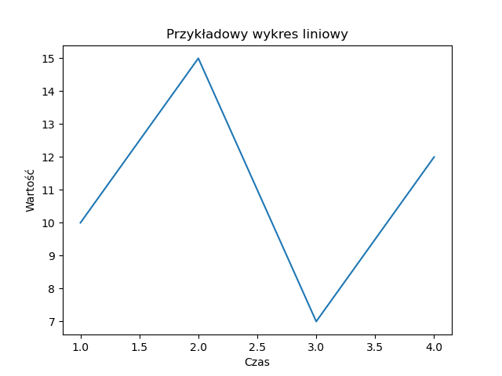


#### 🟩 **Seaborn**
"Młodszy brat Matplotlib, który ma styl". Seaborn to biblioteka zbudowana na biazie Matplotlib, ale robi to samo ładniej i szybciej. Nie musisz pisać tylu linijek kodu – Seaborn sam zadba o kolory, styl i legendę.
- Buduje na Matplotlib, ale wygląda ładniej i ma gotowe style.
- Świetna do wykresów statystycznych: histogramy, wykresy rozrzutu, wykresy pudełkowe.
- Często używana przy analizie danych z Pandas.

**Przykład:**
```python
import seaborn as sns
import pandas as pd

dane = pd.DataFrame({"wiek": [20,22,23,21,25,26,22,23,24]})
sns.histplot(dane["wiek"], bins=5, color="skyblue")
```

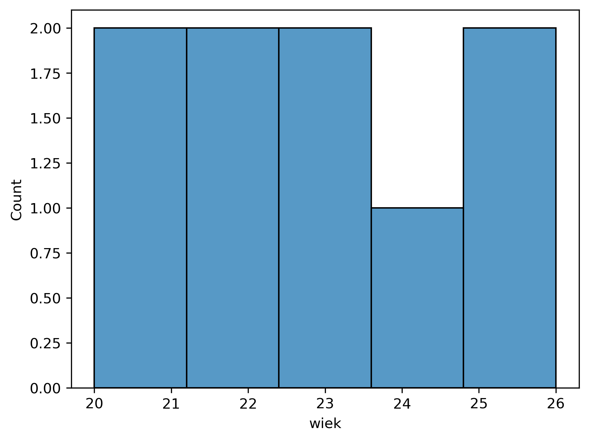


#### 🟨 **Plotly**
"interaktywny czarodziej". Plotly to biblioteka, która tworzy interaktywne wykresy – takie, które możesz przesuwać, powiększać, a po najechaniu myszką pokazują dane. Działa świetnie w przeglądarce, Jupyterze i aplikacjach webowych.
- Tworzy **interaktywne wykresy** (można je obracać, powiększać, najeżdżać kursorem).
- Stosowana często w aplikacjach webowych (np. z Dash lub Streamlit).

**Przykład:**
```python
import plotly.express as px

dane = {"Miasto": ["Olsztyn", "Warszawa", "Kraków"], "Liczba": [120, 300, 250]}
fig = px.bar(dane, x="Miasto", y="Liczba", title="Liczba mieszkańców")
fig.show()
```

[Zobacz wykres Plotly →](Static/Q29/plotly_example.html)


#### 🟥 **Pandas**
„Excel Pythona”. Pandas to jedna z najważniejszych bibliotek w Pythonie — służy do przechowywania, przetwarzania i analizowania danych.
Można powiedzieć, że to Pythonowa wersja Excela, tylko dużo mądrzejsza, szybsza i dająca większe możliwości.
- Sama w sobie nie jest biblioteką wizualizacyjną, ale współpracuje z Matplotlib.
- Można szybko tworzyć wykresy z danych w DataFrame.

**Przykład:**
```python
import pandas as pd

dane = pd.Series([3, 7, 1, 9])
dane.plot(kind='bar')
```

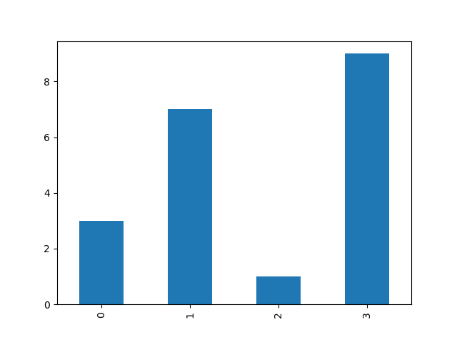


#### 🟪 **Altair**
„Nowoczesny automat do wykresów”. Altair to biblioteka do tworzenia wykresów szybko i zrozumiale.
Nie musisz pisać dużo kodu ani ustawiać szczegółów — po prostu mówisz „co chcesz zobaczyć”, a Altair sam to narysuje.
- Deklaratywna biblioteka oparta na zasadzie „powiedz, co chcesz zobaczyć, a nie jak zrobić”.
- Bardzo czytelna składnia, dobra do szybkich prototypów.

**Przykład:**
```python
import altair as alt
import pandas as pd

dane = pd.DataFrame({
    'Miasto': ['Warszawa', 'Kraków', 'Gdańsk', 'Wrocław', 'Poznań'],
    'Liczba mieszkańców (mln)': [1.8, 0.8, 0.5, 0.6, 0.54]
})

wykres = alt.Chart(dane).mark_bar(color='skyblue').encode(
    x='Miasto',                      
    y='Liczba mieszkańców (mln)',    
    tooltip=['Miasto', 'Liczba mieszkańców (mln)']
).properties(
    title='Liczba mieszkańców w polskich miastach'
)

wykres.show()
```

[Zobacz wykres Altair →](Static/Q29/altair_example.html)

---

## 31. Omów koncepcję "czystych danych/tidy data"
**Odpowiedź:**
**Czyste dane (ang. tidy data)** to sposób przechowywania danych w tabeli, dzięki któremu analiza i wizualizacja są **proste i logiczne**. Koncepcja tidy data została opracowana przez Hadleya Wickhama i stanowi uniwersalny standard organizacji danych, ułatwiający analizę i wizualizację.


### **Zasady czystych danych (wg Hadleya Wickhama):**
1. **Każda kolumna** to **jedna zmienna** (np. imię, wiek, kraj).
2. **Każdy wiersz** to **jedna obserwacja** (np. jedna osoba, produkt, pomiar).
3. **Każda komórka** zawiera **jedną wartość**, a nie kilka naraz.


### **Przykład:**
#### Dane NIEczyste:
| Imię | Wiek-Kraj |
|------|------------|
| Ola  | 20-Polska  |
| Max  | 25-Niemcy  |

Tutaj w jednej kolumnie są **dwie zmienne**: wiek i kraj — to błąd.


#### Dane czyste (tidy):
| Imię | Wiek | Kraj |
|------|------|------|
| Ola  | 20   | Polska |
| Max  | 25   | Niemcy |

Teraz każda kolumna opisuje **jedną cechę**, więc dane są gotowe do analizy.


### **Dlaczego to ważne?**
Przygotowanie danych w takiej formie jest kluczowe, ponieważ zdecydowana większość narzędzi analitycznych (np. w Pythonie) oczekuje danych w strukturze „tidy”. Dane „brudne” (dirty data) natomiast mają często problemy takie jak brakujące wartości, powtórzenia, mieszanie wielu typów informacji w jednej kolumnie, czy wiele kolumn reprezentujących różne okresy czasowe.
Czyste dane są podstawą poprawnej analizy — biblioteki takie jak **pandas** czy **seaborn** zakładają, że dane są właśnie w takim formacie. Dzięki temu, możemy od razu wykonać poprawny i czytelny wykres.


### **Podsumowanie:**
- Jedna kolumna = jedna zmienna  
- Jeden wiersz = jedna obserwacja  
- Jedna komórka = jedna wartość  

Niepoprawne dane → błędne wyniki analiz lub błędy w kodzie.

---

## 32. Etapy analizy i wizualizacji danych
**Odpowiedź:**
Analiza danych to proces, w którym przekształcamy surowe dane w **wiedzę i wnioski**.  
Można to porównać do gotowania – najpierw trzeba umyć i pokroić składniki, zanim coś ugotujemy.  


### **Etapy analizy danych:**

#### 1 **Zbieranie danych**
Jest to pierwszy krok, w którym zbieramy dane z różnych źródeł: baz danych, arkuszy, plików CSV, API, czy ankiet. 
**Przykład:** pobranie danych o temperaturze z pliku CSV lub API pogodowego.

```python
import pandas as pd
dane = pd.read_csv("temperatura.csv")
```


#### 2 **Czyszczenie danych**
Ten etap obejmuje usuwanie błędów, duplikatów, pustych wartości, literówek i nieprawidłowych formatów.

**Przykład:**
```python
dane.dropna(inplace=True)  # usuwa wiersze z pustymi wartościami
```


#### 3 **Analiza eksploracyjna (EDA – Exploratory Data Analysis)**
Sprawdzamy, **jak dane wyglądają**. jakie mają zależności, średnie, min/max, rozkłady.
Wizualizujemy dane, by lepiej je zrozumieć.

**Przykład:**
```python
dane.describe()      # statystyki opisowe
sns.histplot(dane["temperatura"])
```


#### 4 **Modelowanie / obliczenia**
Na tym etapie wykorzystujemy dane do obliczeń lub tworzenia modeli, np. średnia temperatura, regresja liniowa, wykrywanie anomalii itp.

**Przykład:**
```python
dane["średnia"] = dane["temperatura"].mean()
```


#### 5 **Wizualizacja wyników**
Przedstawiamy dane w zrozumiały sposób — w formie wykresów, tabel i dashboardów.
Dobre wizualizacje pomagają szybciej dostrzec wzorce i wnioski.

**Przykład:**
```python
plt.plot(dane["data"], dane["temperatura"])
plt.title("Zmiana temperatury w czasie")
plt.show()
```


#### 6 **Wnioski i prezentacja**
Ostatni etap to interpretacja — **co dane nam mówią?**  
Np. "Temperatura w maju rośnie średnio o 2°C tygodniowo" albo "Sprzedaż maleje w weekendy".


### **Podsumowanie etapów:**
| Etap | Co robimy | Przykład |
|------|------------|-----------|
| Zbieranie | Pobieramy dane z plików, baz, API | CSV z danymi pogodowymi |
| Czyszczenie | Usuwamy błędy, braki | `dropna()`, `fillna()` |
| Analiza | Sprawdzamy zależności | `describe()`, `corr()` |
| Modelowanie | Liczymy średnie, trenujemy model | Regresja liniowa |
| Wizualizacja | Rysujemy wykresy | `plt.plot()`, `sns.barplot()` |
| Wnioski | Interpretujemy dane | np. wzrost temperatury |

---

# Programowanie obiektowe

## 33. Składniki klasy i modyfikatory dostępu
**Odpowiedź:**
Klasa to podstawowy element programowania obiektowego.
Stanowi szablon (wzorzec), według którego tworzone są obiekty – konkretne instancje tej klasy. Klasa określa stan oraz zachowanie obiektu.

### **Składniki klasy**
**Pola (atrybuty)**:
to zmienne należące do klasy lub obiektu, które przechowują jego stan.  
**Metody**: To funkcje należące do klasy, które opisują zachowanie obiektu.  
**Konstruktor**: Specjalna metoda klasy, która służy do inicjalizacji obiektu. Wywoływana automatycznie w momencie tworzenia obiektu (new).
Każda klasa posiada konstruktor — jeśli nie zdefiniujemy go samodzielnie, kompilator tworzy domyślny pusty konstruktor.  
**Gettery i Settery**: To zwykłe metody służące do kontrolowanego dostępu do pól prywatnych.  

### **Modyfikatory dostępu**
Modyfikatory dostępu określają, kto może korzystać z danego pola, metody lub klasy. Pozwalają chronić dane przed niepożądanym dostępem.

| Modyfikator |  Dostępność  |  Opis   |
|------|------------|-----|
| public  |  dostępny wszędzie   |   każdy może użyć (w innych klasach i pakietach)  |
| protected  |  w tej samej klasie i klasach dziedziczących    |   chroni przed dostępem z zewnątrz, ale pozwala dziedziczyć  |
| private  |  tylko w tej samej klasie    |   ukrywa elementy przed światem zewnętrznym  |

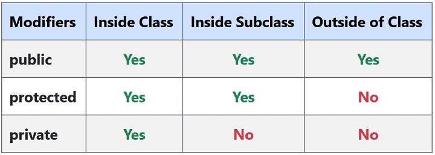

*W językach takich jak C# istnieją dodatkowe modyfikatory, np. internal, które ograniczają dostęp do elementów w obrębie tego samego assembly.*  
*W niektórych językach istnieje domyślny modyfikator, który stosuje się, gdy nie podamy żadnego słowa kluczowego. Jego widoczność zależy od języka (np. w Javie jest to dostęp pakietowy).*
  

Przykład klasy w Java
```
public class Person {

    // Fields (private for encapsulation)
    private String name;
    private int age;

    // Constructor
    public Person(String name, int age) {
        this.name = name;
        this.age = age;
    }

    // Getters
    public String getName() {
        return name;
    }

    public int getAge() {
        return age;
    }

    // Setters
    public void setName(String name) {
        this.name = name;
    }

    public void setAge(int age) {
        this.age = age;
    }

    // Method
    public void introduce() {
        System.out.println("Hello, my name is " + name + " and I am " + age + " years old.");
    }
}
```

Przykład klasy w Python

```
class Person:
    # Konstruktor
    def __init__(self, name, age):
        self._name = name  # prywatne pola (konwencja z "_")
        self._age = age

    # Gettery
    @property
    def name(self):
        return self._name

    @property
    def age(self):
        return self._age

    # Settery
    @name.setter
    def name(self, value):
        self._name = value

    @age.setter
    def age(self, value):
        self._age = value

    # Zwykła metoda
    def introduce(self):
        print(f"Hello, my name is {self._name} and I am {self._age} years old.")
```


## 34. Obiekty a klasy, pojęcie hermetyzacji
**Odpowiedź:**
1. Class  
**Definicja**: Klasa to szablon lub blueprint, który opisuje, jakie pola (dane) i metody (zachowania) będzie miał obiekt.  
**Nie zajmuje pamięci** dopóki nie utworzymy obiektu.

```
class Person:
    def __init__(self, name, age):
        self.name = name  # publiczne pole
        self.age = age    # publiczne pole

    def introduce(self):
        print(f"Hello, my name is {self.name} and I am {self.age} years old.")
```

2. Obiekt (Instance)  
**Definicja**: Obiekt to konkretna instancja klasy, która istnieje w pamięci i posiada własne wartości pól.  
**Każda klasa może tworzyć wiele obiektów**, każdy z własnym stanem.
```
person1 = Person("Alice", 25)
person1.age = 52 # tu przypadkiem zmieniony został wiek
person2 = Person("Bob", 30)
```

*person1 i person2 są różnymi obiektami, chociaż pochodzą z tej samej klasy Person.*

### **Hermetyzacja (Encapsulation)**
Hermetyzacja to zasada ukrywania wewnętrznych danych klasy przed bezpośrednim dostępem z zewnątrz, chroni je przed niepożądanymi zmianami i wymusza kontrolowany dostęp.  
Aby osiągnąć hermetyzację, należy ukryć pola klasy i zapewnić do nich kontrolowany dostęp za pomocą getterów, setterów.

```
class Person:
    def __init__(self, name, age):
        self._name = name
        self._age = age

    # Getter i setter dla name
    @property
    def name(self):
        return self._name

    @name.setter
    def name(self, value):
        self._name = value

    # Getter i setter dla age
    @property
    def age(self):
        return self._age

    @age.setter
    def age(self, value):
        if value < 0:
            print("Age cannot be negative!")
        else:
            self._age = value
```
Dzięki temu możemy kontrolować zmiany danych, np. dodając walidację w setterze.

```
person1 = Person("Alice", 25)

# Zmiana wieku przez setter
person1.age = 26   # poprawna zmiana

person1.age = -5   # Zadziała walidacja i zostanie wyświetlony komunikat
```

## 35. Pola i metody statyczne w klasie
**Odpowiedź:**  
**Pole statyczne** — zmienna należąca do klasy, współdzielona przez wszystkie instancje; istnieje jedna kopia w pamięci.  
**Metoda statyczna** — metoda należąca do klasy, którą wywołujemy bez tworzenia obiektu; nie ma dostępu do this ani do niestatycznych pól instancji.  


### **Najważniejsze różnice statyczne vs instancyjne**
| Cecha |  Statyczne (static)  |  Instancyjne   |
|------|------------|-----|
| Należy do  |  klasy   |   obiektu (instancji)  |
| Liczba kopii  |  1 dla klasy    |   oddzielna dla każdego obiektu  |
| Dostęp do this  |  brak    |   jest dostępne  |
| Wywołanie  |  ClassName.member    |   instance.member (lub this)  |
| Życie w pamięci  |  od załadowania klasy do unload    |   od new do GC obiektu  |

```
class Counter {
    // Pole statyczne - współdzielone przez wszystkie instancje
    static int count = 0;

    // Pole instancyjne - każda instancja ma własną kopię
    String name;

    // Konstruktor
    Counter(String name) {
        this.name = name;
        count++; // zwiększamy licznik statyczny przy każdym utworzeniu obiektu
    }

    // Metoda statyczna
    static void showCount() {
        System.out.println("Liczba wszystkich Counterów: " + count);
        // Nie można użyć 'name' tutaj! Bo name jest instancyjne
    }

    // Metoda instancyjna
    void showName() {
        System.out.println("Nazwa: " + name);
    }
}

public class Main {
    public static void main(String[] args) {
        Counter c1 = new Counter("A");
        Counter c2 = new Counter("B");

        c1.showName(); // Nazwa: A
        c2.showName(); // Nazwa: B

        // Wywołanie metody statycznej bez tworzenia obiektu
        Counter.showCount(); // Liczba wszystkich Counterów: 2

        // Pole statyczne jest współdzielone
        System.out.println("Dostęp przez c1: " + c1.count); // 2
        System.out.println("Dostęp przez c2: " + c2.count); // 2
        System.out.println("Dostęp przez klasę: " + Counter.count); //2
    }
}
```

### **Kiedy używać static — praktyczne zastosowania**
Elementy statyczne są współdzielone przez wszystkie instancje klasy i nie wymagają tworzenia obiektu, aby z nich korzystać.
Używa się ich do przechowywania stałych, wspólnych danych, metod pomocniczych, liczników instancji, a także do wzorców projektowych takich jak Singleton czy Fabryka.


## 36. Dziedziczenie, polimorfizm, szablony klas
**Odpowiedź:** 

### Dziedziczenie
Dziedziczenie to jeden z 4 podstawowych paradygmatów programowania obiektowego. Dziedziczenie jest mechanizmem, w którym jedna klasa nabywa własności innej klasy po której dziedziczy. Dzięki dziedziczeniu możemy ponownie wykorzystać pola i metody istniejącej klasy bez konieczności ich ponownej implementacji.  
**Cel**:
- unikanie duplikacji kodu,
- łatwiejsze utrzymanie,
- hierarchiczna struktura typów.

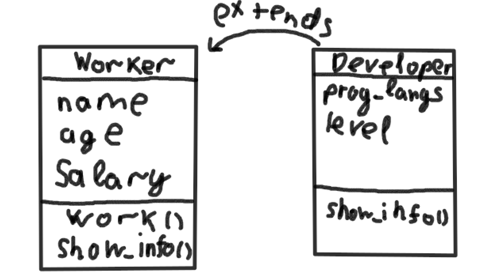

Przykład w Javie
```
class Vehicle {
    String brand;
    int speed;

    Vehicle(String brand, int speed) {
        this.brand = brand;
        this.speed = speed;
    }

    void drive() {
        System.out.println(brand + " jedzie z prędkością " + speed + " km/h");
    }
}

class Car extends Vehicle {
    int numberOfDoors;

    Car(String brand, int speed, int numberOfDoors) {
        super(brand, speed); // wywołanie konstruktora klasy bazowej
        this.numberOfDoors = numberOfDoors;
    }

    // Nadpisanie (override) metody klasy bazowej
    @Override
    void drive() {
        System.out.println(brand + " (samochód) jedzie z prędkością " 
                           + speed + " km/h i ma " + numberOfDoors + " drzwi.");
    }
}

class Bike extends Vehicle {
    boolean isElectric;

    Bike(String brand, int speed, boolean isElectric) {
        super(brand, speed);
        this.isElectric = isElectric;
    }

    @Override
    void drive() {
        System.out.println(brand + " (rower " 
                           + (isElectric ? "elektryczny" : "tradycyjny") 
                           + ") jedzie z prędkością " + speed + " km/h.");
    }
}

public class Main {
    public static void main(String[] args) {
        Vehicle v = new Vehicle("Pojazd", 50);
        Car c = new Car("Toyota", 120, 4);
        Bike b = new Bike("Giant", 25, true);

        v.drive(); //Pojazd jedzie z prędkością 50 km/h
        c.drive(); //Toyota (samochód) jedzie z prędkością 120 km/h i ma 4 drzwi.
        b.drive(); //Giant (rower elektryczny) jedzie z prędkością 25 km/h.
    }
}
```

**Podsumuwując dzięki dziedziczeniu można ponownie wykorzystywać kod, rozszerzać funkcjonalność i unikać powtarzania tych samych fragmentów programu.** 

### Polimorfizm

Polimorfizm to zdolność obiektów do różnego reagowania na te same wywołania metod.
Dzięki temu ta sama metoda może działać inaczej w zależności od typu obiektu, który ją wywołuje.

```
class Shape {
    double area() {
        return 0;
    }
}

class Circle extends Shape {
    double radius;

    Circle(double radius) {
        this.radius = radius;
    }

    @Override
    double area() {
        return Math.PI * radius * radius;
    }
}

class Rectangle extends Shape {
    double width, height;

    Rectangle(double width, double height) {
        this.width = width;
        this.height = height;
    }

    @Override
    double area() {
        return width * height;
    }
}

public class Main {
    public static void main(String[] args) {
        Shape circle = new Circle(5);
        Shape rectangle = new Rectangle(4, 6);

        System.out.println("Pole koła: " + circle.area()); 
        System.out.println("Pole prostokąta: " + rectangle.area());
    }
}
```
Wszystkie obiekty mają ten sam typ referencyjny (Shape),
ale wywiłana metoda zostanie właściwą metodę area() — zależnie od rzeczywistego typu obiektu (Circle, Rectangle).

### Szablony klas (generyki)

Szablony klas to mechanizm programowania, który pozwala tworzyć klasy działające dla różnych typów danych, bez potrzeby ich wielokrotnego przepisywania.  

Dzięki temu można napisać jedną uniwersalną wersję klasy lub funkcji, a kompilator sam wygeneruje odpowiedni kod dla konkretnego typu w momencie kompilacji.

Przykład w C++
```
#include <iostream>
#include <string>

template <typename T>
class Box {
private:
    T value;
public:
    Box(T v) : value(v) {}
    T get() const { return value; }
    void set(T v) { value = v; }
};

int main() {
    Box<int> intBox(42);
    Box<std::string> strBox("Hello");

    std::cout << intBox.get() << std::endl; // 42
    std::cout << strBox.get() << std::endl; // Hello
}
```

Tutaj T jest parametrem typu, który zostanie podstawiony przez konkretny typ danych podczas kompilacji.
Kompilator tworzy osobne wersje klasy Box dla każdego użytego typu.

Przykład w Javie
```
class Box<T> {
    private T value;
    Box(T value) { this.value = value; }
    public T get() { return value; }
    public void set(T value) { this.value = value; }
}

public class Main {
    public static void main(String[] args) {
        Box<Integer> intBox = new Box<>(42);
        Box<String> strBox = new Box<>("Hello");

        System.out.println(intBox.get()); // 42
        System.out.println(strBox.get()); // "Hello" - jako string
    }
}
```

Szablony klas (w C++) i generyki (w Javie, C#) umożliwiają tworzenie kodu, który działa z różnymi typami danych przy zachowaniu bezpieczeństwa typów.
Dzięki nim programista może pisać kod ogólny, elastyczny i łatwy do ponownego użycia.


## 37. Klasy abstrakcyjne i interfejsy
**Odpowiedź:**
### Definicja klasy abstrakcyjnej

Klasa abstrakcyjna to taka, która nie może być bezpośrednio instancjonowana - nie można utworzyć jej obiektu. Służy jako wspólna baza dla klas dziedziczących, które mogą implementować lub rozszerzać jej metody i pola.
- Może zawierać:
  - metody abstrakcyjne (bez implementacji)
  - metody z implementacją
  - pola, konstruktory i stałe
- Klasa pochodna musi zaimplementować wszystkie metody abstrakcyjne, jeśli sama nie jest abstrakcyjna.

Przykład w Javie:
---
    abstract class Fugura {
      abstract double pole(); <--- metoda abstrakcyjna

      cvoid opis() {
            System.out.println("To jest figura geometryczna");
          }
        }

    class Kolo extends Figura {
      double r;

      Kolo(double r) {
        this.r = r;
      }

      double pole() {
        return Math.PI * r * r;
      }
    }
---

### Definicja interfejsu

Interfejs to zbiór metod i stałych, które określają kontrakt - czyli co klasa ma robić, ale nie jak ma to robić. Każda klasa, która implementuje interfejs, musi zaimplementować wszystkie jego metody.
- W interfejsach:
  - metody są domyślnie publiczne i abstrakcyjne
  - pola są publiczne, statyczne i finalne (stałe)
  - w nowszych wersjach języków mozna stosować domyślne implementacje i metody statyczne

Przykład w Javie:
---
    interface Drukowalny {
      void drukuj();
    }

    class Raport  implements Druikowalny {
      public void drukuj() {
        System.out.println("Drukowanie raportu");
      }
    }

### Klasa abstrakcyjna, a interfejs

| Cecha |  Klasa abstrakcyjna  |  Interfejs   |
|------|------------|-----|
| Słowo kluczowe  |  abstract class   |   interface  |
|  Metody Abstrakcyjne  |  Może je zawierać    |   Wszystkie metody są domyślnie abstrakcyjne  |
| Metody konkretne  |  Może zawierać metody z pełnym ciałem    |   Może zawierać domyślne i statyczne metody  |
| Pola  |  Może mieć pola instancji stan obiektu)    |   Ma tylko stałe (public static final)  |
| Dziedziczenie  |  Klasa dziedziczy tylko po jednej klasie abstrakcyjnej    |   Klasa może implementować wiele interfejsów  |
| Konstruktor | Może mieć (wywoływany przez super() w podklasach) | Nie może mieć |

### Zastosowanie w praktyce

- Klasy abstrakcyjne – gdy kilka klas ma wspólne zachowanie lub strukturę (np. Figura, Pojazd, Pracownik).

- Interfejsy – gdy różne klasy muszą udostępniać wspólne metody bez wspólnej implementacji (np. Comparable, Serializable, Runnable).

# Systemy operacyjne

## 38. Procesy, wątki, zarządzanie procesami
**Odpowiedź:**
### Procesy

Proces to uruchomiony program, stanowiący podstawową jednostkę alokacji zasobów i niezależnego wykonywania w systemie operacyjnym.

Kluczowe cechy procesu
- Izolacja pamięci: Każdy proces ma własną, odizolowaną przestrzeń adresową, co zapewnia bezpieczeństwo i stabilność; błąd w jednym procesie nie zakłóca pracy innych.
- Zasoby: Posiada własny zestaw zasobów (rejestry, stos, licznik rozkazów, uchwyty do plików).
- Zarządzanie: Jest tworzony, planowany, przełączany i niszczony przez SO.

Stany procesu

Proces przechodzi przez określony cukl życia zarządzany przez SO:
1. New (Nowy): Utworzony.
2. Ready (Gotowy): Oczekuje na przydział procesora.
3. Running (Wykonywany): Aktualnie używa procesora.
4. Waiting/Blocked (Oczekujący): Czeka na zdarzenie (np. zakończenie operacji I/O).
5. Terminated (Zakończony): Zakończył działanie.
---
### Wątek

Wątek to lekka jednostka wykonawcza działająca wewnątrz procesu. Stanowi ścieżkę wykonywania w ramach wspólnej pamięci procesu.

Kluczowe cechy wątku:
- Współdzielenie pamięci: Wszystkie wątki w tym samym procesie dzielą wspólną przestrzeń adresową i zasoby (np.dane globalne,pliki).
- Własne struktury: Każdy wątek ma własny stos i licznik rozkazów.
- Efektywność: Ich tworzenie i przełączanie kontekstu jest znacznie szybsze (lżejsze) niż procesów, ponieważ nie trzeba przelączać całej przestrzeni adresowej.
- Współbieżność: Umożliwiają równoległe wykonywanie zadań w ramach jednego programu, co jest kluczowe na procesach wielordzeniowych.

| Cecha | Proces | Wątek |
|---|---|---|
| Pamięć | Własna, odizolowana | Współdzielona w obrębie procesu |
| Przełączanie | Ciężkie (kosztowne) | Lżejsze (szybkie |
| Komunikacja | Przez IPC (kolejki, potoki) | Bezpośrednio (współdzielone zmienne) |
---
### Zarządzanie procesami

Zarządzanie procesami to zbiór działań SO mających na celu alokację i kontrolę zasobów w celu optymalnego wykorzystania sprzętu i wydajności systemu.

A. Planowanie (Scheduling)
 SO decyduje, który proces (lub wątek) w stanie Ready ma otrzymać procesor, aby przejść w stan Running. Celem jest optymalizacja:
 - Przepustowości (liczby ukończonych zadań na jednostkę czasu).
 - Czasu odpowiedzi (szybkość reakcji systemu).
 - Sprawiedliwość (żaden proces nie czeka zbyt długo).

B. Tworzenie i usuwanie
- Tworzenie: Obejmuje alokację zasobów (przestrzeń adresowa, struktury danych procesu/wątku) i inicjalizację stanu.
- Usuwanie: De-alokacja zasobów i usunięcie struktur kontrolnych.

C. Synchronizacja
Konieczna gdy wiele wątków lub procesów współdzieli zasoby (np. pamięć). Zapobiega błędom współbieżności.
| Mechanizm | Opis |
|---|---|
| Muteksy | Zapewniają wyłączny dostęp do sekcji krytycznej (blokada binarna: 0 lub 1) |
| Semafory | Kontrolują liczbę jednoczesnych dostępów do zasobu |
| Monitory | Struktura wyższego poziomu (np. synchronized w Javie), łącząca blokadę i kolejki oczekujących wątków |

D. Komunikacja miedzyprocesowa
Metody umożliwiające procesom wymianę infromacji i synchronizację ich działań, np.:
- Potoki (Pipes): Jednokierunkowy lub dwukierunkowy przepływ danych.
- Pamięć współdzielona (Shared memory): Najszybsza metoda, ale wymaga synchronizacji.
- Gniazda (Sockets): Komunikacja przez sieć (używana również lokalnie).

## 39. Synchronizacja procesów współbieżnych. Semafory
**Odpowiedź:**
### Synchronizacja procesów współbieżnych
Synchronizacja to mechanizm zapewniający, że wiele procesów lub wątków, działających spółbieżnie, może bezpiecznie i poprawnie współdzielić zasoby. Jest to kluczowe dla zarządzania sektorami krytycznymi - fragmentami kodu, które uzyskują dostęp do danych współdzielonych.

**Problemy bez synchronizacji:**

Głównym problemem, który rozwiązuje synchronizacja, jest wyścig danych (Race Condition). Występuje on, gdy wynik operacji zależy od kolejności, w jakiej współbieżne procesy lub wątki uzyskują dostęp i modyfikują współdzielone dane.

**Wymagania dla synchronizacji:**

Poprawny mechanizm synchronizacji musi spełniać trzy warunki:
1. Wzajemne wykluczanie (Mutual exclusion): Jeśli proces $$P_i$$ wykonuje swój sektor krytyczny, żaden inny proces nie może w tym czasie wejść do swojego sektora krytycznego.
2. Postęp (Progress): jeśli żaden proces nie wykonuje sektora krytycznego i isnieją procesy, które chcą do niego wejść, decyzja o tym, który proces wejdzie, nie może być odkładana w nieskończoność.
3. Ograniczone oczekiwanie: Musi istnieć limit czasu, przez jaki proces może czekać na wejście do sektora krytycznego. Zapobiega to głodzeniu.
---
### Semafory
Semafory (Semaphores) są całkowitoliczbowymi zmiennymi używanymi do rozwiązywania problemów synchronizacji i osiągania wzajemnego wykluczania. Zostały zaproponowane przez Edsgera Dijkstrę.

**Budowa semafora**

Semafory są dostępne dla procesów tylko poprzez dwie atomowe (niepodzielne) operacje:
| Operacja | Nazwa zwykła | Nazwa w systemach | Działanie |
|---|---|---|---|
| P | `wait()` | `semWait()` lub `down()` | Zmniejsza wartość semfora. Jeśli jest ona nieujemna, wykonanie jest kontynuowane; jeśli ujemna, proces jest blokowany (zawieszany) i umieszczany w kolejce oczekujących. |
| V | `signal()` | `semsignal()` lub `up()` | Zwiększa wartość semafora. Jeśli wartość jest <= 0 (oznacza to procesy w kolejce), budzi jeden z zablokowanych procesów.|

**Rodzaje Semforów**

1. Semafory binarne:
    - Wartość semafora może wynosić tylko 0 lub 1.
    - Używane głównie do implementacji wzajemnego wykluczania. Wartość 1 oznacza, że zasób jest wolny, 0 - że jest zajęty.
    - są funkcjonalnie równoważne z muteksami, choź muteksy często mają dodatkowe funkcje (np. wiedzą, który proces je zablokował).
2. Semafory zliczające:
   - Mogą przyjmować dowolną nieujemną wartość całkowitą.
   - Wartość semfora reprezentuje liczbę dostępnych jednostek danego zasobu.
   - Używanie do kontroli dostępu do puli zasobów (np. limit 10 połączeń do bazy danych). Proces wchodzi do puli, jeśli semafor jest > 0 ('wait()' zmniejsza), i opuszcza, zwalniając jednostkę ('signal()' zwiększa).

**Przykład zastosowania**

Semafory binarne gwarantują, że tylko jeden proces wejdzie do sektora krytycznego:

Przykład w Javie
```Java
Semaphore mutex = new Semaphore(1); // Inicjalizacja na 1 (wolny zasób)

// Proces P1:
// ...
mutex.wait(); // Opcja P: Zmniejsza semafor do 0.
// SEKTOR KRYTYCZNY (np. modyfikacja współdzielonej zmiennej)
mutex.signal(); // Opcja V: Zwiększa semafor do 1, zwalniając blokadę.
// ...

// Proces P2:
// ...
mutex.wait(); // Blokuje się, jeśli semafor jest 0.
// SEKTOR KRYTYCZNY
mutex.signal();
```

# Inżynieria oprogramowania

## 40. Cykle projektowania i życia oprogramowania
**Odpowiedź:**
### Fazy cyklu życia oprogramowania
Typowy cykl SDLC sklada się z następujących głównych faz:
1. Planowanie: Określenie zakresu, celów, harmonogramu i wykonalności projektu (technicznej, ekonoicznej, operacyjnej). Ustalenie, czy projekt jest opłacalny i możliwy do zrealizowania.
2. Analiza wymagań: Zebranie, udokumentowanie i weryfikacja wymagań funkcjonalnych (co system ma robić) i niefunkcjonalnych (jak system ma działać, np. wydajność, bezpieczeństwo). Rezultatem jest specyfikacja wymagań.
3. Projektowanie: Przekształcenie wymagań w projekt architektury systemu. Obejmuje to:
   - Projekt architektury: Określenie struktury systemu, komponentów i ich interakcji.
   - Projekt szczegółowy: Opracowanie szczegółów implementacyjnych, struktur danych i algorytmów.
4. Implementacja: Pisanie kodu zgodnie z projektem.
5. Testowanie: Weryfikacja, czy oprogramowanie działa zgodnie z wymaganiami. Obejmuje testy jednostkowe, integracyjne, systemowe i akceptacyjne.
6. Wdrożenie: Udostępnienie systemu użytkownikom w środowisku produkcyjnym (instalacja, konfiguracja, migracja danych).
7. Utrzymanie: Najdłuższa faza. Obejmuje: naprawę błędów, adaptację do nowych środowisk, doskonalenie (dodawanie nowych funkcji) i zapobieganie awariom.
---
### Modele cykli projektowania
Różne modele SDLC stanowią różne podejścia do organizacji i sekwencjonowania tych faz:
1. Model kaskadowy (Waterfall model)
   - Charakterystyka: Liniowy, sekwencyjny model. Każda faza musi być całkowicie ukończona, zanim rozpocznie się następna. Wymaga szczegółowego planowania na szamym początku.
   - Zalety: Prosty w zarządzaniu, idealny dla małych, dobrze zdefiniowanych projektów o stabilnych wymaganiach.
   - Wady: Mała elastyczność; błędy wykryte późno są bardzo kosztowne do naprawy.
2. Modele iteracyjne i przyrostowe (Iterative & Incremental models)
   - Charakterystyka: Oprogramowanie jest budowane i dostarczane w serii iteracji (cykli). Każda iteracja tworzy przyrost (klejny fragment funkcjonalności) i obejmuje wszystkie fazy (od wymagań po testowanie).
   - Zalety: Wczesna wersja robocza jest dostępna, łatwiej jest zarządzać zmianami i minimalizować ryzyko.
   - Wady: Wymaga ścisłego zarządzania celami iteracji.
3. Model spiralny (Spiral model)
   - Charakterystyka: Łączy iteracyjny charakter z systematyczną analizą ryzyka. Cykl powtarza się w spirali, przechodząc przez cztery kwadranty: określenie celów, analiza ryzyka, inżynieria (projektowanie/testowanie) i planowanie następnej iteracji.
   - Zalety: Świetny do dużych, złożonych projektów, gdzie ryzyko jest wysokie.
   - Wady: Kosztowny, wymaga znacznego doświadczenia w zarządzaniu ryzykiem.
4. Metodyki agile:
   - Charakterystyka: Podejście iteracyjne i przyrostowe, kładące nacisk na szybką adaptację do zmian, współpracę z klientem, dostarczanie działającego oprogramowania w krótkich cyklach (Sprinty/Iteracje) i ludzi ponad procesy.
   - Zalety: Wysoka elastyczność, szybka reakcja na zmieniające się wymagania, stałe dostarczanie wartości.
   - Wady: Wymagają zaangażowania klienta i zdyscyplinowanego zespołu (Przykłady: Scrum, Kanban).


## 41. Metody oraz strategie testowania oprogramowania
**Odpowiedź:**

Testowanie oprogramowania to proces planowania, projektowania, wykonywania i oceny testów w celu wykrycia problemów i potwierdzenia, że system spełnia wymagania użytkownika.

### Metody testowania
Podziały metod testowania:

a) Ze względu na znajomość kodu testowanego oprogramowania
- **Czarna skrzynka** – testowanie bez znajomości kodu wewnętrznego; fokus na wymaganiach, wejściach i wyjściach.
- **Biała skrzynka** – testowanie z pełnym dostępem do kodu źródłowego; analiza ścieżek logicznych i pokrycia kodu.
- **Szara skrzynka** – połączenie powyższych; częściowa znajomość struktury wewnętrznej.

b) Ze względu na sposób wykonywania testów
- **Manualne** – ręczne wykonywanie scenariuszy testowych przez testera.
- **Automatyczne** – wykonywanie testów za pomocą skryptów i narzędzi.


### Poziomy testowania

1. **Jednostkowe (unit)** – testy izolowanych komponentów (funkcje, klasy).
2. **Integracyjne** – weryfikacja współpracy między modułami (np. API i baza danych).
3. **Systemowe** – testy całej aplikacji w środowisku zbliżonym do produkcyjnego.
4. **Akceptacyjne(UAT)** – weryfikacja przez użytkownika końcowego.


### Strategie testowania

- **Testy regresji** – ponowne wykonanie istniejących testów po zmianach w kodzie.
- **Testy eksploracyjne** – nieustrukturyzowane testowanie oparte na intuicji i doświadczeniu testera.
- **Testy obciążeniowe (load)** – symulacja dużego ruchu użytkowników w warunkach produkcyjnych.
- **Testy wytrzymałościowe (stress)** – przekraczanie limitów systemu w celu wykrycia punktów awarii.
- **Testy bezpieczeństwa** – Identyfikacja luk i podatności w systemie, które mogą zostać wykorzystane do nieautoryzowanego dostępu, utraty danych lub ataku.
- **Testy kompatybilności** – sprawdzanie działania na różnych przeglądarkach, systemach, urządzeniach.
- **Testy smoke (sanity)** – szybka weryfikacja, czy system w ogóle się uruchamia.

---
# Projektowanie systemów informatycznych

## 42. Metodologie wytwarzania systemów informatycznych
**Odpowiedź:**


| Metodologia     | Opis                                      | Zalety                                 | Wady                                                  | Zastosowanie                        |
|-----------------|------------------------------------------|----------------------------------------|-------------------------------------------------------|------------------------------------|
| **Kaskadowy**   | Sekwencyjny: analiza → projekt → implementacja → testy | Jasne etapy, pełna dokumentacja        | Mała elastyczność, brak powrotu do wcześniejszych faz | Małe projekty z dobrze określonymi wymaganiami |
| **V**           | Kaskadowy + testy odpowiadające fazom    | Wczesne planowanie testów, ścisła weryfikacja | Ograniczona elastyczność                              | Systemy wbudowane, lotnictwo, medycyna |
| **Przyrostowy** | System dostarczany etapami (moduły)     | Szybkie częściowe dostarczenie, kontakt z klientem | Trudny podział prac, ryzyko integracji, wyższe koszty | Projekty z etapową akceptacją funkcji |
| **Iteracyjny**  | Fazy powtarzane, każda iteracja udoskonala produkt | Lepsza kontrola, wczesne testy          | Wyższa złożoność i przez to koszty                    | Projekty wymagające ciągłego dopracowywania |
| **Spiralny**    | Iteracje + analiza ryzyka: planowanie → ryzyko → rozwój → testy | Skupienie na jakości i ryzyku          | Wysoki koszt, duża złożoność                          | Duże projekty krytyczne jakościowo |
| **Agile**       | Filozofia iteracyjna/adaptacyjna; Scrum/Kanban | Szybka reakcja, częsty kontakt z klientem | Wymaga doświadczonego zespołu, minimalna dokumentacja | Projekty zmienne, wymagające elastyczności |

**Kluczowe różnice:**  
- **Przyrostowy** → dodawanie nowych funkcji/modułów  
- **Iteracyjny** → udoskonalanie istniejących funkcji (refaktoring)  

## 43. Metody identyfikacji wymagań systemu informatycznego
**Odpowiedź:**

Identyfikacja wymagań jest kluczowym etapem analizy systemu informatycznego. Celem tego procesu jest określenie, jakie funkcje ma realizować system oraz jakie ograniczenia powinien spełniać. Wymagania dzielimy na: 
- **Funkcjonalne** – określające, co system ma robić (np. reakcje na działania użytkownika, funkcje interfejsu).  
- **Niefunkcjonalne** – definiujące warunki, jakie system musi spełniać (np. wydajność, niezawodność, cele biznesowe).  

### Sposoby identyfikacji wymagań

W początkowej fazie kluczowe jest zrozumienie otoczenia i przyszłego działania systemu. W tym celu stosuje się różne metody:

- **Wywiady** – rozmowy z interesariuszami w formie ustrukturyzowanej lub swobodnej.  
- **Burze mózgów** – generowanie pomysłów dotyczących funkcjonowania systemu.  
- **Scenariusze i przypadki użycia** – opisy sekwencji działań użytkownika prowadzących do osiągnięcia celu.
- **Prototypowanie** – tworzenie wstępnych makiet, modeli lub szkieletów systemu i ich testowanie z użytkownikami.  
- **Spotkania grupowe i warsztaty** – wspólne dyskusje z udziałem interesariuszy nad wymaganiami i rozwiązaniami.  
- **Obserwacja** – analiza sposobu pracy użytkowników (uczestnicząca lub nieuczestnicząca).  
- **Kwestionariusze (ankiety)** – pozyskiwanie informacji od wielu osób w sposób ustrukturyzowany.  
- **Eksperymenty** – testowanie niewielkich rozwiązań w celu oceny reakcji użytkowników.  
- **Ciągła współpraca** – bieżący udział klienta w procesie projektowym w celu weryfikacji kierunku prac.  
- **Symulacja punktów widzenia** – przyjęcie roli interesariusza w celu zrozumienia jego potrzeb.
### Punkty widzenia

**Punkt widzenia** to osoba lub element otoczenia mający wpływ na wymagania systemu. Dzielą się one na:
- **Bezpośrednie** – docelowi użytkownicy systemu.
- **Pośrednie** – kierownictwo, osoby odpowiedzialne za bezpieczeństwo.  
- **Związane z dziedziną** – przepisy, standardy, regulacje.  

---

# Podstawy logiki, algebra, analiza, metody probabilistyczne

## 44. Działania na zbiorach
**Odpowiedź:**

Dopełnienie zbioru – **A' = U \ A**

Suma zbiorów (unia) – **A ∪ B = {x : x ∈ A lub x ∈ B}**

Część wspólna (iloczyn) – **A ∩ B = {x : x ∈ A i x ∈ B}**

Różnica zbiorów – **A \ B = {x : x ∈ A i x ∉ B}**

Różnica symetryczna – **A △ B = (A \ B) ∪ (B \ A)**


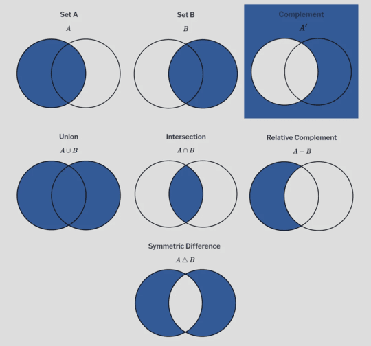

**Iloczyn kartezjański**  
 Zbiór wszystkich uporządkowanych par, gdzie pierwszy element pochodzi ze zbioru A, a drugi ze zbioru B.

**A x B = {(a, b) : a ∈ A, b ∈ B}**


Własności działań na zbiorach
 

Przemienność:

**A ∪ B = B ∪ A**  
**A ∩ B = B ∩ A**

Łączność:  

**(A ∪ B) ∪ C = A ∪ (B ∪ C)**  
**(A ∩ B) ∩ C = A ∩ (B ∩ C)**

Rozdzielność:

**A ∩ (B ∪ C) = (A ∩ B) ∪ (A ∩ C)**  
**A ∪ (B ∩ C) = (A ∪ B) ∩ (A ∪ C)**

Prawa de Morgana:

**(A ∪ B)' = A' ∩ B'**  
**(A ∩ B)' = A' ∪ B'**


## 45. Rachunek zdań
**Odpowiedź:**

Rachunek zdań to dział logiki matematycznej, który zajmuje się badaniem zależności między zdaniami logicznymi oraz ustalaniem wartości logicznych zdań złożonych tworzonych za pomocą spójników logicznych.

Każde zdanie logiczne może mieć tylko jedną z dwóch wartości logicznych:
- 1 - zdanie prawdziwe (P)
- 0 - zdanie fałszywe (F)

Alfabet rachunku zdań składa się z trzech rodzajów znaków:
- zmienne zdaniowe (zdania) oznaczane np. 'p', 'q', 'r', 's'
- spójniki logiczne (negacja, koniunkcja, alternatywa, implikacja, równoważność)
- znaki pomocnicze np. nawiasy

Typy zdań złożonych:
- Tautologia - zdanie zawsze prawdziwe (np. p ∨ ~p)
- Sprzeczność - zdanie zawsze fałszywe (np. p ∧ ~p)
- Zdanie spełnialne - zdanie prawdziwe dla niektórych wartości logicznych jego składników

**Negacja (~p)**

Negacja to zdanie postaci: „Nieprawda, że p", gdzie p jest zdaniem logicznym.
Zdanie ~p jest prawdziwe tylko wtedy, gdy zdanie p jest fałszywe.

| p | ~p |
|---|-----|
| 1 | 0 |
| 0 | 1 |

**Koniunkcja (p ∧ q)**

Koniunkcja to zdanie postaci: „p i q", gdzie p i q są zdaniami logicznymi.
Zdanie p ∧ q jest prawdziwe tylko wtedy, gdy oba zdania p i q są prawdziwe.

| p | q | p ∧ q |
|---|---|-------|
| 1 | 1 | 1 |
| 1 | 0 | 0 |
| 0 | 1 | 0 |
| 0 | 0 | 0 |

**Alternatywa (p ∨ q)**

Alternatywa to zdanie postaci: „p lub q", gdzie p i q są zdaniami logicznymi.
Zdanie p ∨ q jest prawdziwe wtedy, gdy co najmniej jedno ze zdań p lub q jest prawdziwe.

| p | q | p ∨ q |
|---|---|-------|
| 1 | 1 | 1 |
| 1 | 0 | 1 |
| 0 | 1 | 1 |
| 0 | 0 | 0 |

**Implikacja (p → q)**

Implikacja to zdanie postaci: „Jeśli p, to q", gdzie p jest poprzednikiem, a q następnikiem.
Implikacja jest prawdziwa, o ile ze zdania prawdziwego nie wynika zdanie fałszywe.

| p | q | p → q |
|---|---|-------|
| 1 | 1 | 1 |
| 1 | 0 | 0 |
| 0 | 1 | 1 |
| 0 | 0 | 1 |

**Równoważność (p ↔ q)**

Równoważność to zdanie postaci: „p wtedy i tylko wtedy, gdy q".
Zdanie p ↔ q jest prawdziwe wtedy i tylko wtedy, gdy p i q mają tę samą wartość logiczną (obie prawdziwe lub obie fałszywe).

| p | q | p ↔ q |
|---|---|-------|
| 1 | 1 | 1 |
| 1 | 0 | 0 |
| 0 | 1 | 0 |
| 0 | 0 | 1 |

**Podstawowe prawa rachunku zdań**

**A. Prawo wyłączonego środka**

p ∨ ~p ≡ 1

Dla każdego zdania p zawsze prawdą jest jedno z dwóch: p lub jego zaprzeczenie.

**B. Prawo sprzeczności**

~(p ∧ ~p)

Nie może być tak, że zdanie i jego zaprzeczenie są jednocześnie prawdziwe.

**C. Prawo podwójnej negacji**

~(~p) ≡ p

Podwójna negacja nie zmienia wartości logicznej zdania - jeśli zaprzeczymy dwa razy, otrzymujemy pierwotne zdanie.

**D. I prawo de Morgana**

~(p ∧ q) ≡ (~p ∨ ~q)

Zaprzeczenie koniunkcji dwóch zdań jest równoważne alternatywie zaprzeczeń tych zdań.

**E. II prawo de Morgana**

~(p ∨ q) ≡ (~p ∧ ~q)

Zaprzeczenie alternatywy dwóch zdań jest równoważne koniunkcji zaprzeczeń tych zdań.

**F. Prawo odrywania (modus ponens)**

[(p → q) ∧ p] → q

Jeśli prawdziwe są implikacja p→q oraz jej poprzednik p, to również jej następnik q jest zdaniem prawdziwym.

**G. Prawo negacji implikacji**

~(p → q) ≡ (p ∧ ~q)

Zaprzeczenie implikacji „Jeśli p, to q" jest równoważne zdaniu „p i nie q".

**H. Prawo kontrapozycji**

(p → q) ≡ (~q → ~p)

Implikacja jest równoważna zdaniu odwrotnemu z zanegowanymi częściami.

**I. Prawo rozdzielności koniunkcji względem alternatywy**

p ∧ (q ∨ r) ≡ (p ∧ q) ∨ (p ∧ r)

Koniunkcja rozdziela się na oba człony alternatywy

**J. Prawo rozdzielności alternatywy względem koniunkcji**

p ∨ (q ∧ r) ≡ (p ∨ q) ∧ (p ∨ r)

Alternatywa rozdziela się na oba człony koniunkcji.

## 46. Działania na macierzach
**Odpowiedź:**

Macierzą m × n nazywamy uporządkowaną tablicę liczb ułożonych w m wierszach oraz n kolumnach.

Liczby znajdujące się na przecięciu wierszy i kolumn nazywamy elementami macierzy i zapisujemy jako a<sub>ij</sub>, gdzie:
- i – numer wiersza (i = 1, 2, ..., m)
- j – numer kolumny (j = 1, 2, ..., n)

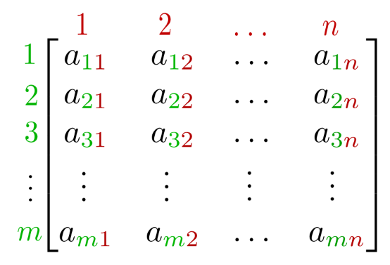

**Dodawanie i odejmowanie**

Dwie macierze można dodać lub odjąć tylko wtedy, gdy mają takie same wymiary. Dodajemy lub odejmujemy do siebie odpowiednie elementy pierwszej i drugiej macierzy.

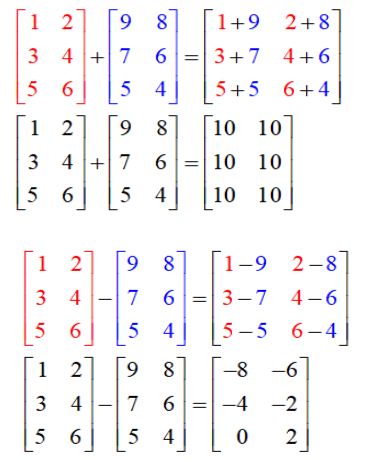

**Mnożenie przez skalar**

Mnożenie macierzy przez skalar polega na pomnożeniu każdego elementu macierzy przez tę liczbę.

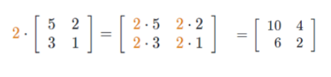

**Mnożenie macierzy**

Mnożenie macierzy jest możliwe tylko wtedy, gdy liczba kolumn pierwszej macierzy jest równa liczbie wierszy drugiej macierzy.
W wyniku otrzymujemy macierz o tylu wierszach, ile ma pierwsza macierz, i o tylu kolumnach, ile ma druga.
Każdy element macierzy wynikowej powstaje poprzez pomnożenie elementów odpowiadających sobie w wierszu pierwszej macierzy i kolumnie drugiej, a następnie zsumowanie otrzymanych iloczynów.
Ta suma stanowi pojedynczy element macierzy wynikowej.

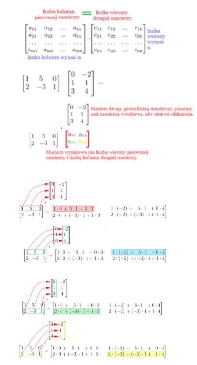

**Transpozycja macierzy**

Zamiana wierszy na kolumny.

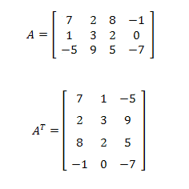

**Wyznacznik macierzy**

Wyznacznik to liczba, którą oblicza się na podstawie elementów macierzy kwadratowej.

- Wyznacznik stopnia 1

Jeżeli macierz ma tylko jeden element to wyznacznik to po prostu ta liczba.

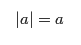

- Wyznacznik stopnia 2

Mnożymy elementy na przekątnej głównej i odejmujemy iloczyn przekątnej przeciwnej.

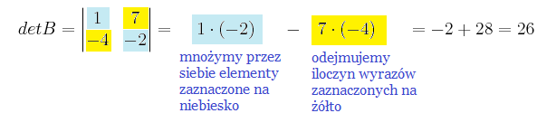

- Wyznacznik stopnia 3

Ogólny wzór:

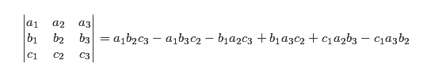

Aby obliczyć wyznacznik macierzy 3×3, przepisujemy jeszcze raz pierwsze dwa wiersze pod macierzą, żeby móc łatwo zaznaczyć przekątne. Następnie mnożymy elementy na trzech przekątnych biegnących w dół i dodajemy te wyniki. Potem mnożymy elementy na trzech przekątnych biegnących w górę i te wyniki odejmujemy od wcześniejszej sumy. Różnica tych dwóch sum to wyznacznik.

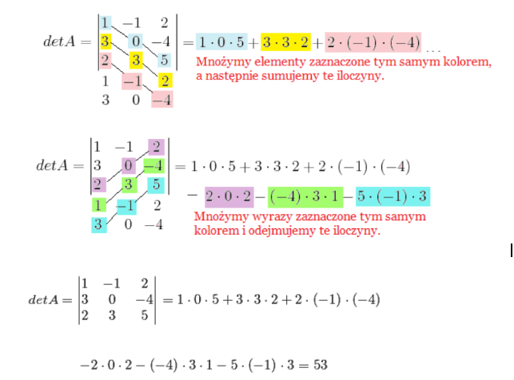

**Macierz odwrotna**

Macierz odwrotna to taka macierz, która „odwraca" działanie macierzy A, czyli po jej pomnożeniu dostajemy macierz jednostkową. Macierz odwrotna istnieje tylko wtedy, gdy wyznacznik macierzy jest różny od zera.

A · A<sup>-1</sup> = A<sup>-1</sup> · A = I, gdzie I to macierz jednostkowa


Macierz odwrotną można obliczyć, stosując metodę macierzy dołączonej lub metodę Gaussa–Jordana.
W przypadku macierzy 2×2, odwrotność można wyznaczyć ze wzoru:

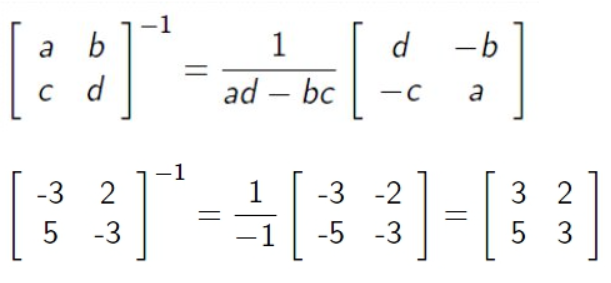

pod warunkiem, że wyznacznik macierzy A jest różny od zera.

## 47. Układy równań liniowych – twierdzenie Kroneckera-Capelliego
**Odpowiedź:**

Układ równań liniowych to zbiór równań, w których niewiadome występują tylko w pierwszej potędze.

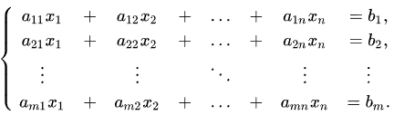

gdzie:
- a<sub>11</sub>,...,a<sub>mn</sub> - są to współczynniki równania (dane)
- b<sub>1</sub>,...,b<sub>m</sub> - wyrazy wolne (dane)
- x<sub>1</sub>,...,x<sub>n</sub> - niewiadome równania (szukane)

Aby zbadać, czy układ ma rozwiązanie, zapisujemy go w postaci macierzowej.

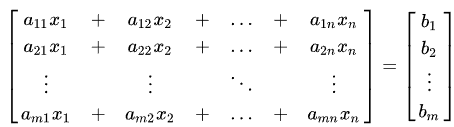

**Rząd macierzy (oznaczenie: r(A))**

Rząd macierzy to największa liczba wierszy (lub kolumn), które są liniowo niezależne, czyli nie da się ich otrzymać przez dodanie, odjęcie lub pomnożenie innych wierszy. W praktyce, gdy sprowadzimy macierz do postaci schodkowej (np. metodą Gaussa), rząd to po prostu liczba wierszy niezerowych, które pozostały po uproszczeniu.

**Macierz uzupełniona układu równań liniowych**

Macierz uzupełnioną otrzymujemy przez dołączenie do macierzy współczynników dodatkowej kolumny, w której znajdują się wyrazy wolne.

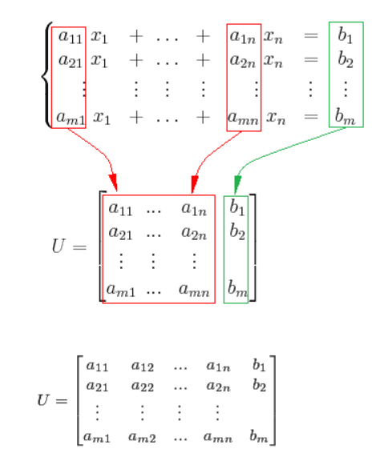

**Macierz współczynników**

Macierz współczynników powstaje przez zapisanie wszystkich współczynników stojących przy niewiadomych w układzie równań.

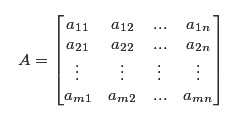

**Twierdzenie Kroneckera-Capelliego**

Niech A, U będą odpowiednio macierzą i macierzą uzupełnioną układu równań liniowych z n niewiadomymi.

Układ ten ma rozwiązanie wtedy i tylko wtedy, gdy r(A) = r(U).

- Jeśli r(A) = r(U) = n, to układ ma dokładnie jedno rozwiązanie.
- Jeśli r(A) = r(U) = k < n, to układ ma nieskończenie wiele rozwiązań zależnych od n−k parametrów.
- Jeżeli natomiast r(A) ≠ r(U), to układ nie ma rozwiązania. Taki układ nazywamy sprzecznym.

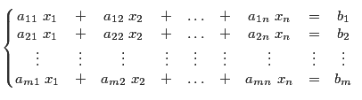

**Przykład:**

Określ liczbę rozwiązań układu równań postaci:

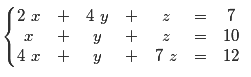

Niewiadome w tym układzie to x, y, z. Zatem liczba niewiadomych to n=3

Rozpoczynamy od wyznaczenia macierzy współczynników oraz macierzy uzupełnionej.

Macierz współczynników układu:

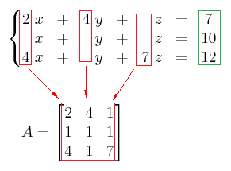

Macierz uzupełniona układu.

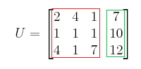

Obliczamy rzędy obu macierzy. Najpierw sprawdzamy wyznacznik macierzy A:

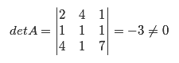

Wyznacznik jest niezerowy, dlatego macierz A ma maksymalny rząd, czyli rząd równy 3.

Ponieważ rząd macierzy współczynników jest największy z możliwych, to rząd macierzy uzupełnionej również wynosi 3. Zatem:

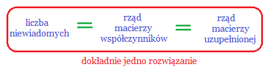

Zgodnie z Twierdzeniem Kroneckera-Capellego rozważany układ równań ma dokładnie jedno rozwiązanie. Możemy ten układ rozwiązać np. stosując wzory Cramera. Otrzymamy wówczas, że:

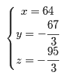

## 48. Pojęcie relacji i funkcji
**Odpowiedź:**

**Relacja**

To dowolny podzbiór R iloczynu kartezjańskiego dwóch zbiorów X × Y. Mówimy, że element x ∈ X jest w relacji z elementem y ∈ Y wtedy i tylko wtedy, gdy para (x,y) jest elementem zbioru R. Piszemy wtedy xRy. Jeżeli dodatkowo X = Y, to mówimy, że jest to relacja w zbiorze X (relacja na jednym zbiorze).

**Funkcja**

To szczególny rodzaj relacji między dwoma zbiorami X i Y. Mówimy, że mamy funkcję f: X → Y, jeżeli każdemu elementowi x ze zbioru X jest przyporządkowany dokładnie jeden element y ze zbioru Y. Element y nazywamy wartością funkcji w punkcie x lub obrazem punktu x i zapisujemy to jako y = f(x).

Zbiór X nazywamy dziedziną funkcji, a zbiór Y nazywamy przeciwdziedziną. Natomiast podzbiór przeciwdziedziny, złożony ze wszystkich wartości, które funkcja faktycznie przyjmuje, oznaczamy jako f(X) i nazywamy zbiorem wartości funkcji.

Funkcja jest więc relacją, ale taką, w której przyporządkowanie jest jednoznaczne - każdy argument ma dokładnie jedną wartość.

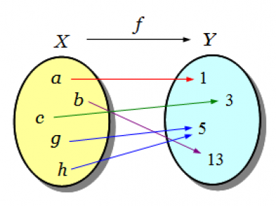

## 49. Własności relacji: relacje porządkujące; relacje równoważności
**Odpowiedź:**
1. Podstawowe własności relacji:

-   Zwrotność: Oznacza że każdy element jest w relacji z samym sobą.

$$ ∀ x ∈ X: x R x $$

-   Symetryczność: Jeśli x jest w relacji z y, to oznacza to również, że
    y jest w relacji z x.

$$ x R y ⟹ y R x $$

Antysymetryczność występuje gdy powyższa własność jest prawdziwa jedynie
dla x=y.

-   Przechodniość: Jeśli element x jest w relacji z elementem y, a y w
    relacji z z, to x również jest w relacji z z.

$$ (x R y ∧ y R z)⟹x R z $$

-   Spójność: na zbiorze X wszystkie elementy zbioru wchodzą w relację z
    dowolnym innym elementem.

2.**Relacja równoważności:** relacja ta mówi nam, że dwa obiekty są
\"takie same\" pod względem pewnej cechy, mimo że mogą być różnymi
obiektami. Aby relacja była relacją równoważności musi spełnić trzy
warunki:

-   Jest zwrotna.

-   Jest symetryczna.

-   Jest przechodnia.

Najważniejszą konsekwencją istnienia relacji równoważności jest podział
zbioru na **klasy abstrakcji** (klasy równoważności). Każdy element
zbioru należy do dokładnie jednej klasy.

3.**Relacja porządkująca:** Relacja ta oznacza że elementy zbioru są
uporządkowane, czyli jego elementy możemy ułożyć w szereg od
najmniejszego do największego. Dla określenia takiego porządku istotna
jest relacja „x poprzedza y", którą można zapisać jako x ≤ y. Aby
relacja była relacją porządkującą musi spełniać warunki:

-   Jest zwrotna

-   Jest antysymetryczna

-   Jest przechodnia

-   Jest spójna

Jeśli relacja spełnia trzy pierwsze warunki, mówimy o częściowym
porządku.

## 50. Własności funkcji: miejsca zerowe, ciągłość, pochodna
**Odpowiedź:**
**Podstawowe własności funkcji:**

-   Dziedzina: zbiór wszystkich argumentów funkcji

-   Zbiór wartości: wszystkie wartości przyjmowane dla argumentów z
    dziedziny

-   Miejsca zerowe: argument dla którego funkcja ma wartość 0

-   Monotoniczność: jeśli funkcja jest rosnąca, malejąca, nierosnoąca,
    niemalejąca lub stała.

-   Różnowartościowość: dla każdego argumentu funkcja przyjmuje inną
    wartość

-   Parzystość: funkcja jest parzysta jeśli jej wykres jest symetryczny
    względem osi y

-   Nieparzystość: wykres jest symetryczny względem punktu (0, 0).
    -f(-x)

-   Maksimum i minimum: wartości największe i najmniejsze

    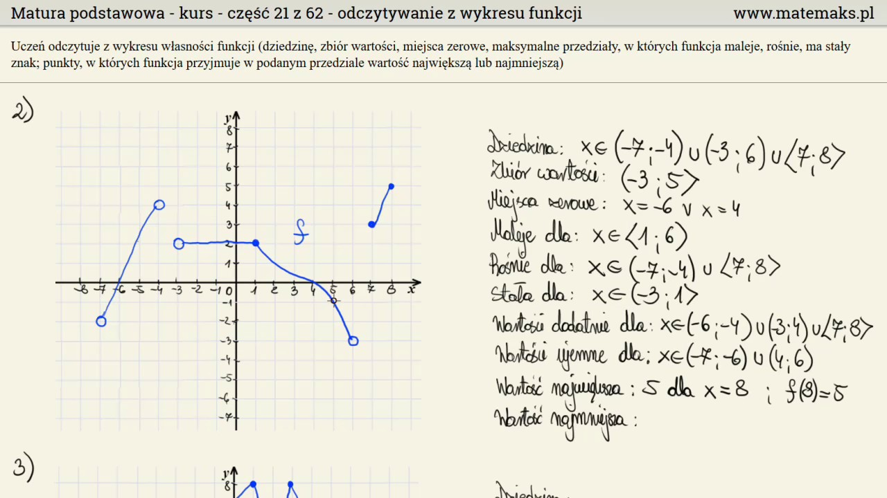

**Typy funkcji**:
-  Surjekcja: funkcja przyjmująca jako swoje wartości wszystkie elementy
przeciwdziedziny
-  Injekcja: funkcja różnowartościowa

-  Bijekcja: funkcja, która spełnia jednocześnie dwie poprzednie własności

**Ciągłość funkcji:** funkcja jest ciągła wtedy gdy nie ma w niej „dziur".

Definicja Heinego:

Funkcja jest ciągła w punkcie x~0~ należącego do M wtedy i tylko wtedy
gdy dla każdego ciągu (x~n~) liczb z M, który jest zbieżny do x~0~, ciąg
wartości (f(x~n~)) jest zbieżny do f(x~0~). Mówimy, że funkcja jest
ciągła jeżeli jest ciągła na całej swojej dziedzinie.

Nieciągłości: wyróżniamy dwa typy:

-   Usuwalna -- jeżeli istnieje granica funkcji w punkcie nieciągłości

-   Odosobniona -- jeżeli w pewnym sąsiedztwie punktu nieciągłości
    funkcja jest ciągła (np. signum)

Dodatkowe rodzaje nieciągłości:

-   Skok

-   Nieciągłość zwyczajna (1 rodzaju)

-   2 rodzaju

Pochodna: miara szybkości funkcji, czyli tempa zmian jej wartości
względem zmian jej argumentów.

Niech y=f(x) będzie funkcją zmiennej rzeczywistej x określoną w
otoczeniu punktu x~0~. Pochodną funkcji nazywamy granicę ilorazu
różnicowego:

$$\lim_{\Delta x \rightarrow 0}\frac{f\left( x_{0} + \Delta x \right) - f\left( x_{0} \right)}{\Delta x}$$

## 51. Zmienna losowa i jej charakterystyki liczbowe
**Odpowiedź:**
Zmienna losowa - funkcja przypisująca zdarzeniom elementarnym liczby.

Do określenia zmiennej losowej potrzebna jest przestrzeń
probabilistyczna. Załóżmy więc, że dana jest dowolna przestrzeń
probabilistyczna (E, Z, P), a więc zmienna losową nazywamy dowolną
funkcję X, określoną na przestrzeni zdarzeń elementarnych E, o
własnościach ze zbioru liczb rzeczywistych i mierzalną względem ciała
zdarzeń Z.

Zmienna losowa X dana jest zbiorem:  <br>

$$X:E\mathbb{\rightarrow R}$$

Zmienne losowe oznaczamy dużymi literami np.: S, T, X, Y, Z, ich
własności zaś odpowiednimi małymi literami: s, t, x, y, z, często ze
wskaźnikami.

Jeżeli zbiór wartości, jakie przyjmuje funkcja X, jest zbiorem
policzalnym, wtedy zmienną losową nazywamy zmienną losową dyskretną lub
skokową.

Natomiast jeśli funkcja X przyjmuje wartości z pewnego przedziału
liczbowego, nazywamy ją zmienną losową ciągłą.

Rodzaje zmiennych losowych:

-   Zmienne losowe skokowe (dyskretne)

-   Zmienne losowe ciągłe

Dystrubuanta zmiennej losowej X jest funkcją określoną na całym zbiorze
liczb rzeczywistych i dana jest wzorem: 

$$ F(x) = P(X < x) = \sum_{x_{i} < x}^{}p_{i} $$

Charakterystyki zmiennej losowej

-   Wartość przeciętna\
    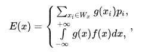

-   Wariancja zmiennej losowej

> 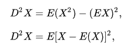

-   Odchylenie standardowe zmiennej losowej\
    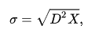

Rozkład normalny\
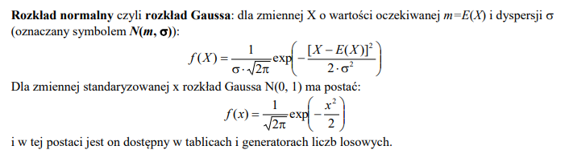

---

---

# Programowanie deklaratywne

## 52. Definicje unifikatora (podstawienia uzgadniającego), najogólniejszego unifikatora, algorytm unifikacji i twierdzenie o unifikacji
**Odpowiedź:**
Unifikacja jest podstawowym mechanizmem obliczeniowym w programowaniu deklaratywnym. Jest to proces dopasowywania do siebie dwóch wyrażeń (termów) w celu sprawdzenia, czy mogą one stać się identyczne, oraz wyznaczenia wartości zmiennych, które to umożliwią.

1\. Definicja unifikatora (podstawienia uzgadniającego)

W programowaniu logicznym operujemy na termach, które mogą być stałymi, zmiennymi lub strukturami złożonymi. Unifikatorem dwóch termów nazywamy taki zbiór podstawień wartości za zmienne, po którego zastosowaniu oba termy stają się identyczne. Innymi słowy, jest to zestaw instrukcji mówiący, co trzeba wpisać w miejsce zmiennych w obu wyrażeniach, aby stały się one nierozróżnialne.

Przykład: 
Jeśli mamy term rodzic(Anna, X) oraz term rodzic(Y, Tomek), to unifikatorem jest podstawienie: X = Tomek oraz Y = Anna. Po podstawieniu oba termy brzmią rodzic(Anna, Tomek).

2\. Najogólniejszy unifikator

Dla dwóch termów może istnieć wiele różnych unifikatorów. Najogólniejszy unifikator to takie podstawienie, które doprowadza do uzgodnienia termów, ale nie wprowadza żadnych zbędnych ograniczeń ani nadmiarowych konkretów. Jest to rozwiązanie najbardziej uniwersalne, które pozostawia zmienne niezwiązane, jeśli nie jest to konieczne do unifikacji. Każdy inny unifikator dla tych termów jest szczególnym przypadkiem najogólniejszego unifikatora.

Przykład:
  Dla termów f(X) i f(Y) można przyjąć unifikator {X = 5, Y = 5}, ale jest on zbyt szczegółowy (narzuca liczbę 5). Najogólniejszym unifikatorem jest po prostu {X = Y}, co oznacza, że zmienne muszą być sobie równe, bez wskazywania konkretnej wartości.

3\. Algorytm unifikacji

Jest to procedura, która automatycznie znajduje najogólniejszy unifikator dla dwóch termów lub informuje, że ich uzgodnienie jest niemożliwe. Algorytm działa rekurencyjnie, porównując termy element po elemencie:

-  Stałe: Jeśli porównywane elementy są stałymi, muszą być identyczne. Jeśli są różne, unifikacja kończy się porażką.

-  Zmienne: Jeśli jeden z elementów jest zmienną, algorytm podstawia za nią drugi element.

-  Ważny wyjątek: Przed podstawieniem należy sprawdzić, czy zmienna nie występuje wewnątrz termu, który ma być za nią podstawiony (np. X i f(X)). Jeśli występuje, unifikacja jest niemożliwa (prowadziłaby do pętli nieskończonej).

-  Struktury złożone: Jeśli oba elementy są funkcjami lub predykatami, muszą mieć tę samą nazwę (funktor) i taką samą liczbę argumentów. Algorytm wywołuje się wtedy rekurencyjnie dla każdej pary odpowiadających sobie argumentów.

Proces kończy się sukcesem, gdy cała struktura zostanie przetworzona bez
błędów, a wynikiem jest zebrany zestaw podstawień.

4\.  Twierdzenie o unifikacji (Robinsona)

Jest to fundamentalne twierdzenie matematyczne, które gwarantuje poprawność działania powyższego mechanizmu. Mówi ono, że dla dowolnych dwóch termów:

-  Algorytm unifikacji zawsze kończy działanie w skończonym czasie.

-  Jeżeli termy można uzgodnić, algorytm zawsze znajdzie unifikator i
będzie to najogólniejszy unifikator.

-  Jeżeli algorytm zwróci wynik negatywny, oznacza to, że termów nie da się
uzgodnić w żaden sposób.


## 53. Budowa programu w Prologu: klauzule (fakty, reguły), definicje predykatów. Sposób realizacji programu
**Odpowiedź:**

**Prolog** to język programowania logicznego, jest **językiem deklaratywnym**, co oznacza, że programista opisuje **CO** ma zostać rozwiązane, zamiast **JAK** to zrobić. Program napisany w języku Prolog składa się z dwóch głównych elementów: **faktów**, które można traktować jako aksjomaty pewnej teorii oraz **reguł wnioskowania** dla tej teorii.  

Program w Prologu składa się z zestawu klauzul, które mogą być:

- **Faktami** – aksjomatami opisującymi pewną teorię lub bazę wiedzy.
  Przykład faktu:
  ```prolog
  kot(tom).
  ```
- **Regułami** – opisującymi relacje między faktami oraz wnioski, które można wyprowadzić.
  Przykład reguły:
  ```prolog
  zwierze_domowe(X) :- kot(X).
  ```
W tym przypadku reguła mówi: „X jest zwierzęciem domowym, jeśli X jest kotem lub psem”.

Każdy program w Prologu opiera się na rachunku predykatów pierwszego rzędu oraz na zasadzie rezolucji, czyli mechanizmie automatycznego wnioskowania.

Podczas działania programu użytkownik zadaje pytanie (zapytanie) do bazy wiedzy, a Prolog próbuje je udowodnić na podstawie dostępnych faktów i reguł.
Przykładowo: 
```prolog
?- zwierze_domowe(tom).
```
Prolog odpowie „true”.

Podsumowując, programowanie w Prologu polega na definiowaniu **faktów i reguł wnioskowania**, które tworzą pewną teorię, a następnie stawianiu pytań, które język ten próbuje rozwiązać logicznie.

### Reguły w Prologu
Baza danych w Prologu może zawierać nie tylko fakty, ale także reguły, które pozwalają wyprowadzać wnioski z danych. Reguła ma postać:
  ```bash
  jest(światło) :- włączony(przycisk).
  ```
Zapis **:-** oznacza „**jeśli**” lub „**wtedy, gdy**”. Reguła powyżej oznacza:
  - Zdanie **jest(światło)** jest prawdziwe, jeśli prawdziwe jest zdanie **włączony(przycisk)**.

Każda reguła musi kończyć się kropką.

Reguły mogą używać **zmiennych**, które w Prologu zapisuje się wielką literą, natomiast stałe zaczynają się od małej litery. Przykład:
  ```bash
  ojciec(X, Y) :- rodzic(X, Y), jest_rodzaju_męskiego(X).
  ```
**Interpretacja:** „X jest ojcem Y, jeśli X jest rodzicem Y i X jest mężczyzną”.

### Zapytania w Prologu
Po zdefiniowaniu faktów i reguł, możemy zadawać pytania do bazy wiedzy. Zapytanie wygląda jak fakt, poprzedzony symbolem **?-**
  ```prolog
  ?- ojciec(tomasz, agata).
  ```
**Interpretacja:** „Czy Tomasz jest ojcem Agaty?”

Prolog przeszukuje bazę wiedzy i odpowiada:
  - **yes** – jeśli pytanie jest prawdziwe,
  - **no** – jeśli nie istnieje odpowiedni fakt ani reguła.

### Listy w Prologu
Lista to uporządkowana sekwencja termów zapisywana w nawiasach kwadratowych, np.:
```bash
[jabłko, gruszka, pomarańcza]
[1,2,3,4]
[X, 2, dom(texas)]
[[a,b,c], lista]
```
  - Elementami listy mogą być dowolne termy.
  - Listy można dzielić na głowę i ogon używając symbolu |:
```bash
[a|[b,c,d]] = [a,b,c,d]
[a|[]] = [a]
```

### Rekurencja w Prologu
Prolog pozwala na użycie **rekurencji**, czyli wywoływania predykatu w jego własnej definicji.
Przykład rekurencyjnego predykatu sumującego elementy listy:
```prolog
suma([], 0).
suma([H|T], Suma) :- suma(T, S), Suma is H + S.
```

### Podsumowanie najważniejszych zasad Prologu
**1. Fakty** – bezwarunkowo prawdziwe twierdzenia, zakończone kropką.
- **Składnia:** nazwa_predykatu(argument1, argument2, ...).
- **Argumenty mogą być:** stałymi (małe litery, np. marta, "Marta"), zmiennymi (duża litera, np. X).
- Przykład:
```prolog
lubi(marta, mandarynki).      % Marta lubi mandarynki
lubi(piotr, marta).           % Piotr lubi Martę
```
**2. Reguły** – warunkowe stwierdzenia, wnioski wyprowadzane z faktów.
- **Składnia:** **wniosek :- warunek1, warunek2, ... .**
    Można używać zmiennych (**X**, **Y**) i zmiennych anonimowych (**_**).
- **Przykład:**
```prolog
ojciec(X, Y) :- rodzic(X, Y), jest_rodzaju_męskiego(X).
siostra(S, X) :- kobieta(S), rodzice(Matka, Ojciec, S), rodzice(Matka, Ojciec, X).
lubi(marta, X) :- mezczyzna(X), przystojny(X), jezdzi(X, porsche).
  ```
**3. Zapytania** – pytania do bazy wiedzy, poprzedzone **?-**.
- Przykład:
```prolog
?- ojciec(tomasz, agata).  	  % Czy Tomasz jest ojcem Agaty?
?- zwierze_domowe(tom).    	  % Czy tom jest zwierzęciem domowym?
```
**4. Listy** – uporządkowane sekwencje termów, zapis w nawiasach kwadratowych.
- Przykład:
```bash
[1, 2, 3, 4]
[jablko, gruszka, pomarancza]
[H|T]      % głowa | ogon
```
**5. Rekurencja** – predykaty wywołujące same siebie, np. do przetwarzania list:
Przykład:
```prolog
suma([], 0).
suma([H|T], Suma) :- suma(T, S), Suma is H + S.
```
**6. Zasady ogólne:**
- Każdy predykat kończy się kropką.
- Nazwy predykatów i stałych piszemy małymi literami, zmienne dużymi literami.
- Kolejność i liczba argumentów mają znaczenie.
- Predykaty o tej samej nazwie tworzą procedury.

### Przydatne materiały

- [Wykład Prolog – PWR](https://ki.pwr.edu.pl/kobylanski/prolog/page0/index.html)  
- [Tutorialspoint – Prolog Relations](https://www.tutorialspoint.com/prolog/prolog_relations.htm)  
- [Prolog Programming Examples](https://athena.ecs.csus.edu/~mei/logicp/prolog/programming-examples.html)

# Technika cyfrowa

## 54. Systemy (zestawy) funkcjonalnie pełne
**Odpowiedź:**
**System funkcjonalnie pełny** - taki zbiór funkcji boolowskich, dla którego dowolna funkcja boolowska może być przedstawiona za pomocą funkcji należących do tego zbioru i argumentów funkcji.
Prościej mówiąc, zestaw funkcji logicznych (czyli operatorów logicznych AND, OR, NOT) nazywamy funkcjonalnie pełnym, jeśli przy pomocy tylko tych funkcji można zbudować dowolną funkcję logiczną.

Funkcje sumy, iloczynu i negacji tworzą tzw. podstawowy system funkcjonalnie pełny. Nie jest to jednak system minimalny. Systemy funkcjonalnie pełne tworzą również:
- iloczyn i negacja (suma może zostać wyeliminowana dzięki prawu De Morgana)
- suma i negacja (analogicznie jak wyżej)
- funkcja Sheffera (NAND) (jak wyżej oraz ponieważ `a' = (a*a)'`) 
- funkcja Peirce'a (NOR) (`a' = (a+a)'`)

```bash
a` - oznacza sprzęzenie
```

**Klasyczny zestaw funkcji logicznych:**
Podstawowe funkcje:
- negacja (NOT)
- suma logiczna (OR)
- iloczyn logiczny (AND)

Ten zestaw {NOT, AND, OR} jest funkcjonalnie pełny, bo każdą inną funkcję logiczną (np. XOR, NAND, NOR, implikację, równoważność itd.) można przedstawić za pomocą kombinacji tych trzech operacji.

- [System funkcjonalnie pełny: Operacje NAND i NOR](https://elektrotechnika.ans.pila.pl/fcp/BGBUKOQtTKlQhbx08SlkTUQRQX2o8DAoHNiwFE1wZDyEPG1gnBVcoFW8SBDRKTxMKRy0SODwBBAEIMQheCFVAORFCH2dGTDxSJ28dPEpZE1EHSktqMQ/_users/code_eCEUAMhdDO1gzHg45HwpDEF8bMzg5GUMSBj8PUAhZCiE/elektronika_cyfrowa/system_f_p_nand_nor.pdf)

## 55. Elementy pamięciowe stosowane w układach sekwencyjnych
**Odpowiedź:**
Układy sekwencyjne to takie układy cyfrowe, których wyjścia zależą nie tylko od aktualnych wejść, ale także od poprzednich stanów, dlatego wymagają elementów pamięciowych.
Do zapamiętywania stanów wykorzystuje się elementy pamięciowe, które mogą przechowywać 1 bit informacji.

### Elementy pamięciowe – ogólna idea
Element pamięciowy to układ cyfrowy, który może przyjmować i utrzymywać jeden z dwóch stanów logicznych: 0 lub 1 (czyli stan niski lub wysoki).
Stan ten może się zmienić dopiero po spełnieniu określonego warunku (np. podaniu impulsu zegara lub zmianie sygnału sterującego).

Najważniejsze elementy pamięciowe to **przerzutniki (flip-flops)** i **zatrzaski (latches)**.
Najprostszym elementem pamięciowym jest **układ bistabilny**, który ma dwa stabilne stany - 0 i 1.

### 1. Przerzutniki (flip-flops)
Przerzutniki są elementami pamięciowymi sterowanymi zboczem zegara, czyli zmieniają stan tylko w chwili zmiany sygnału CLK.
a) **Przerzutnik SR** – ma wejścia Set i Reset, służy do ustawiania i zerowania stanu.
b) **Przerzutnik D** – zapamiętuje wartość z wejścia D w momencie zbocza zegara — dlatego używa się go w rejestrach i pamięciach.
c) **Przerzutnik JK** – jest bardziej uniwersalny — eliminuje stan niedozwolony RS-a, a T służy głównie do zliczania, bo przełącza się przy każdym impulsie zegara.
d) **Przerzutnik T** – uproszczona wersja JK; gdy T=1 zmienia stan; stosowany w licznikach
Elementy te tworzą podstawę układów sekwencyjnych takich jak liczniki, rejestry, automaty stanów oraz pamięci.

### 2. Zatrzaski (latches)
Zatrzaski są elementami pamięciowymi sterowanymi poziomem sygnału (aktywne, gdy wejście sterujące ma określony poziom – najczęściej 1).
a) **Zatrzask SR (Set-Reset)** – wejścia Set i Reset, utrzymuje stan gdy S=R=0
b) **Zatrzask D (Data / Delay)** – gdy EN=1, przepisuje D na wyjście, inaczej pamięta stan

- [Przerzutniki – ETI PG](https://eti.pg.edu.pl/documents/176770/35019317/20151214_przerzutniki.pdf)
- [Przerzutnik SR – Uniwersytet Zielona Góra](https://staff.uz.zgora.pl/ipajak/materials/_general/autom/przerzutnik_SR.pdf)
- [Struktury danych – EDUINF](https://eduinf.waw.pl/inf/alg/002_struct/0032.php)
- [Układy sekwencyjne – WEL WAT](https://wel.wat.edu.pl/wp-content/uploads/2022/02/uc1_uklady_sekwencyjne.pdf)

## 56. Rodzaje układów sekwencyjnych, różnice w procedurach ich projektowania
**Odpowiedź:**
Układy sekwencyjne to układy cyfrowe, których **wyjścia zależą zarówno od aktualnych wejść, jak i od poprzedniego stanu**. Z tego powodu wymagają elementów pamięciowych (przerzutników lub zatrzasków).

Rodzaje układów sekwencyjnych można podzielić na dwie główne grupy:

### 1. Układy sekwencyjne asynchroniczne
- Stan zmienia się natychmiast po zmianie wejść (brak zegara)
- Zbudowane zwykle z zatrzasków (latches) sterowanych poziomem
- Zmiany rozchodzą się według opóźnień bramek -> mogą powstawać hazardy i oscylacje
- Trudniejsze w projektowaniu i analizie

**Cechy:**
- Brak sygnału zegarowego
- Szybka reakcja
- Podatność na zakłócenia
- Bardziej złożona procedura projektowania

**Projektowanie układów asynchronicznych obejmuje:**
- Minimalizację funkcji przejść
- Wykrywanie i eliminację hazardów
- Zapewnienie stabilnych stanów
- Analizę sekwencji zmian wejść, by unikać konfliktów

### 2. Układy sekwencyjne synchroniczne
- Zmieniają stan tylko w takt zegara (CLK)
- W większości wykorzystują przerzutniki (flip-flops)
- Są stabilne i przewidywalne -> dominujące w systemach cyfrowych

**Cechy:**
- Sygnał zegarowy kontroluje wszystkie zmiany
- Większa odporność na zakłócenia
- Łatwiejsze projektowanie
- Stosowane w praktyce (liczniki, rejestry, automaty stanów, procesory)

**Projektowanie układów synchronicznych obejmuje:**
- Określenie liczby stanów układu (diagram stanów)
- Minimalizację stanów
- Kodowanie stanów (np. binarnie, Gray, one-hot)
- Dobór typu przerzutnika (D, JK, T)
- Wyznaczenie funkcji wejść przerzutników
- Syntezę równań logicznych
- Weryfikację timingową i implementację

> Procedura projektowania układów synchronicznych jest systematyczna i łatwa do zautomatyzowania.

---

# Systemy wbudowane

## 57. Mikrokontrolery i systemy wbudowane
### 1. Czym jest mikrokontroler?
Mikrokontroler to układ scalony łączący w jednej obudowie:
- CPU (jednostkę obliczeniową),
- pamięć programu (Flash),
- pamięć operacyjną (RAM),
- peryferia wejścia/wyjścia.

Dzięki temu jest samowystarczalny i może sterować urządzeniem bez dodatkowych układów zewnętrznych.

> Schemat blokowy mikrokontrolera  
> 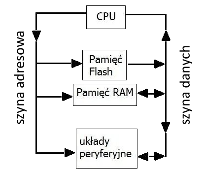
>
>- CPU steruje wszystkimi modułami i pobiera dane z pamięci lub I/O.
>- Pamięć i rejestry przechowują dane i instrukcje, które CPU wykonuje.
>- Moduły komunikacyjne i I/O wymieniają dane z otoczeniem.
>- Timery, przetworniki i inne peryferia rozszerzają funkcjonalność mikrokontrolera.
>

### 2. Kluczowe cechy mikrokontrolerów
Najważniejsze właściwości, które mikrokontrolery odróżniają od mikroprocesorów:

#### 2.1 Elementy wbudowane mikrokontrolera
- pamięć Flash,
- pamięć RAM,
- timery,
- przetworniki ADC/DAC,
- interfejsy komunikacyjne (UART, SPI, I2C, CAN, USB),
- watchdog,
- GPIO.

#### 2.2 Zalety mikrokontrolerów
- niska cena,
- niewielkie rozmiary,
- niski pobór energii,
- możliwość pracy bez dodatkowych układów zewnętrznych.

#### 2.3 Typowe zastosowania mikrokontrolerów
- sterowniki silników,
- urządzenia IoT,
- układy pomiarowe,
- automatyka przemysłowa,
- elektronika użytkowa (AGD, zabawki, sterowniki LED).

> Przykładowe mikrokontrolery Atmel AVR
> 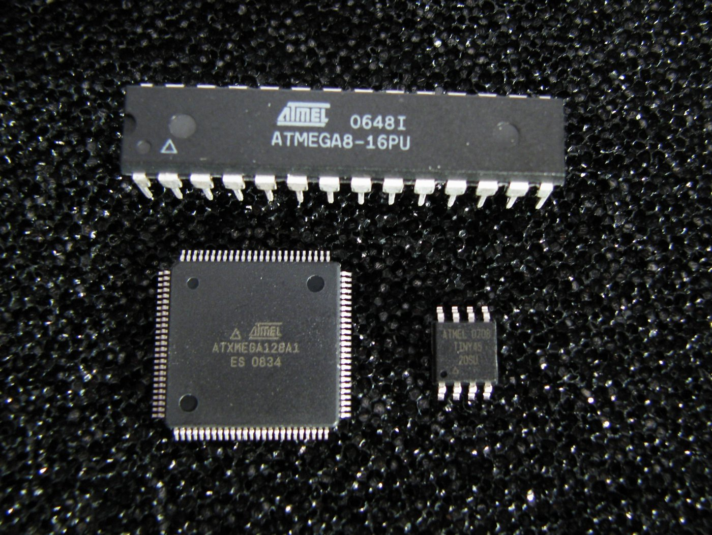


### 3. Systemy wbudowane – definicja i rola
System wbudowany (embedded system) to urządzenie, którego działanie:
- jest ściśle określone,
- nie służy jako komputer ogólnego zastosowania,
- działa najczęściej w czasie rzeczywistym.

#### Przykładowe urządzenia:
- sterowniki przemysłowe,
- systemy samochodowe (ABS, ESP),
- smart home,
- urządzenia medyczne,
- robotyka,
- telefony i elektronika consumer.

#### Typowy układ systemu wbudowanego
- mikrokontroler,
- czujniki,
- elementy wykonawcze (silniki, przekaźniki, siłowniki),
- komunikacja (np. Bluetooth, Wi-Fi, RS485),
- zasilanie.

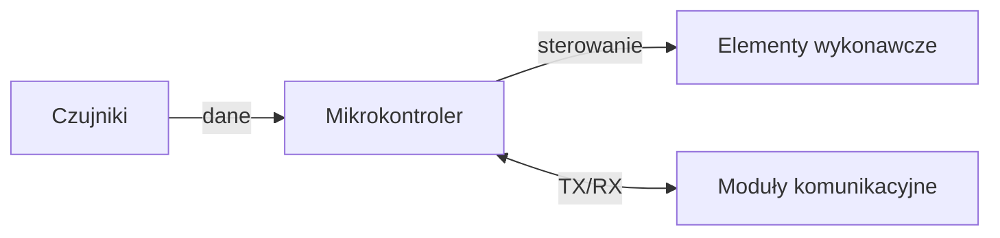

### 4. Programowanie mikrokontrolerów

#### Najczęściej stosowane języki:
- **C** – standard w systemach embedded,
- **C++** – coraz częściej stosowany,
- **Assembler** – gdy wymagane są optymalizacje,
- **MicroPython** – w niektórych platformach (ESP32, Micro:bit).

#### Jak to wygląda?
-  Na komputerze pisany jest kod.
-  Następuje kompilacja do formatu zrozumiałego dla mikrokontrolera.
-  Skompilowany program jest wgrywany przez programator/USB.
-  Mikrokontroler wykonuje program samodzielnie.

> Przykładowy kod
>```c
>// Definiujemy pin, do którego podłączona jest dioda
>#define LED_PIN 13
>
>// Funkcja główna
>int main(void) {
>    // Ustawienie pinu jako wyjście
>    pinMode(LED_PIN, OUTPUT);
>
>    while(1) {                   // Pętla nieskończona
>        digitalWrite(LED_PIN, HIGH); // Włącz LED
>        delay(500);                  // Poczekaj 500 ms
>        digitalWrite(LED_PIN, LOW);  // Wyłącz LED
>        delay(500);                  // Poczekaj 500 ms
>    }
>
>    return 0;
>}
>```

## 58. Tryby adresowania rozkazów mikrokontrolera

### 1. Każdy mikrokontroler wykonuje instrukcje (rozka­zy), które operują na danych.  
**Tryb adresowania** określa:
- skąd instrukcja pobiera dane,
- gdzie zapisuje wynik.

Dzięki różnym trybom adresowania można efektywnie sterować pamięcią, rejestrami i peryferiami.

### 2. Główne tryby adresowania

#### 2.1 Adresowanie bezpośrednie (Immediate)
- Dane są zapisane **bezpośrednio w instrukcji**.
- Nie wymaga odczytu pamięci ani rejestrów.
- Używane do wstawiania stałych wartości.

> **Przykład:**
> ```c
> MOV R1, #10  // do rejestru R1 wstaw 10
> ```

#### 2.2 Adresowanie rejestrowe (Register)
- Instrukcja operuje na danych znajdujących się w **rejestrach CPU**.
- Jest to bardzo szybkie, bo rejestry znajdują się bezpośrednio w procesorze.

> **Przykład:**
> ```c
> ADD R1, R2   // dodaj zawartość R2 do R1
> ```

#### 2.3 Adresowanie pośrednie (Indirect)
- Instrukcja używa **rejestru jako wskaźnika** do pamięci.
- Pozwala pracować na danych w RAM lub w tablicach.

> **Przykład:**
> ```c
> MOV A, @R0   // pobierz dane spod adresu w R0 i wstaw do akumulatora A
> ```

#### 2.4 Adresowanie bezpośrednie do pamięci (Direct)
- Adres pamięci jest podany **bezpośrednio w instrukcji**.
- Używane do odczytu lub zapisu konkretnej komórki pamięci.

> **Przykład:**
> ```c
> MOV A, 30h  // wstaw zawartość komórki pamięci 0x30 do akumulatora
> ```

#### 2.5 Adresowanie względne (Relative)
- Instrukcja podaje **przesunięcie względem bieżącej pozycji programu**.
- Najczęściej stosowane w skokach warunkowych.

> **Przykład:**
> ```c
> JZ LABEL   // (JZ) - Jump if Zero, jeśli zero, skocz o offset do LABEL
>
> LABEL:
> // kod wykonywany po skoku
> ```

### 3. Wszystko w jednym miejscu

| Tryb adresowania 	|        Skąd pobiera dane        	|  Gdzie zapisuje wynik  	|    Typowe zastosowanie    	|
|:----------------:	|:-------------------------------:	|:----------------------:	|:-------------------------:	|
| Immediate        	| W samej instrukcji              	| Rejestr lub akumulator 	| Stałe wartości            	|
| Register         	| Rejestr CPU                     	| Rejestr CPU            	| Operacje arytmetyczne     	|
| Indirect         	| Pamięć wskazywana przez rejestr 	| Rejestr/akumulator     	| Tablice, RAM              	|
| Direct           	| Bezpośredni adres pamięci       	| Rejestr/akumulator     	| Konkretna komórka pamięci 	|
| Relative         	| Offset względem PC              	| Adres skoku            	| Skoki warunkowe, pętle    	|


## 59. Rodzaje transmisji szeregowej

### 1. Czym jest transmisja szeregowa?
Transmisja szeregowa to sposób przesyłania danych **bit po bicie przez jeden przewód lub linię komunikacyjną**.  
Jest powszechnie stosowana w mikrokontrolerach i systemach wbudowanych, bo wymaga **mniej przewodów** niż transmisja równoległa, co upraszcza układy i zmniejsza koszty.

### 2. Podstawowe rodzaje transmisji szeregowej

### 2.1 Asynchroniczna (UART, RS232)
- Dane wysyłane są **bez zegara**, odbiorca musi wiedzieć, kiedy zaczyna się bajt.
- Każdy bajt otoczony jest:
  - **bit startu** – sygnalizuje początek danych
  - **bity danych** – 5–9 bitów
  - **bit parzystości (opcjonalny)** – sprawdzenie błędów
  - **bit stopu** – kończy bajt
- **Zalety:** prosta, wymaga tylko 2 przewodów (TX i RX), tania.
- **Wady:** wolniejsza i mniej odporna na zakłócenia niż SPI/I2C.

### 2.2 Synchronous (SPI, I2C)
Dane wysyłane są **zsynchronizowane z sygnałem zegarowym**.

#### 2.2.1 SPI (Serial Peripheral Interface)
- 4 przewody: 
  - MOSI (Master Out Slave In)
  - MISO (Master In Slave Out) 
  - SCK (zegar)
  - CS (wybór urządzenia).
- Szybka transmisja między mikrokontrolerem a peryferiami.
- **Zalety:** bardzo szybka, prosta dla krótkich połączeń.
- **Wady:** wymaga więcej przewodów niż I2C, trudniejsza w przypadku wielu urządzeń.

#### 2.2.2 I2C (Inter-Integrated Circuit)
- 2 przewody: SDA (dane), SCL (zegar)
- Pozwala podłączyć wiele urządzeń do jednej magistrali przy użyciu adresów.
- **Zalety:** oszczędza przewody, pozwala podłączyć wiele urządzeń.
- **Wady:** wolniejsza niż SPI, wymaga odpowiedniego programowania obsługi adresów.


### 2.3 Inne standardy szeregowe
- **CAN (Controller Area Network)** – używany w motoryzacji i automatyce, odporny na zakłócenia.
- **1-Wire** – przesył danych i zasilania po jednej linii.
- **USB (Universal Serial Bus)** – szybka transmisja między komputerem a mikrokontrolerem.

### 3. Porównanie podstawowych rodzajów transmisji szeregowej

| Typ transmisji 	| Liczba przewodów                     	| Synchronizacja             	| Zastosowanie                                                     	|
|----------------	|--------------------------------------	|----------------------------	|------------------------------------------------------------------	|
| UART / RS232   	| 2                                    	| Asynchroniczna             	| PC ↔ mikrokontroler                                              	|
| SPI            	| 4                                    	| Synchroniczna              	| Mikrokontroler ↔ peryferia                                       	|
| I2C            	| 2                                    	| Synchroniczna              	| Wiele urządzeń na jednej magistrali                              	|
| CAN            	| 2                                    	| Synchroniczna              	| Motoryzacja, automatyka                                          	|
| 1-Wire         	| 1                                    	| Asynchroniczna             	| Czujniki, proste urządzenia                                      	|
| USB            	| 4 (lub 2 w trybie USB 2.0 Low Speed) 	| Synchroniczna z protokołem 	| Komputer ↔ mikrokontroler, pamięć masowa, urządzenia peryferyjne 	|

---

# Sztuczna inteligencja i metody inżynierii wiedzy

## 60. Model obliczeniowy perceptronu

### 1. Czym jest perceptron?
Perceptron to najprostszy model **sztucznego neuronu** w sieciach neuronowych.  
Jest to **matematyczny model inspirowany neuronem biologicznym**, który przetwarza sygnały wejściowe i generuje sygnał wyjściowy na podstawie wagi i funkcji aktywacji.

Perceptron jest wykorzystywany do:
- klasyfikacji danych (np. True/False),
- rozpoznawania prostych wzorców,
- nauki maszynowej w trybie nadzorowanym.

### 2. Struktura perceptronu
Perceptron składa się z kilku elementów:

1. **Wejścia**: $x_1, x_2, \dots, x_n$ – wartości danych wejściowych.
2. **Wagi**: $w_1, w_2, \dots, w_n$ – określają, jak ważne jest każde wejście.
3. **Suma ważona**: obliczana jako  
   $z = \sum_{i=1}^{n} w_i x_i + b$  
   gdzie $b$ to **bias** (przesunięcie).
4. **Funkcja aktywacji**: decyduje o wyjściu perceptronu. Najczęściej:
   - **skok jednostkowy (Heaviside)**: wyjście 0 lub 1
   - **sigmoidalna**: wyjście w przedziale (0,1)
   - **ReLU**: wyjście ≥0
5. **Wyjście**: $y$ – wartość, którą perceptron przekazuje dalej lub klasyfikuje


> **Diagram perceptronu:**
>```mermaid
>graph LR
>X1[Wejście x1] -- w1 --> SUMA[Suma ważona + Bias] --> AKT[Funkcja aktywacji] --> Y[Wyjście y]
>X2[Wejście x2] -- w2 --> SUMA
>Xn[Wejście xn] -- wn --> SUMA
>```

### 33. Przykład działania perceptronu

Załóżmy taki perceptron z dwoma wejściami $x_1$ i $x_2$ oraz funkcją aktywacji skokową.

- Wagi: $w_1 = 0.6$, $w_2 = 0.4$  
- Bias: $b = -0.5$  
- Funkcja aktywacji: skokowa

Dla danych wejściowych $x_1 = 1$, $x_2 = 1$:

$$
z = (0.6 \cdot 1) + (0.4 \cdot 1) - 0.5 = 0.5
$$

Ponieważ $z > 0$, perceptron **wychodzi 1** (np. klasyfikacja „TAK”).

Dla danych wejściowych $x_1 = 0$, $x_2 = 1$:

$$
z = (0.6 \cdot 0) + (0.4 \cdot 1) - 0.5 = -0.1
$$

Ponieważ $z < 0$, perceptron **wychodzi 0** (np. klasyfikacja „NIE”).

### 4. Uczenie perceptronu

- Perceptron **uczy się na podstawie danych treningowych**.  
- Celem jest dobranie wag $w_i$ i biasu $b$, aby perceptron poprawnie klasyfikował wszystkie przykłady.  
- Algorytm uczenia perceptronu:

  1. Wybierz przykład treningowy.  
  2. Oblicz wyjście perceptronu.  
  3. Porównaj z wartością oczekiwaną.  
  4. Jeśli wynik jest błędny, **skoryguj wagi i bias**:

     $$
     w_i \leftarrow w_i + \Delta w_i, \quad \Delta w_i = \eta \,(y_{\text{oczekiwane}} - y_{\text{obliczone}}) \, x_i
     $$

     gdzie $\eta$ – współczynnik uczenia (mała liczba, np. 0.1).

- Proces powtarza się aż do uzyskania poprawnych wyników dla wszystkich przykładów (lub po określonej liczbie iteracji).

> **Diagram uczenia perceptronu:**
>```mermaid
>flowchart TD
>START[Start] --> INICJALIZUJ[Inicjalizuj wagi i bias]
>INICJALIZUJ --> ITERACJA[Ustaw licznik iteracji = 0]
>ITERACJA --> WYBIERZ[Wybierz pierwszy/kolejny przykład]
>WYBIERZ --> OBLICZ[Oblicz wyjście perceptronu]
>OBLICZ --> POROWNAJ{Porównaj z wartością oczekiwaną}
>POROWNAJ -->|Poprawny| NASTEPNY[Następny przykład]
>POROWNAJ -->|Błędny| AKTUALIZUJ[Aktualizuj wagi i bias] --> NASTEPNY
>NASTEPNY --> SPRAWDZ{Czy są jeszcze przykłady w zbiorze?}
>SPRAWDZ -->|Tak| WYBIERZ
>SPRAWDZ -->|Nie| KONTROLA{Sprawdź poprawność wszystkich przykładów}
>KONTROLA -->|Wszystkie poprawne| KONIEC[Koniec uczenia]
>KONTROLA -->|Są błędy| INKREMENTUJ[Licznik iteracji +1] --> SPRAWDZ_ITERACJE{Czy osiągnięto max iteracji?}
>SPRAWDZ_ITERACJE -->|Tak| KONIEC
>SPRAWDZ_ITERACJE -->|Nie| WYBIERZ
>```

### 5. TL;DR
- Perceptron to **najprostszy sztuczny neuron**.  
- Operuje na **wejściach, wagach, sumie i funkcji aktywacji**.  
- Używany głównie do **binarnych klasyfikacji**.  
- Nie potrafi rozwiązywać problemów nieliniowo separowalnych (np. XOR), ale jest podstawą dla **wielowarstwowych sieci neuronowych**.


## 61. Metody uczenia sieci neuronowych

**Odpowiedź:**

Uczenie sieci neuronowych to proces dostosowywania jej parametrów, głównie wag połączeń między neuronami, w taki sposób, aby sieć jak najlepiej realizowała postawione przed nią zadanie. Proces ten opiera się na analizie danych uczących. Istnieją trzy główne paradygmaty uczenia maszynowego, które znajdują zastosowanie w treningu sieci neuronowych.

### Schemat podziału metod uczenia

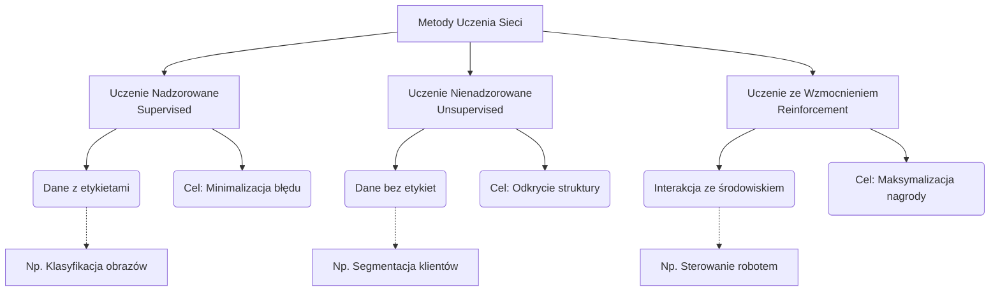

**1. Uczenie nadzorowane (Supervised Learning):**

Jest to najczęściej stosowana metoda, w której sieć uczy się na podstawie zbioru danych zawierającego przykłady wejściowe wraz z odpowiadającymi im, prawidłowymi odpowiedziami (etykietami).

*   **Mechanizm:** Kluczowym algorytmem jest **wsteczna propagacja błędu (backpropagation)**.
    1.  **Propagacja w przód:** `Wejście -> Warstwy Ukryte -> Wyjście (Predykcja)`
    2.  **Obliczenie błędu:** `Błąd = Oczekiwana Wartość - Predykcja`
    3.  **Propagacja wsteczna:** Aktualizacja wag w celu zmniejszenia błędu (metoda spadku gradientowego).

> **Przykład:** System antyspamowy.
> *   **Dane:** Tysiące e-maili oznaczonych ręcznie jako "Spam" lub "Nie spam".
> *   **Uczenie:** Sieć uczy się cech (słowa kluczowe, nadawca), które korelują z etykietą "Spam".

**2. Uczenie nienadzorowane (Unsupervised Learning):**

Sieć otrzymuje dane surowe (bez etykiet). Zadaniem jest samodzielne odkrycie ukrytych struktur, wzorców lub zależności. Brak tu sygnału błędu z zewnątrz.

*   **Zastosowania:**
    *   **Klastrowanie:** Grupowanie podobnych obiektów (np. klastrowanie klientów banku wg historii transakcji).
    *   **Redukcja wymiarowości:** Kompresja danych przy zachowaniu najważniejszych informacji (np. Autoenkodery).
    *   **Asocjacja:** "Klienci, którzy kupili chleb, kupili też masło".

> **Przykład:** Sieci Kohonena (SOM) porządkujące kolory. Na wejściu podajemy losowe wartości RGB. Po uczeniu sieć tworzy mapę 2D, na której podobne kolory sąsiadują ze sobą.

**3. Uczenie ze wzmocnieniem (Reinforcement Learning):**

Metoda inspirowana psychologią behawioralną. Agent uczy się metodą prób i błędów.

*   **Cykl działania:**
    1.  Agent obserwuje **Stan** środowiska.
    2.  Podejmuje **Akcję**.
    3.  Otrzymuje **Nagrodę** (pozytywną) lub **Karę** (negatywną).
    4.  Aktualizuje swoją **Politykę** działania, aby w przyszłości uzyskać więcej nagród.

> **Przykład:** Nauka gry w szachy.
> *   Wygrałeś partię? +100 punktów (wzmocnienie decyzji, które do tego doprowadziły).
> *   Przegrałeś? -100 punktów.
> *   Wykonałeś nielegalny ruch? -10 punktów (natychmiastowa kara).

---

## 62. Mechanizm działania algorytmu genetycznego

**Odpowiedź:**

Algorytm genetyczny (AG) to heurystyczna metoda optymalizacji inspirowana ewolucją biologiczna. Przetwarza on populację rozwiązań (osobników), dążąc do znalezienia najlepszego wyniku poprzez mechanizmy dziedziczenia, mutacji i selekcji.

### Cykl działania Algorytmu Genetycznego

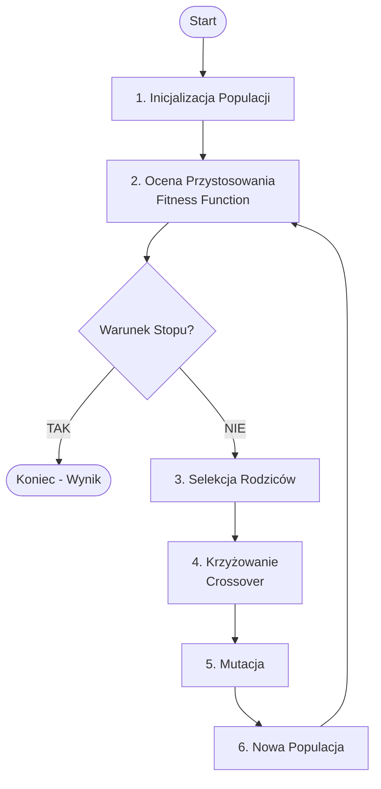

**Szczegółowy opis kroków:**

1.  **Inicjalizacja:** Losowe wygenerowanie populacji początkowej. Każdy osobnik (chromosom) to zakodowane rozwiązanie problemu (np. ciąg bitów).
2.  **Ocena (Fitness):** Każdy osobnik otrzymuje ocenę liczbową. Im wyższa, tym lepsze rozwiązanie.
3.  **Selekcja:** Wybór osobników do reprodukcji (np. metodą koła ruletki – lepsze osobniki mają większy wycinek koła).

**4. Operatory genetyczne (Przykłady):**

To kluczowy moment tworzenia nowego pokolenia.

*   **Krzyżowanie (Crossover) jednopunktowe:**
    Wymiana fragmentów kodu między rodzicami.
    ```text
    Rodzic A:  1 1 1 1 | 1 1    (miejsce cięcia po 4 bicie)
    Rodzic B:  0 0 0 0 | 0 0

    Potomek 1: 1 1 1 1 0 0      (poczatek A, koniec B)
    Potomek 2: 0 0 0 0 1 1      (poczatek B, koniec A)
    ```

*   **Mutacja:**
    Losowa zmiana genu, zapobiegająca utknięciu w lokalnym minimum.
    ```text
    Przed:     1 1 1 1 1 0
                       ^
    Po:        1 1 1 1 1 1      (bit 0 zamieniony na 1)
    ```

5.  **Utworzenie nowej populacji:** Potomkowie zastępują rodziców.
6.  **Warunek zatrzymania:** Algorytm działa do osiągnięcia np. 1000 pokoleń lub znalezienia idealnego rozwiązania.

---

## 63. Definicja entropii informacji i wybrane zastosowanie tego pojęcia

**Odpowiedź:**

**Entropia informacji** (Entropia Shannona) to miara niepewności lub nieuporządkowania zbioru danych. Określa średnią ilość informacji potrzebną do opisania stanu układu. Im bardziej losowe zdarzenie, tym wyższa jego entropia.

**Wzór matematyczny:**
Dla zmiennej losowej $X$ przyjmującej wartości $x_1, ..., x_n$ z prawdopodobieństwem $P(x_i)$:

$$H(X) = - \sum_{i=1}^{n} P(x_i) \log_2 P(x_i)$$

**Przykład obliczeniowy (Rzut monetą):**

*   **Moneta sprawiedliwa (50% orzeł, 50% reszka):**
    Pełna niepewność.
    $H(X) = - (0.5 \cdot \log_2 0.5 + 0.5 \cdot \log_2 0.5) = -(-0.5 - 0.5) = \mathbf{1 \ bit}$
*   **Moneta sfałszowana (100% orzeł, 0% reszka):**
    Brak niepewności (wynik jest znany z góry).
    $H(X) = - (1 \cdot \log_2 1 + 0 \cdot \dots) = \mathbf{0 \ bitów}$

**Zastosowanie: Budowa Drzew Decyzyjnych (Algorytm ID3/C4.5)**

Entropia jest używana do decydowania, **które pytanie zadać** (który atrybut wybrać do podziału), aby jak najlepiej posegregować dane. Dążymy do minimalizacji entropii w liściach drzewa.

### Wizualizacja koncepcji w drzewach decyzyjnych

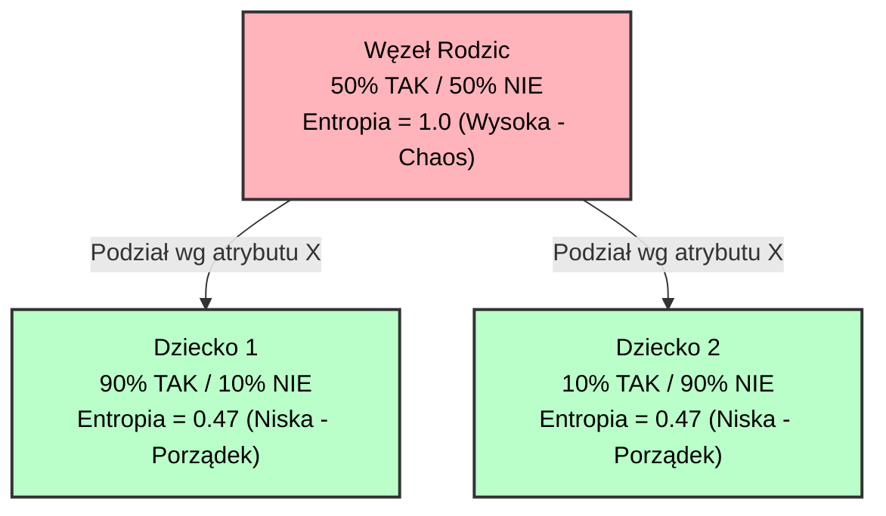

Algorytm wybiera ten atrybut, który daje największy **Zysk Informacyjny (Information Gain)**, czyli najbardziej redukuje entropię (zamienia chaos w węźle rodzica na porządek w węzłach dzieciach).

**Inne zastosowania:**
1.  **Kompresja danych:** Entropia wyznacza teoretyczny limit kompresji bezstratnej (nie można zapisać danych na mniejszej liczbie bitów niż wynosi ich entropia).
2.  **Kryptografia:** Ocena siły haseł (hasło o wysokiej entropii jest trudniejsze do zgadnięcia).

---

## 64. Metody generacji reguł decyzyjnych

**Odpowiedź:**

Generacja reguł decyzyjnych to proces wydobywania z danych wiedzy w postaci czytelnych dla człowieka instrukcji warunkowych:
> **JEŻELI** (warunek 1) **I** (warunek 2) **TO** (Decyzja)

Istnieją dwie główne strategie generowania takich reguł.

### 1. Metody pośrednie (Z drzew decyzyjnych)

Najpierw budujemy drzewo decyzyjne, a następnie każdą ścieżkę od korzenia do liścia zamieniamy na jedną regułę.

**Przykład transformacji Drzewo -> Reguły:**

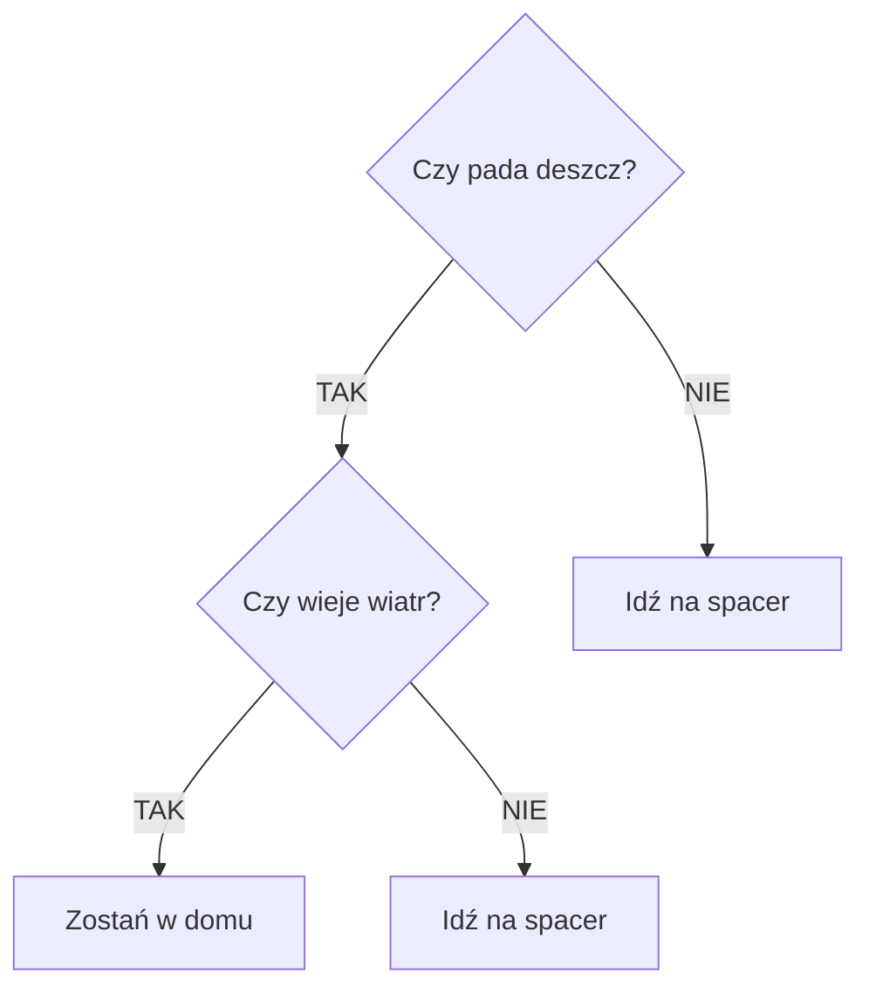

**Wygenerowane reguły:**
1.  `JEŻELI (Pada deszcz = NIE) TO (Idź na spacer)`
2.  `JEŻELI (Pada deszcz = TAK) I (Wieje wiatr = TAK) TO (Zostań w domu)`
3.  `JEŻELI (Pada deszcz = TAK) I (Wieje wiatr = NIE) TO (Idź na spacer)`

### 2. Metody bezpośrednie (Algorytmy pokrycia sekwencyjnego)

Algorytmy te (np. CN2, AQ) generują reguły bezpośrednio z danych, bez budowania drzewa. Stosują strategię **"Oddziel i Zwyciężaj" (Separate-and-Conquer)**.

**Mechanizm działania:**

1.  **Znajdź jedną regułę**, która poprawnie klasyfikuje część przykładów z danej klasy (np. "pozytywnej").
2.  **Usuń** ze zbioru uczącego przykłady, które ta reguła pokryła (zostały już "wyjaśnione").
3.  **Powtórz** proces dla pozostałych danych, aż zbiór będzie pusty.

> **Analogi:** Wyobraź sobie podłogę (zbiór danych) z rozsypanymi okruchami (przykłady).
> *   Drzewo decyzyjne to próba pocięcia całej podłogi liniami prostymi na czyste kawałki.
> *   Metoda bezpośrednia to przykrywanie okruchów serwetkami (regułami). Kładziesz serwetkę tam, gdzie jest najwięcej okruchów, sprzątasz je i bierzesz kolejną serwetkę do pozostałych.

**Porównanie reguł decyzyjnych i asocjacyjnych:**

| Cecha | Reguły Decyzyjne | Reguły Asocjacyjne |
| :--- | :--- | :--- |
| **Cel** | Przewidywanie jednej, konkretnej zmiennej (Decyzji/Klasy). | Znajdowanie powiązań między *dowolnymi* zmiennymi. |
| **Przykład** | Jeśli *Wiek > 60* i *Pali = Tak* to *Ryzyko = Wysokie*. | Jeśli kupił *Piwo*, to kupi też *Chipsy* (Analiza koszykowa). |
| **Algorytmy** | C4.5, AQ, CN2 | Apriori, FP-Growth |

## 65. Uczenie się zespołowe

**Uczenie zespołowe (ensemble learning)** to podejście w uczeniu maszynowym, w którym:
- trenujemy wiele modeli (tzw. modele bazowe, np. wiele drzew decyzyjnych),
- a następnie łączymy ich wyniki, aby uzyskać jedną, lepszą decyzję.

### Cel uczenia zespołowego:
- zwiększenie dokładności,
- zmniejszenie ryzyka błędu pojedynczego modelu,
- ograniczenie przeuczenia (overfittingu).

### Sposoby łączenia modeli:
- **Klasyfikacja** (np. TAK/NIE, kot/pies)  
  → głosowanie większościowe  
  (jeśli 7 modeli wskazuje „kot”, a 3 „pies”, wynik to „kot”)
- **Regresja** (wartości liczbowe)  
  → średnia z wyników wszystkich modeli

### Zalety:
- stabilniejszy wynik,
- mniejszy wpływ błędu pojedynczego modelu,
- często lepsza dokładność niż w przypadku jednego, nawet bardzo złożonego modelu.

### Wady:
- większy koszt obliczeniowy,
- trudniejsza interpretacja wyników.

### Główne typy uczenia zespołowego:
- **Bagging**
  - modele uczone niezależnie,
  - każdy na losowym podzbiorze danych,
  - wyniki są uśredniane lub poddawane głosowaniu.
- **Boosting**
  - modele uczone sekwencyjnie,
  - każdy kolejny poprawia błędy poprzednich,
  - skuteczny dla trudnych przypadków.

---

## Wprowadzenie do grafiki maszynowej

## 66. Modele barw

**Model barw** to matematyczny sposób opisu koloru za pomocą kilku liczb, np.  
`(R=120, G=200, B=50)`.

### Najważniejsze modele barw:

### RGB (Red, Green, Blue)
- stosowany w: monitorach, telewizorach, telefonach,
- kolor jako mieszanka trzech składowych światła,
- zakres wartości: 0–255,
- model addytywny:
  - (0,0,0) → czarny
  - (255,255,255) → biały

### CMYK (Cyan, Magenta, Yellow, Key)
- stosowany w drukarkach,
- model subtraktywny (odejmowanie światła),
- im więcej tuszu, tym ciemniejszy kolor.

### HSV / HSL
- używany w programach graficznych,
- bardziej intuicyjny dla człowieka:
  - **H** – odcień,
  - **S** – nasycenie,
  - **V/L** – jasność,
- ułatwia modyfikację kolorów (rozjaśnianie, zmiana nasycenia).

---

## 67. Algorytmy rastrowe

Algorytmy rastrowe określają, które piksele należy uaktywnić, aby jak najlepiej odwzorować obiekty geometryczne w obrazie rastrowym.

### Przykłady algorytmów:
- **rysowanie odcinków** – algorytm Bresenhama,
- **rysowanie okręgów i elips** – np. okrąg Bresenhama,
- **wypełnianie obszarów** – flood fill,
- **rasteryzacja wielokątów** – algorytmy scanline (np. trójkąty w grafice 3D).

### Cechy algorytmów rastrowych:
- działają w przestrzeni dyskretnej (siatka pikseli),
- są wydajne (proste operacje, często bez liczb zmiennoprzecinkowych),
- dążą do jak najlepszego przybliżenia obiektów geometrycznych,
- mogą wykorzystywać antyaliasing.

---

## 68. Formaty plików graficznych

### Najważniejsze formaty:

### BMP
- brak lub słaba kompresja,
- duże pliki, bezstratna jakość,
- rzadko używany w internecie.

### JPEG / JPG
- kompresja stratna,
- bardzo dobry do zdjęć,
- brak przezroczystości,
- najpopularniejszy format w sieci.

### PNG
- kompresja bezstratna,
- obsługa przezroczystości (kanał alfa),
- idealny do ikon, logotypów i screenów.

### GIF
- maksymalnie 256 kolorów,
- obsługuje animacje,
- nie nadaje się do zdjęć wysokiej jakości.

### SVG
- format wektorowy,
- skalowanie bez utraty jakości,
- idealny do ikon i logotypów.

### WebP
- nowoczesny format Google,
- mały rozmiar pliku,
- dobra jakość i przezroczystość.

### Podsumowanie
- JPEG – zdjęcia,
- PNG – grafika z przezroczystością,
- GIF – animacje,
- SVG – grafika wektorowa.


Przekształcenia afiniczne w przestrzeni trójwymiarowej (3W) to operacje geometryczne, które zachowują równoległość linii i proporcje odległości wzdłuż tych linii. Są fundamentalne w grafice komputerowej 3D do manipulacji obiektami.

### Podstawowe rodzaje przekształceń afinicznych:

#### 1. **Translacja (przesunięcie)**
Przesuwa obiekt o określony wektor w przestrzeni 3D.

**Macierz translacji 4×4:**
```
[ 1  0  0  tx ]
[ 0  1  0  ty ]
[ 0  0  1  tz ]
[ 0  0  0  1  ]
```

Gdzie `tx`, `ty`, `tz` to przesunięcia wzdłuż osi X, Y, Z.

**Przykład:**
```python
# Przesunięcie punktu (2, 3, 4) o wektor (5, -2, 3)
P = (2, 3, 4)
T = (5, -2, 3)
P' = (2+5, 3-2, 4+3) = (7, 1, 7)
```

#### 2. **Skalowanie (zmiana rozmiaru)**
Zmienia rozmiar obiektu względem początku układu współrzędnych lub określonego punktu.

**Macierz skalowania:**
```
[ sx  0   0   0 ]
[ 0   sy  0   0 ]
[ 0   0   sz  0 ]
[ 0   0   0   1 ]
```

Gdzie `sx`, `sy`, `sz` to współczynniki skalowania wzdłuż osi X, Y, Z.

**Przykłady:**
- Skalowanie jednolite: `sx = sy = sz = 2` (powiększenie 2×)
- Skalowanie niejednolite: `sx = 2, sy = 1, sz = 0.5` (rozciągnięcie wzdłuż X, spłaszczenie wzdłuż Z)

#### 3. **Obrót (rotacja)**
Obraca obiekt wokół osi X, Y lub Z o określony kąt.

**Obrót wokół osi Z (o kąt θ):**
```
[ cos(θ)  -sin(θ)  0  0 ]
[ sin(θ)   cos(θ)  0  0 ]
[ 0        0       1  0 ]
[ 0        0       0  1 ]
```

**Obrót wokół osi X (o kąt θ):**
```
[ 1  0        0       0 ]
[ 0  cos(θ)  -sin(θ)  0 ]
[ 0  sin(θ)   cos(θ)  0 ]
[ 0  0        0       1 ]
```

**Obrót wokół osi Y (o kąt θ):**
```
[ cos(θ)   0  sin(θ)  0 ]
[ 0        1  0       0 ]
[ -sin(θ)  0  cos(θ)  0 ]
[ 0        0  0       1 ]
```
### Współrzędne jednorodne

W grafice 3D używamy **współrzędnych jednorodnych** (x, y, z, w), gdzie zwykle w=1. Pozwala to reprezentować wszystkie przekształcenia afiniczne jako mnożenie macierzy 4×4:

```
P' = M × P

Gdzie:
P = [x, y, z, 1]ᵀ  - punkt wejściowy
M - macierz przekształcenia 4×4
P' = [x', y', z', 1]ᵀ - punkt wynikowy
```

### Kompozycja przekształceń

Przekształcenia można łączyć przez mnożenie macierzy:

```python
# Obrót, następnie translacja, następnie skalowanie
M = S × T × R
P' = M × P
```

**Uwaga:** Kolejność mnożenia ma znaczenie! `M₁ × M₂ ≠ M₂ × M₁`

### Właściwości przekształceń afinicznych:

- **Zachowują równoległość** - linie równoległe pozostają równoległe
- **Zachowują proporcje** - stosunek odległości punktów na linii pozostaje stały
- **Punkt środkowy** - środek odcinka pozostaje środkiem po przekształceniu
- **Kombinacja liniowa** - przekształcenie kombinacji liniowej punktów równa się kombinacji liniowej przekształconych punktów

### Zastosowania w grafice 3D:

1. **Animacja obiektów** - płynne przesuwanie, obracanie, skalowanie
2. **Hierarchie obiektów** - przekształcenia względne (np. ruch ramienia robota)
3. **Transformacje kamery** - pozycjonowanie punktu widzenia
4. **Deformacje modeli** - tworzenie złożonych kształtów
5. **Systemy cząstek** - generowanie efektów specjalnych
Przekształcenia afiniczne są podstawą wszelkich operacji na obiektach 3D w grafice komputerowej, silnikach gier i aplikacjach CAD.

## 70. Rzutowanie w grafice 3W
**Odpowiedź:**

Rzutowanie (projection) to proces przekształcania obiektów trójwymiarowych na płaszczyznę dwuwymiarową (ekran). Jest to kluczowy element pipeline'u renderowania grafiki 3D.

### Główne typy rzutowania:

## 1. **Rzutowanie równoległe (Parallel Projection)**

Promienie rzutujące są równoległe do siebie.

### A) **Rzutowanie ortogonalne (Orthographic)**

Promienie rzutujące są prostopadłe do płaszczyzny rzutowania.

**Macierz rzutowania ortogonalnego:**
```
[ 2/(r-l)    0          0         -(r+l)/(r-l) ]
[ 0          2/(t-b)    0         -(t+b)/(t-b) ]
[ 0          0         -2/(f-n)   -(f+n)/(f-n) ]
[ 0          0          0          1           ]
```
### B) **Rzutowanie skośne (Oblique)**

Promienie rzutujące tworzą kąt inny niż 90° z płaszczyzną rzutowania.

**Odmiany:**
- **Cavalier** - zachowuje długości linii równoległych do płaszczyzny rzutowania
- **Cabinet** - linie prostopadłe do płaszczyzny rzutowania są skrócone o połowę

**Zastosowanie:** Rysunki techniczne, wizualizacje architektoniczne

## 2. **Rzutowanie perspektywiczne (Perspective Projection)**

Promienie rzutujące zbiegają się w jednym punkcie (oku obserwatora).

**Wzór podstawowy:**
```
x_ekran = (x_3d * d) / z_3d
y_ekran = (y_3d * d) / z_3d
```
Gdzie `d` to odległość od kamery do płaszczyzny projekcji.

### Typy perspektywy:

**1-punktowa perspektywa:**
- Jeden punkt zbiegu na horyzoncie
- Stosowana dla widoków z przodu

**2-punktowa perspektywa:**
- Dwa punkty zbiegu
- Najbardziej naturalna dla widoków architektonicznych

**3-punktowa perspektywa:**
- Trzy punkty zbiegu
- Stosowana dla ekstremalnych kątów (widok z dołu/góry)

**Zastosowania:**
- Gry 3D (FPS, TPS)
- Filmy CGI
- Symulatory
- Rzeczywistość wirtualna (VR)

### Porównanie rzutowań:

| Cecha | Ortogonalne | Perspektywiczne |
|-------|-------------|-----------------|
| Realistyczność | Mała | Duża |
| Zachowanie proporcji | Tak | Nie |
| Równoległość linii | Zachowana | Linie zbiegają się |
| Mierzalność | Możliwa | Niemożliwa |
| Złożoność obliczeń | Niska | Średnia |
| Zastosowanie | CAD, techniczne | Gry, wizualizacje |
Rzutowanie jest fundamentalnym elementem każdego silnika graficznego 3D, determinującym sposób wyświetlania sceny 3D na ekranie 2D.

## 71. Krzywe Béziera
**Odpowiedź:**

Krzywe Béziera to parametryczne krzywe wykorzystywane w grafice komputerowej, projektowaniu CAD i typografii do modelowania gładkich kształtów. Zostały opracowane niezależnie przez Pierre'a Béziera (Renault) i Paula de Casteljau (Citroën) w latach 60. XX wieku.

### Podstawy matematyczne

Krzywa Béziera stopnia `n` jest definiowana przez `n+1` punktów kontrolnych P₀, P₁, ..., Pₙ i opisana wzorem:

**Wzór ogólny:**
```
B(t) = Σ(i=0 do n) [Bᵢⁿ(t) × Pᵢ]

Gdzie:
- t ∈ [0, 1] - parametr krzywej
- Bᵢⁿ(t) - wielomiany Bernsteina
- Pᵢ - punkty kontrolne
```
### Rodzaje krzywych Béziera:

## 1. **Krzywa Béziera liniowa (stopień 1)**

Dwa punkty kontrolne: P₀, P₁

**Wzór:**
```
B(t) = (1-t)P₀ + tP₁
```

To po prostu odcinek łączący P₀ z P₁.

## 2. **Krzywa Béziera kwadratowa (stopień 2)**

Trzy punkty kontrolne: P₀, P₁, P₂

**Wzór:**
```
B(t) = (1-t)²P₀ + 2(1-t)tP₁ + t²P₂
```
## 3. **Krzywa Béziera sześcienna (stopień 3)**

Cztery punkty kontrolne: P₀, P₁, P₂, P₃

**Wzór:**
```
B(t) = (1-t)³P₀ + 3(1-t)²tP₁ + 3(1-t)t²P₂ + t³P₃
```
> 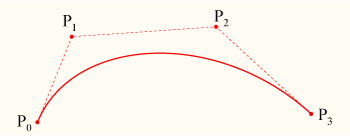

**Macierzowa reprezentacja:**
```
B(t) = [t³ t² t 1] × M × [P₀ P₁ P₂ P₃]ᵀ

Gdzie M (macierz Béziera) =
[-1   3  -3   1]
[ 3  -6   3   0]
[-3   3   0   0]
[ 1   0   0   0]
```
### Właściwości krzywych Béziera:

1. **Interpolacja końców** - krzywa przechodzi przez P₀ i Pₙ
   - B(0) = P₀
   - B(1) = Pₙ

2. **Styczność** - krzywa jest styczna do wielokąta kontrolnego na końcach:
   - B'(0) jest równoległe do P₁ - P₀
   - B'(1) jest równoległe do Pₙ - Pₙ₋₁

3. **Otoczka wypukła** - krzywa leży w otoczce wypukłej punktów kontrolnych

4. **Niezmienniczość afiniczna** - przekształcenia afiniczne krzywej = przekształcenia punktów kontrolnych

5. **Symetria** - B(t) i B(1-t) dają tę samą krzywą w odwrotnym kierunku

6. **Podział krzywej** - algorytm de Casteljau pozwala podzielić krzywą w dowolnym punkcie

### Pochodne krzywych Béziera:

**Pierwsza pochodna (dla krzywej sześciennej):**
```
B'(t) = 3(1-t)²(P₁-P₀) + 6(1-t)t(P₂-P₁) + 3t²(P₃-P₂)
```

Styczna w punkcie t pozwala na:
- Obliczanie kąta nachylenia
- Łączenie krzywych w sposób gładki (C¹, C² continuity)
- Animacje (orientacja obiektu wzdłuż ścieżki)
### Zastosowania:

1. **Grafika wektorowa:**
   - Adobe Illustrator, Inkscape
   - Format SVG: `<path d="M 0,0 C 1,2 2,2 2,0"/>`

2. **Typografia:**
   - Fonty TrueType (kwadratowe)
   - Fonty PostScript/OpenType (sześcienne)

3. **Animacje:**
   - CSS transitions: `cubic-bezier(0.42, 0, 0.58, 1)`
   - Ścieżki ruchu w grach i filmach

4. **Modelowanie 3D:**
   - Powierzchnie Béziera (tensor product)
   - Krzywe na powierzchniach

5. **CAD/CAM:**
   - Projektowanie kształtów samochodów, samolotów
   - Ścieżki narzędzi CNC

Krzywe Béziera to eleganckie i wszechstronne narzędzie matematyczne, które stało się fundamentem współczesnej grafiki komputerowej i projektowania.

# Problemy społeczne i zawodowe informatyki

## 72. Trzy podstawowe obszary uzależnień komputerowych  
**Odpowiedź:**

Uzależnienia komputerowe zaliczają się do uzależnień behawioralnych. Obejmują one różne formy nadmiernego korzystania z technologii, które wpływają negatywnie na funkcjonowanie człowieka. Najczęściej wyróżnia się trzy podstawowe obszary uzależnień komputerowych:

### 1. Uzależnienie od internetu
Dotyczy kompulsywnego korzystania z sieci, które prowadzi do utraty kontroli nad czasem spędzanym online.  
**Objawy:**
- wielogodzinne przeglądanie stron, social mediów,
- niepokój przy braku dostępu do sieci,
- traktowanie internetu jako formy ucieczki,
- zaniedbywanie obowiązków.

### 2. Uzależnienie od gier komputerowych
Polega na nadmiernym i niekontrolowanym graniu, często kosztem życia rodzinnego, nauki lub pracy.  
**Cechy:**
- ciągłe myślenie o grach,
- wydłużanie czasu gry,
- agresja przy próbach ograniczenia,
- granie mimo negatywnych konsekwencji.

### 3. Uzależnienie od komputera / nowych technologii
Obejmuje kompulsywne korzystanie z komputera lub urządzeń elektronicznych bez konkretnego celu.  
**Przykłady:**
- obsesyjne sprawdzanie komunikatorów,
- nadmierne oglądanie treści (YouTube, streaming),
- ciągłe „bycie przy ekranie”.


---

## 73. Zasadnicza różnica między ochroną własności intelektualnej i ochroną patentową  
**Odpowiedź:**

Ochrona własności intelektualnej oraz ochrona patentowa dotyczą zabezpieczenia efektów pracy twórczej, jednak są to dwa różne pojęcia o innym zakresie i zastosowaniu.

### Ochrona własności intelektualnej
Jest pojęciem **szerokim** i obejmuje:
- prawa autorskie,
- znaki towarowe,
- wzory przemysłowe,
- bazy danych,
- **patenty** (jako jeden z elementów).

Powstaje często **automatycznie**, np. prawa autorskie do programu komputerowego powstają w momencie jego stworzenia. Chroni **formę utworu**, a nie sam pomysł.

### Ochrona patentowa
Dotyczy tylko **wynalazków technicznych**, które są:
- nowe,
- innowacyjne,
- mają zastosowanie przemysłowe.

Patent daje twórcy **wyłączność** na korzystanie i rozwijanie wynalazku przez określony czas (najczęściej 20 lat).  
Wymaga **rejestracji** i spełnienia rygorystycznych kryteriów — jest to procedura formalna i często kosztowna.

### Zasadnicza różnica
- **Własność intelektualna** = szeroka ochrona twórczości (różne kategorie).  
- **Patent** = wąska, specjalistyczna forma ochrony dotycząca wyłącznie wynalazków.


---

## 74. Szpiegostwo komputerowe  
**Odpowiedź:**

Szpiegostwo komputerowe to celowe, nielegalne pozyskiwanie danych lub zasobów informatycznych bez wiedzy i zgody właściciela. Może być stosowane zarówno przez cyberprzestępców, firmy, jak i przez państwa w ramach cyberwywiadu.

### Na czym polega szpiegostwo komputerowe?
Atakujący dąży do zdobycia wartościowych informacji, takich jak:
- dane osobowe,
- tajemnice firmowe i handlowe,
- projekty technologiczne,
- hasła i loginy,
- poufne dokumenty rządowe.

Celem nie jest niszczenie danych, ale **ukryte ich pozyskanie**.

### Metody szpiegostwa komputerowego
Najczęściej wykorzystywane techniki:

- **Malware (oprogramowanie szpiegujące)**  
  keyloggery, spyware, trojany.

- **Ataki socjotechniczne**  
  phishing, podszywanie się pod instytucje, wyłudzanie danych.

- **Sniffing i podsłuchiwanie sieci**  
  przechwytywanie danych przesyłanych nieszyfrowanymi połączeniami.

- **Backdoory**  
  ukryte furtki umożliwiające zdalny dostęp.

- **Zaawansowane ataki państwowe (APT)**  
  długotrwałe operacje cyberwywiadowcze prowadzone przez wyspecjalizowane grupy.

### Skutki szpiegostwa komputerowego
- kradzież danych osobowych i finansowych,
- wyciek poufnych informacji,
- utrata reputacji firmy,
- kradzież technologii,
- zagrażanie bezpieczeństwu państwa,
- możliwość szantażu.

### Ochrona przed szpiegostwem
- aktualizowanie systemów,
- stosowanie silnych haseł i dwuskładnikowego uwierzytelniania,
- szyfrowanie transmisji,
- programy anty-malware,
- ostrożność przy otwieraniu załączników,
- edukacja dotycząca socjotechniki.

